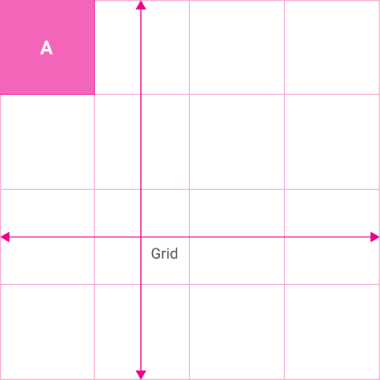
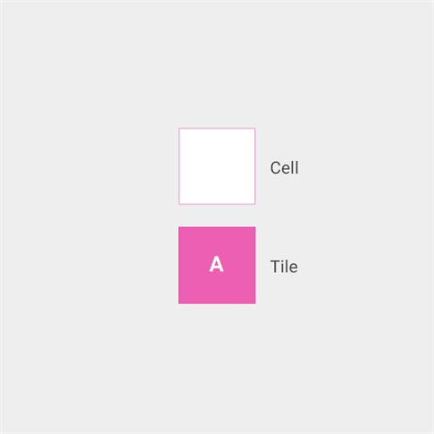
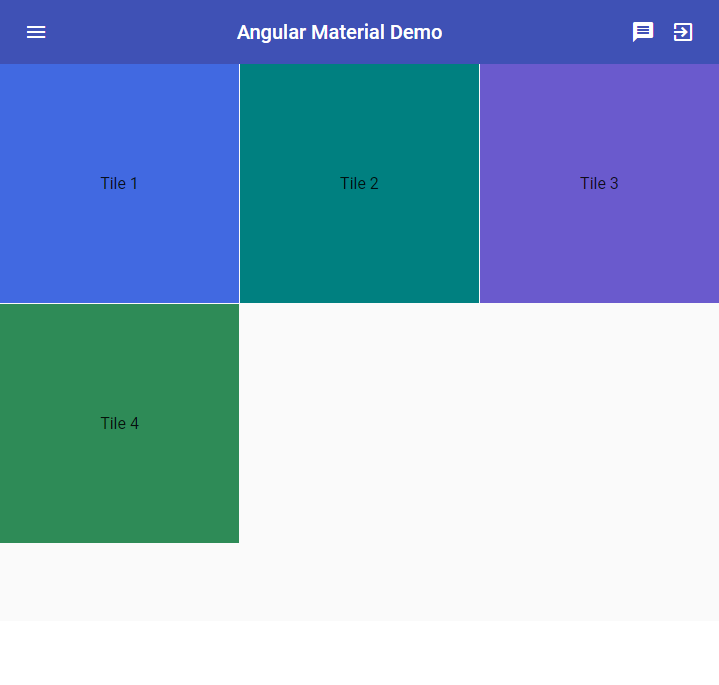
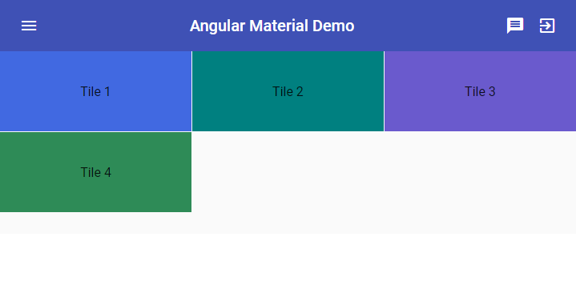
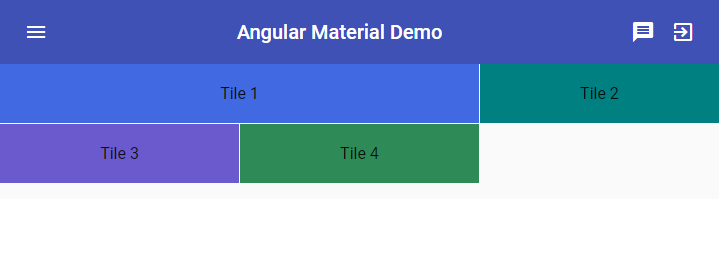
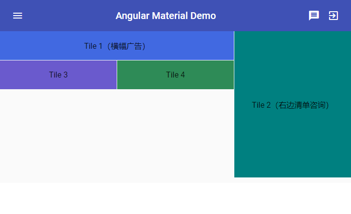
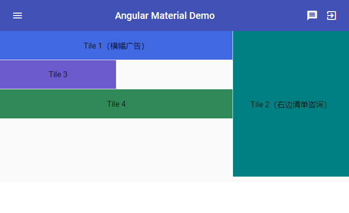
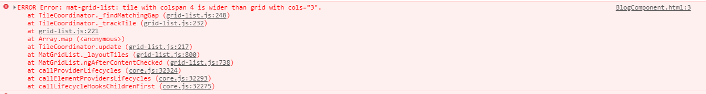
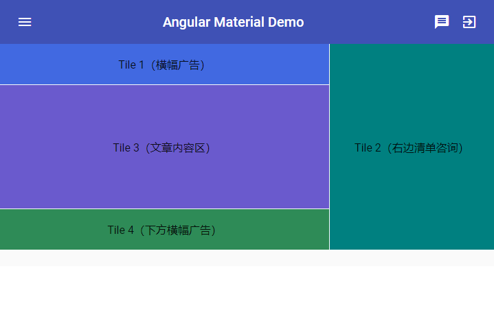
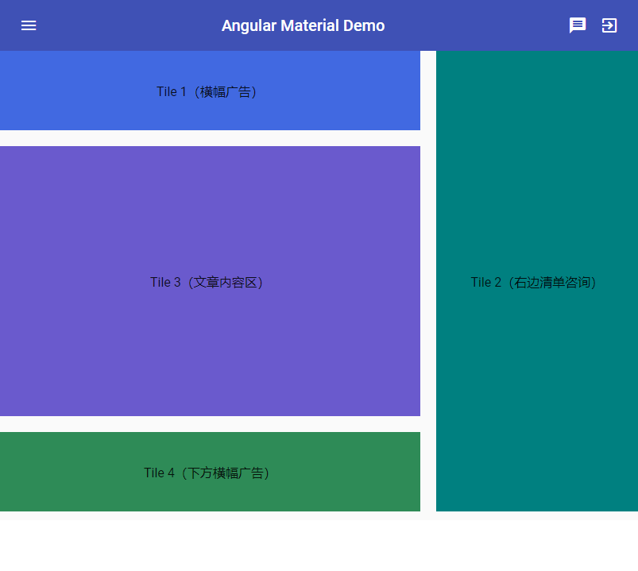

# 设计一个部落格 - Grid List

今天我们来看看在 Material Design 其中一种显示清单资料的方法 —— Grid List，以及 Angular Material 中如何实现应用这样的方法，将一个简易的部落格版型给切出来！

## 关于 Material Design 中的 Grid List

在 [Material Design 的 Grid List 设计指南](https://material.io/components/image-lists/#)中，Grid List 是一种用**网格**呈现重复性资料方式，可以想象成是用来放置多组类似的组件容器，**具有水平和垂直的排列组合**，来呈现资料。由于有水平和垂直的排列组合，我们也可以想象 Grid List 是一种类似表格式的排版（当然不是真的用 `<table>` 去排版）。

 

Grid List 使用的是网络的概念，每一个格子称之为 Cell，Tile 则代表用来放置内容的容器，且一个 Tile 是可以横跨多个 Cells 的。

 

## 开始使用 Angular Material 的 Grid List

在 Angular Material 中 Grid List 主要由 2 个组件组件，分别是：

- `<mat-grid-list>`：用来设置 Grid List 的基本状态
- `<mat-grid-tile>`：放置在 `<mat-grid-list>` 中，代表一个又一个的 tile，我们可以在 `<mat-grid-list>` 中设置它会横跨几个垂直或水平的 cell。

只需要加入 `MatGridListModule`，就可以开始使用 Grid List 的功能：

*src\app\shared-material\shared-material.module.ts*

```typescript
@NgModule({
  exports: [
    MatGridListModule,
    ...
  ]
})
export class SharedMaterialModule {}
```

虽然 Grid List 适合用来放置复杂的清单资料，但也很适**合当做一个排版系统来使用**，虽然针对排版 Angular 也有一套 `angular/flex-layout` 可以使用，但 Angular Material 的 Grid List 概念相对简单，而且使用上非常贴近我们熟悉的 Table，虽然功能没那么强大，但基本的排版可以说是完全没有问题。下面我们介绍时会把它当做排版系统。

### 使用 mat-grid-list

所有的 Grid List 都是使用 `<mat-grid-list>` 作为 起手式，而 `<mat-grid-list>` 至少需要设置一个参数：`cols`，代表这个 Grid List 会有几个栏位资料。

*src\app\dashboard\blog\blog.component.html*

```html
<mat-grid-list cols="3">
  <mat-grid-tile style="background: royalblue;">Tile 1</mat-grid-tile>
  <mat-grid-tile style="background: teal;">Tile 2</mat-grid-tile>
  <mat-grid-tile style="background: slateblue;">Tile 3</mat-grid-tile>
</mat-grid-list>

```

这里设置 `cols="3"`，`<mat-grid-list>`会自动占满可以使用的宽度，然后平均分成 3 等分（cell）。接着我们可以在里面放置`<mat-grid-tile>`，代表每一个资料呈现的区块，`<mat-grid-list>`会依照 `cols` 的设定，决定每列放置多少个 `<mat-grid-tile>`。

 

可以看到每个 `<mat-grid-tile>`所占的宽度为 1/3，因此第 4 个 tile 就会被放置到第 2 列（row）上，一个基本的Grid List 就完成了。

### 在 mat-grid-list 中使用 rowHeight 设置每列高度

`<mat-grid-list>`会依照 `col` 的设置来**切割cell，此时每个 cell 的宽度会平均**，假设`<mat-grid-list>`占满宽度后是 `300px`，此时每个 cell 的宽度就是 `100px`，同时 `<mat-grid-list>` 也会将高度视为 `100px`，**成为一个正方形**，这么一来**屏幕越宽，每个 cell 的高度就越高**，这样的高度未必是我们想要的，因此我们可以设置 `rowHeight` 来控制高度。

例如，每列高度是 `100px`，可以如下设置：

*src\app\dashboard\blog\blog.component.html*

```html
<mat-grid-list cols="3" rowHeight="100px">
  <mat-grid-tile style="background: royalblue;">Tile 1</mat-grid-tile>
  <mat-grid-tile style="background: teal;">Tile 2</mat-grid-tile>
  <mat-grid-tile style="background: slateblue;">Tile 3</mat-grid-tile>
  <mat-grid-tile style="background: seagreen;">Tile 4</mat-grid-tile>
</mat-grid-list>

```

 

除此之外，我们也可以给予一个比例的字串，来决定宽跟高的比例，这时候高度就会依照目前 tile 的宽度自动去计算：

*src\app\dashboard\blog\blog.component.html*

```html
<!-- rowHeight：宽高比例 -->
<mat-grid-list cols="3" rowHeight="4:1">
  <mat-grid-tile style="background: royalblue;">Tile 1</mat-grid-tile>
  <mat-grid-tile style="background: teal;">Tile 2</mat-grid-tile>
  <mat-grid-tile style="background: slateblue;">Tile 3</mat-grid-tile>
  <mat-grid-tile style="background: seagreen;">Tile 4</mat-grid-tile>
</mat-grid-list>
```

 

### 使用 rowspan 和 colspan 设置 mat-grid-tile 所占的 cell

一个 tile 可以水平和垂直的跨越多个 cell，在 Angular Material 中我们可以设置 `<mat-grid-tile>` 的 `rowspan` 和 `colspan` （默认值都为1）来控制每个 tile 跨越的列和栏。

> 很眼熟？没错！就是和 table 的 `rowspan` 和 `colspan` 是一样的概念，只是使用 table 排版是众所周知的罪恶！而 `<mat-grid-list>` 中所使用过的排版系统是 flex，但是排版起来容易理解

下面我们来做一下调整：

首先将原来的 Tile 1 当做广告横幅，因此要横向跨越 2 个 cell（也就是 `colspan`）

*src\app\dashboard\blog\blog.component.html*

```html
<!-- colspan：横向跨越 2 -->
<mat-grid-list cols="3" rowHeight="4:1">
  <mat-grid-tile style="background: royalblue;" colspan="2">Tile 1</mat-grid-tile>
  <mat-grid-tile style="background: teal;">Tile 2</mat-grid-tile>
  <mat-grid-tile style="background: slateblue;">Tile 3</mat-grid-tile>
  <mat-grid-tile style="background: seagreen;">Tile 4</mat-grid-tile>
</mat-grid-list>
```

 

此时 Tile 2 就被挤到最右边，正好可以当做是右边的最新文章等等的清单，让他垂直跨越 5 个 cell（也就是 `rowspan`）。

*src\app\dashboard\blog\blog.component.html*

```html
<!-- colspan：横向跨越 2 -->
<!-- rowspan：纵向跨越 5 -->
<mat-grid-list cols="3" rowHeight="4:1">
  <mat-grid-tile style="background: royalblue;" colspan="2">Tile 1（横幅广告）</mat-grid-tile>
  <mat-grid-tile style="background: teal;" rowspan="5">Tile 2（右边清单咨询）</mat-grid-tile>
  <mat-grid-tile style="background: slateblue;">Tile 3</mat-grid-tile>
  <mat-grid-tile style="background: seagreen;">Tile 4</mat-grid-tile>
</mat-grid-list>
```

 

接着我们先看 Tile 4，一样希望他是一个在最下面的横幅广告，因此让他跨越 2个 cell，程序代码如 Tile 1的设置：

*src\app\dashboard\blog\blog.component.html*

```html
<mat-grid-list cols="3" rowHeight="4:1">
  <mat-grid-tile style="background: royalblue;" colspan="2">Tile 1（横幅广告）</mat-grid-tile>
  <mat-grid-tile style="background: teal;" rowspan="5">Tile 2（右边清单咨询）</mat-grid-tile>
  <mat-grid-tile style="background: slateblue;">Tile 3</mat-grid-tile>
  <mat-grid-tile style="background: seagreen;" colspan="2">Tile 4</mat-grid-tile>
</mat-grid-list>
```

 

由于 Tile 2 垂直跨越 5 个 cell 的关系，导致第 2 列只剩下 2 个 cell 可以用，而原来的 Tile 3 已经占用 1 个 cell，所以占用 2 个 cell 的 Tile 2 无法放在 Tile 3 旁边，就被推到下方去了。

接着我们测试看看，在第二列只剩下 2 个 cell 可以用的情况下，设置 `colspan="3"` 会有什么结果：

*src\app\dashboard\blog\blog.component.html*

```html
<mat-grid-list cols="3" rowHeight="4:1">
  <mat-grid-tile style="background: royalblue;" colspan="2">Tile 1（横幅广告）</mat-grid-tile>
  <mat-grid-tile style="background: teal;" rowspan="5">Tile 2（右边清单咨询）</mat-grid-tile>
  <mat-grid-tile style="background: slateblue;" colspan="3">Tile 3</mat-grid-tile>
  <mat-grid-tile style="background: seagreen;" colspan="2">Tile 4</mat-grid-tile>
</mat-grid-list>
```

 

如果设置 `colspan="4"` 使其超过原来的 `cols="3"` 的设置呢？



结果是一片空白，然后跳出错误信息！

测试到此结束，让我们认真的设置 Tile 3，我们希望 Tile 3用来放置接下来部落格列表的资讯，我们可以合并使用 `colspan` 和 `rowspan` 填满剩下的空间！

*src\app\dashboard\blog\blog.component.html*

```html
<mat-grid-list cols="3" rowHeight="4:1">
  <mat-grid-tile style="background: royalblue;" colspan="2">Tile 1（横幅广告）</mat-grid-tile>
  <mat-grid-tile style="background: teal;" rowspan="5">Tile 2（右边清单咨询）</mat-grid-tile>
  <mat-grid-tile style="background: slateblue;" colspan="2" rowspan="3">
      Tile 3（文章内容区）
  </mat-grid-tile>
  <mat-grid-tile style="background: seagreen;" colspan="2">Tile 4（下方横幅广告）</mat-grid-tile>
</mat-grid-list>
```

 

### 使用 gutterSize 调整 cell 的间距

我们可以在 `<mat-grid-list>` 中使用 `gutterSize` 来调整每个 cell 之间的间距，可以使用 `px`、`em` 或 `rem`为单位。

*src\app\dashboard\blog\blog.component.html*

```html
<mat-grid-list cols="3" rowHeight="100px" gutterSize="20px">
  <mat-grid-tile style="background: royalblue;" colspan="2">Tile 1（横幅广告）</mat-grid-tile>
  <mat-grid-tile style="background: teal;" rowspan="5">Tile 2（右边清单咨询）</mat-grid-tile>
  <mat-grid-tile style="background: slateblue;" colspan="2" rowspan="3">
      Tile 3（文章内容区）
  </mat-grid-tile>
  <mat-grid-tile style="background: seagreen;" colspan="2">Tile 4（下方横幅广告）</mat-grid-tile>
</mat-grid-list>
```



### 为 mat-grid-tile 加上 header 与 footer

在每个 tile 内，我们可以使用 `<mat-grid-tile-header>` 和 `<mat-grid-tile-footer>`，为我们的 `<mat-grid-tile>` 加上 header 跟 footer：

*src\app\dashboard\blog\blog.component.html*

```html
<mat-grid-list cols="3" rowHeight="100px" gutterSize="20px">
  ...
  <mat-grid-tile style="background: teal;" rowspan="5">

    <mat-grid-tile-header>
      <h3 mat-line>功能清单</h3>
      <span mat-line>选择你要的</span>
      <mat-icon>list</mat-icon>
    </mat-grid-tile-header>

    <mat-grid-tile-footer>
      <span mat-line>Angular</span>
      <span mat-line>Vue</span>
      <span mat-line>React</span>
      <mat-icon>thumb_up</mat-icon>
    </mat-grid-tile-footer>
    Tile 2（右边清单讯息）
  </mat-grid-tile>
  ...
</mat-grid-list>
```

 