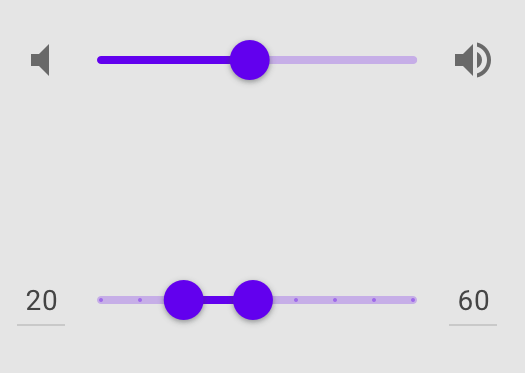
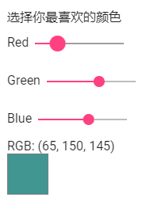
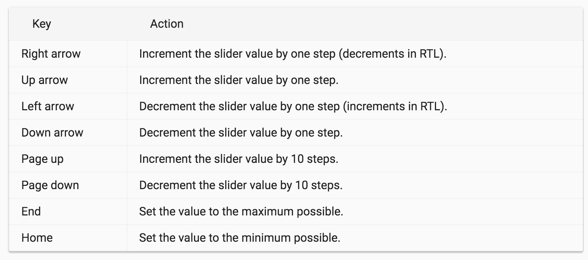
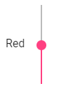
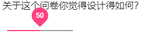
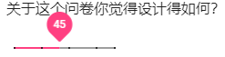

# 问卷页面 - Slider

今天要介绍目前 Angular Material 里关于 Form Control 的最后一个组件 —— Slider。

## 关于 Material Design 的 Slider

在 [Material Design 的 Sliders 设计指南](https://material.io/guidelines/components/sliders.html)中，Slider 是一个允许使用者针对某个目标调整其**强度**的功能，例如：音量、屏幕亮度等等，都很适合使用 Slider 来设计其功能，Slider 的两端代表强度的最大值和最小值，习惯上最大值在右边，而最小值在左边。

 

## 开始使用 Angular Material 的 Slider

我们可以 `MatSliderModule` 后，直接使用 `<mat-slider>` 组件。

*src\app\shared-material\shared-material.module.ts*

```typescript
@NgModule({
  exports: [
    MatSliderModule,
    ...
  ]
})
export class SharedMaterialModule {}
```

### 使用 mat-slider

 `<mat-slider>` 功能类似于 HTML 原生的 `<input type="range">`，我们一样可以使用 `min`、`max` 和 `step` 这些参数；接下来我们试着使用 `<mat-slider>` 自定义一个 RGB 颜色选择器，如下：

*src\app\dashboard\survey\survey.component.ts*

```typescript
export class SurveyComponent implements OnInit {
    
    get selectedColorRed() {
        return this.surveyForm.get('otherQuestions').get('favoriteColorRed').value;
    }
    get selectedColorGreen() {
        return this.surveyForm.get('otherQuestions').get('favoriteColorGreen').value;
    }
    get selectedColorBlue() {
        return this.surveyForm.get('otherQuestions').get('favoriteColorBlue').value;
    }
    get selectedColorStyle() {
        return `rgb(${this.selectedColorRed}, ${this.selectedColorGreen}, ${this.selectedColorBlue})`;
    }
    
    constructor(private httpClient: HttpClient) {
        
        this.surveyForm = new FormGroup({
            ...,
            otherQuestions: new FormGroup({
                favoriteColorRed: new FormControl(0),
                favoriteColorGreen: new FormControl(0),
                favoriteColorBlue: new FormControl(0),
            })
        });
    }
}
```

*src\app\dashboard\survey\survey.component.html*

```html
<!-- 使用 mat-slider -->
<section>
    <div>选择你最喜欢的颜色</div>
    <div>
        <span>Red</span>
        <mat-slider formControlName="favoriteColorRed" min="0" max="255" step="1"></mat-slider>
    </div>
    <div>
        <span>Green</span>
        <mat-slider formControlName="favoriteColorGreen" min="0" max="255" step="1"></mat-slider>
    </div>
    <div>
        <span>Blue</span>
        <mat-slider formControlName="favoriteColorBlue" min="0" max="255" step="1"></mat-slider>
    </div>
    <div>RGB: ({{ selectedColorRed }}, {{ selectedColorGreen }}, {{ selectedColorBlue }})</div>
    <div style="width: 50px; height: 50px; border: 1px solid gray;" 
         [ngStyle]="{ background: selectedColorStyle }"></div>
</section>
```

 

我们可以通过拖拽 `<mat-slider>`（Angular Material 8.x默认不可拖拽只能点击，9.x可以）来调整每个颜色的强度，另外也能使用键盘的上下左右键来调整数值，设置可以用 `PageDown`、`PageUp` 一次跳多一点数值，以及 `Home` 和 `End` 直接跳到起始或结束为止。

目前 `<mat-slider>` 可用的键盘对应如下：



### 调整 mat-slider 的垂直/水平方向

默认 `<mat-slider>` 是水平的，但我们可以通过设定 `vertical` 来改变成垂直的方向。

*src\app\dashboard\survey\survey.component.html*

```html
<div>
    <span>Red</span>
    <mat-slider formControlName="favoriteColorRed" min="0" max="255" step="1" vertical></mat-slider>
</div>
```

 

### 调整最大 / 最小值位置

默认情况下，最大值会放在右边，最小值在左边；但这个设置是可以被改变的，只要加上 `invert` 即可。

*src\app\dashboard\survey\survey.component.html*

```html
<div>
    <span>Green</span>
	<mat-slider formControlName="favoriteColorGreen" min="0" max="255" step="1" invert></mat-slider>
</div>
```

 

### 设置 thumbLabel

默认下，我们是看不到 `<mat-slider>` 选择的数字的，这样有时候不大方便，如果是一个给予评价的 Slider（例如：1 - 5颗星），总不会单纯的凭感觉去拖拽吧！这时候我们可以通过 `thumbLabel`，来显示一个目前数值的标志，如下：

*src\app\dashboard\survey\survey.component.html*

```html
<section>
    <div style="margin-bottom: 10px;">关于这个问卷你觉得设计得如何？</div>
    <mat-slider formControlName="surveyScore" min="0" max="100" step="5" thumbLabel></mat-slider>
</section>
```

 

### 设置 tickInterval

我们可以设置 `tickInterval`，替 `<mat-slider>` 显示一个刻度标示，让我们在选择时更加的有把握！我们给予一个 `tickInterval` 一个数值，代表每隔多少显示一个刻度标示；有一点需要特别注意的是，`tickInterval` 和 `step` 是有关系的，我们可以想象成是：**每步要移动几个数字（step），且每几步（tickInterval）放置一个标志（tick）**，因此假设我们设置每步移动 `5`，且每 `2` 步放一个标识，代表每移动 `10` 就会看到一个刻度。

另外我们也可以给一个字符串 `auto` 让 Angular Material 自己去算，这么一来 Angular Material 会在每 `30px` 替我们加上一个刻度。

*src\app\dashboard\survey\survey.component.html*

```html
<section>
    <div style="margin-bottom: 10px;">关于这个问卷你觉得设计得如何？</div>
    <mat-slider formControlName="surveyScore" min="0" max="100" step="5" thumbLabel 
                tickInterval="auto"></mat-slider>
</section>
```

 