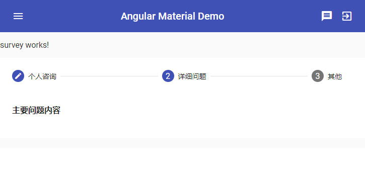
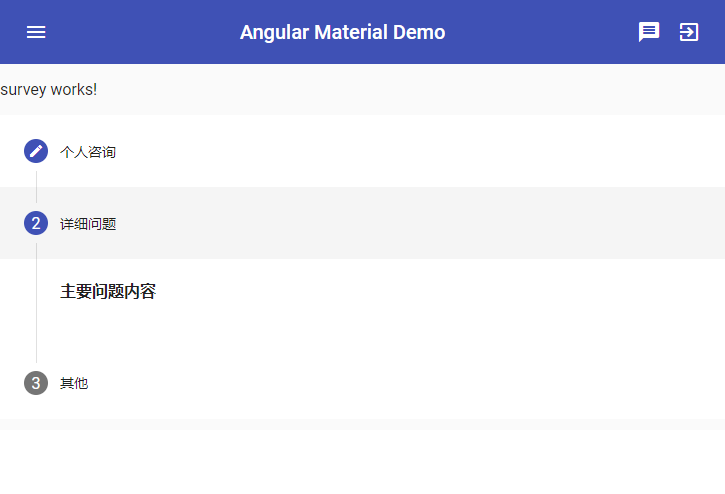
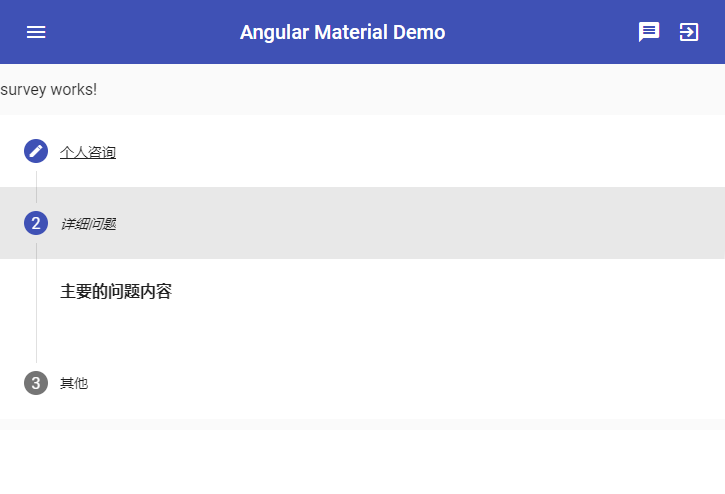
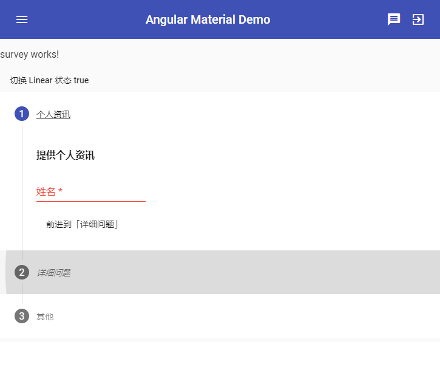
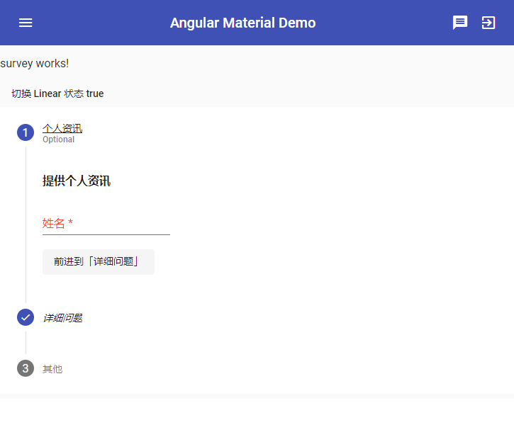
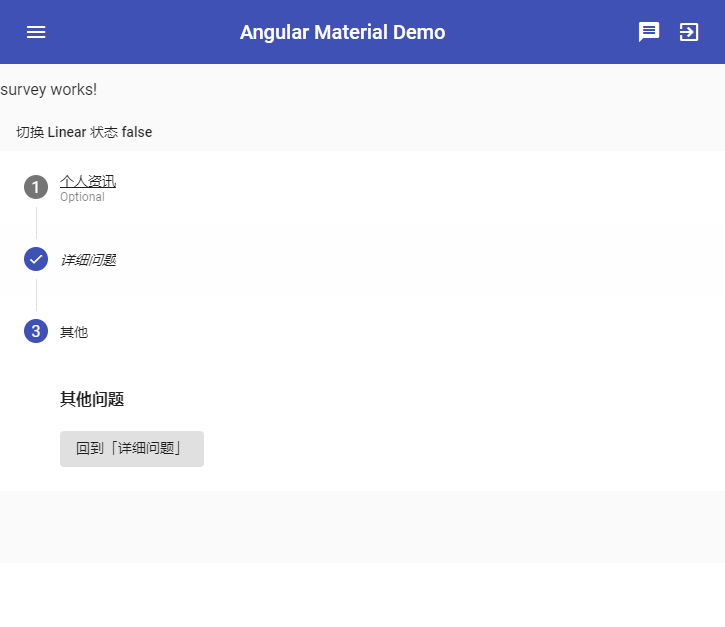
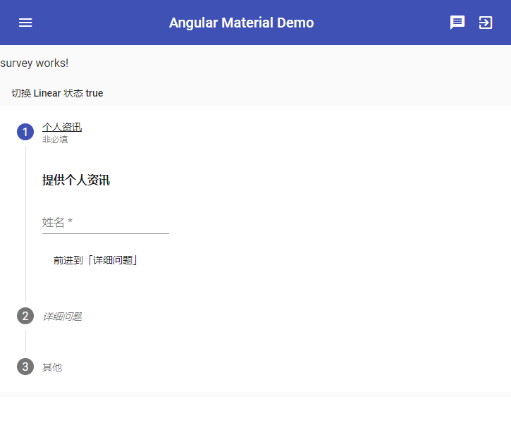

# 问卷页面 - Stepper

今天我们要使用 Angular Material 来制作一个问卷调查的页面，这个练习主要学习 Angular Material 的表单组件，在前端的世界里各式各样的表单是必须面临的一大议题！不过在介绍表单组件之前，我们先来介绍一个还蛮适合放在问卷页面的组件 —— Stepper。

## 关于 Material Design 中的 Stepper

在 [Material Design 的 Stepper 设计指南](https://material.io/design)中，Stepper 可以说是**操作群组化**的结果，我们可以将这些操作分成不同的群组，并且依照顺序变成几个进度，使用者可以依循这些进度完成所有步骤。

在许多组件的设计上，这也称作**精灵（Wizard）**，不管怎么称呼，这类组件的目标很加单，就是**引导使用者完成所有步骤，并得到完成步骤后的结果**。因此像是注册页面、问卷调查等等，都很适合使用这样的组件来设计，避免因为太多过程而混淆。

Stepper 也有许多不同的呈现模式，我们可以依照需要的不同来决定选择使用什么样的模式，例如：是否允许回去编辑上一步骤，或是否一定要依循页面的步骤去操作等等，都是设计上需要仔细考量的点。

## 开始使用 Angular Material 的 Stepper 组件

首先加入 `MatStepperModule`。

```typescript
@NgModule({
  imports: [
    MatStepperModule, ...
  ],
  exports: [
    MatStepperModule, ...
  ]
})
export class SharedMaterialModule { }
```

### 使用 mat-stepper

Stepper 基本上是一个水平或垂直的 Component 与一系列的 step 的组合，下面是一个水平的 Stepper：

*src\app\dashboard\survey\survey.component.html*

```html
<mat-horizontal-stepper>
  <mat-step label="个人咨询"><h4>提供个人咨询</h4></mat-step>
  <mat-step label="详细问题"><h4>主要问题内容</h4></mat-step>
  <mat-step label="其他"><h4>其他问题</h4></mat-step>
</mat-horizontal-stepper>

```

 

上述程序中，我们使用 `<mat-horizontal-stepper>` 作为一个水平 stepper 的容器，接着每一步骤都可以一个 `<mat-step>` 包装起来，对于每个步骤的基本标题文字则使用 `<mat-step>` 的 `label` 属性。

> 这个组件一样可以通过方向键、Tab 和 Enter 键来互动的。

### 改变 Stepper 排列方向

如果希望改为垂直排列，只需要将最外面的 `<mat-horizontal-stepper>` 改为 `<mat-vertical-stepper>` 即可，效果如下：

*src\app\dashboard\survey\survey.component.html*

```html
<mat-vertical-stepper>
  <mat-step label="个人咨询"><h4>提供个人咨询</h4></mat-step>
  <mat-step label="详细问题"><h4>主要问题内容</h4></mat-step>
  <mat-step label="其他"><h4>其他问题</h4></mat-step>
</mat-vertical-stepper>
```

 

### 设定复杂的 label

如果显示的 label 想要以比较复杂的方式呈现，可以在 `<mat-step>` 里加一个带有 `matStepLabel` directive 的 `<ng-template>` 元素。

*src\app\dashboard\survey\survey.component.html*

```html
<mat-vertical-stepper>
  <mat-step>
    <!-- label -->
    <ng-template matStepLabel><u>个人咨询</u></ng-template>
    <h4>提供个人咨询</h4>
  </mat-step>
  <mat-step>
    <!-- label -->
    <ng-template matStepLabel><em>详细问题</em></ng-template>
    <h4>主要的问题内容</h4>
  </mat-step>
  <mat-step label="其他">
    <h4>其他问题</h4>
  </mat-step>
</mat-vertical-stepper>

```

 

### 加上「上一步」和「下一步」按钮

我们可以在 `<mat-step>` 中使用按钮并通过 `matSepperNext` 和 `matStepperPrevious` 来动态切换不同的步骤：

*src\app\dashboard\survey\survey.component.html*

```html
<!-- 「上一步」和「下一步」 -->
<mat-vertical-stepper>
  <mat-step>
    <ng-template matStepLabel><u>个人资讯</u></ng-template><h4>提供个人资讯</h4>
    <button mat-button matStepperNext>前进到「详细问题」</button>
  </mat-step>
  <mat-step>
    <ng-template matStepLabel><em>详细问题</em></ng-template><h4>主要问题内容</h4>
    <button mat-button matStepperPrevious>后退到「个人资讯」</button>
    <button mat-button matStepperNext>前进到「其他」</button>
  </mat-step>
  <mat-step label="其他">
    <h4>其他问题</h4>
    <button mat-button matStepperPrevious>回到「详细问题」</button>
  </mat-step>
</mat-vertical-stepper>

```

 

### 设定 Linear Stepper

Stepper 有一个 `linear` 属性设定后，如果 step 内的表单是 `invalid` 的话，就会无法前进到下一步，这个设定比较复杂，且必须搭配表单验证（form validation）来处理，我们使用 ReactiveForm 来演示：

*src\app\shared-material\shared-material.module.ts*

```typescript
import {
  ...,
  MatStepperModule,
  MatFormFieldModule,
  MatInputModule
} from '@angular/material';


@NgModule({
  exports: [
    MatFormFieldModule,
    MatInputModule,
    MatStepperModule,
    ...
  ]
})
export class SharedMaterialModule { }

```

*src\app\dashboard\dashboard.component.ts*

```typescript
import { FormsModule, ReactiveFormsModule } from '@angular/forms';


@NgModule({
  declarations: [DashboardComponent, SurveyComponent],
  imports: [
    ...,
    ReactiveFormsModule,
    DashboardRoutingModule,
    ..
  ]
})
export class DashboardModule { }

```

*src\app\dashboard\survey\survey.component.ts*

```typescript
import { Component, OnInit } from '@angular/core';
import { FormGroup, Validators, FormControl } from '@angular/forms';

@Component({
  selector: 'app-survey',
  templateUrl: './survey.component.html',
  styleUrls: ['./survey.component.scss']
})
export class SurveyComponent implements OnInit {

  // 切换 linear 状态
  isLinear = true;

  basicFormGroup: FormGroup;

  constructor() {
    this.basicFormGroup = new FormGroup({
      name: new FormControl('', Validators.required)
    });
  }

  ngOnInit() {
  }

}

```

*src\app\dashboard\survey\survey.component.html*

```html
<!-- isLinear：step 包含 form -->
<button mat-button (click)="isLinear = !isLinear">切换 Linear 状态 {{ isLinear }}</button>
<mat-vertical-stepper [linear]="isLinear">
  <mat-step [stepControl]="basicFormGroup">
    <form [formGroup]="basicFormGroup">
      <ng-template matStepLabel><u>个人资讯</u></ng-template><h4>提供个人资讯</h4>
      <mat-form-field>
        <input type="text" name="name" matInput placeholder="姓名" formControlName="name" required>
      </mat-form-field>
    </form>
    <button mat-button matStepperNext>前进到「详细问题」</button>
  </mat-step>
  <mat-step>
    <ng-template matStepLabel><em>详细问题</em></ng-template><h4>主要问题内容</h4>
    <button mat-button matStepperPrevious>后退到「个人资讯」</button>
    <button mat-button matStepperNext>前进到「其他」</button>
  </mat-step>
  <mat-step label="其他">
    <h4>其他问题</h4>
    <button mat-button matStepperPrevious>回到「详细问题」</button>
  </mat-step>
</mat-vertical-stepper>

```

 

上面的程序中，先在 `<mat-step>` 中设定 `stepControl` 这个设定是用来让整个 step 知道要以哪个 form group 的 valid 状态来决定是否可以推进到下一步，接着里面就只是一般的 ReactiveForm 的设计了。

### 只用单一一个表单包含所有的 Step 状态

上面我们用一个 `<mat-step>` 对一个表单的方式，如果不喜欢我们可以使用一个大的表单包住所有的 Step 的方式来设计，只需要同时设计一个大的巢状 `FormGroup` 即可。

*src\app\dashboard\survey\survey.component.ts*

```typescript
import { Component, OnInit } from '@angular/core';
import { FormGroup, Validators, FormControl } from '@angular/forms';

@Component({
  selector: 'app-survey',
  templateUrl: './survey.component.html',
  styleUrls: ['./survey.component.scss']
})
export class SurveyComponent implements OnInit {

  // 切换 linear 状态
  isLinear = true;

  surveyForm: FormGroup;

  constructor() {
    this.surveyForm = new FormGroup({
      basicQuestions: new FormGroup({
        name: new FormControl('', Validators.required)
      })
    });
  }
}

```

*src\app\dashboard\survey\survey.component.html*

```html
<p>survey works!</p>

<button mat-button (click)="isLinear = !isLinear">切换 Linear 状态 {{ isLinear }}</button>

<!-- 一个 form 包含所有 step -->
<form [formGroup]="surveyForm">
  <mat-vertical-stepper [linear]="isLinear">
    <mat-step formGroupName="basicQuestions" [stepControl]="surveyForm.get('basicQuestions')">
      <ng-template matStepLabel><u>个人资讯</u></ng-template><h4>提供个人资讯</h4>
      <mat-form-field>
        <input type="text" name="name" matInput placeholder="姓名" formControlName="name" required>
      </mat-form-field>
      <button mat-button matStepperNext>前进到「详细问题」</button>
    </mat-step>
    <mat-step>
      <ng-template matStepLabel><em>详细问题</em></ng-template><h4>主要问题内容</h4>
      <button mat-button matStepperPrevious>后退到「个人资讯」</button>
      <button mat-button matStepperNext>前进到「其他」</button>
    </mat-step>
    <mat-step label="其他">
      <h4>其他问题</h4>
      <button mat-button matStepperPrevious>回到「详细问题」</button>
    </mat-step>
  </mat-vertical-stepper>
</form>

```

这里我们直接在最外面用一个 form 包起来并指定主要的 FormGroup，接着 `<mat-step>` 中指定内部的 `formGroupName`，及 `stepControl`，如此一来就可以用一个大的 model 涵盖所有的 step 的内容了！

### 设定 optional step

如果某个 step 不是必要的，我们可以在 `<mat-step>` 中设定 `optional` 属性，设定了这个属性后，会在这个 step 的 label 下出现一个灰色的 optional 提示。

> *不过如果有设定 `linear` 属性的话，只要在里面的 form group 是 invalid，依然会无法直接跳到下一步（毕竟 optional 只是参考用的）。*
>
> **经过试验 `linear` 设置为 true，可以不通过验证进入下一步。**

```html
<mat-step formGroupName="basicQuestions" [stepControl]="surveyForm.get('basicQuestions')" 
          optional>[optional]="true"
    ...
</mat-step>
```

 

### 设定 editable step

默认下，每个 step 都是可以被编辑的状态，不过若是希望这个状态不可以利用「上一步」切换回来编辑，可以设定 `editable="false"`

```html
<mat-step editable="false">
    <ng-template matStepLabel><em>详细问题</em></ng-template><h4>主要问题内容</h4>
	<button mat-button matStepperPrevious>后退到「个人资讯」</button>
	<button mat-button matStepperNext>前进到「其他」</button>
</mat-step>
```

 

### 自定义 optional label 文字内容

当 `<mat-step>` 加上 `optional`属性后，会显示一个灰色的英文 `optional` 文字标签，不过 Angular Material 可以调整文字内容，使用 `MatStepperIntl` 来设置 optional 文字内容，其中 `optionalLabel` 就是用来设置显示文字的 。

*src\app\dashboard\survey\survey.component.ts*

```typescript
import { Component, OnInit } from '@angular/core';
import { FormGroup, Validators, FormControl } from '@angular/forms';
import { MatStepperIntl } from '@angular/material';

export class MySteppIntl extends MatStepperIntl {
  optionalLabel = '非必填';
}

@Component({
  selector: 'app-survey',
  templateUrl: './survey.component.html',
  styleUrls: ['./survey.component.scss'],
  providers: [{ provide: MatStepperIntl, useClass: MySteppIntl }]
})
export class SurveyComponent implements OnInit {...}

```

 

这里我们只对 SurveyComponent 的 Stepper 去设定，如果希望能在所有组件使用到 Stepper 都用到的话，可以加在更外层的 Module 中。