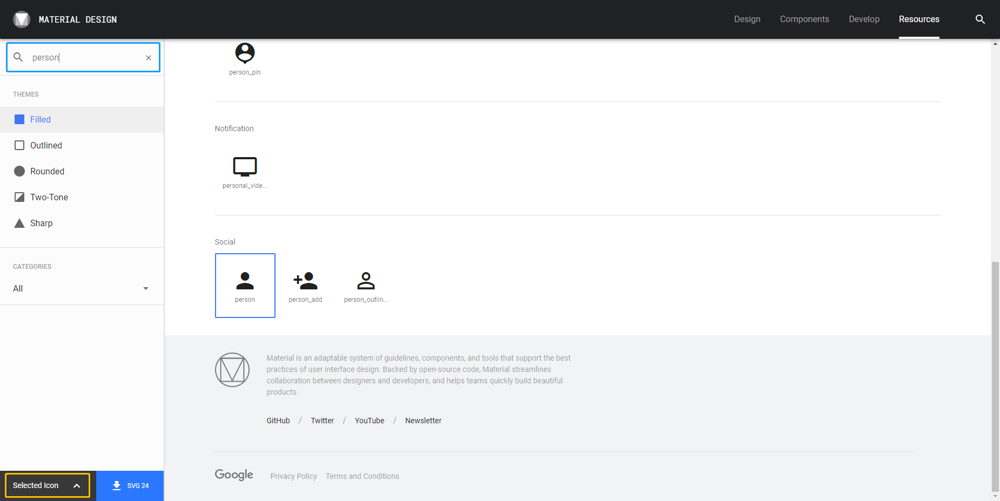
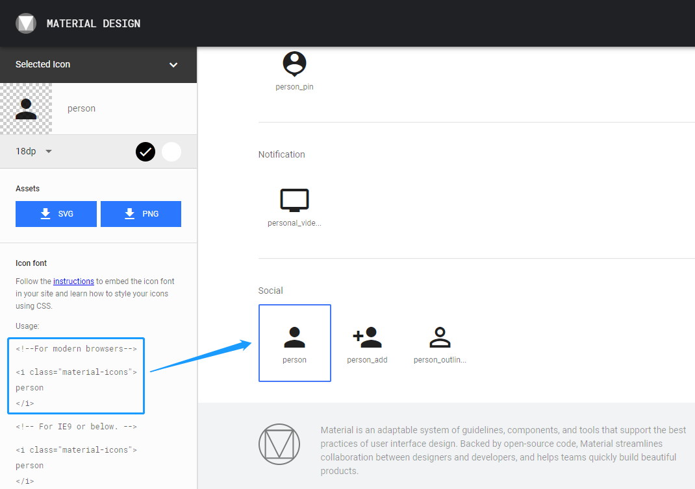
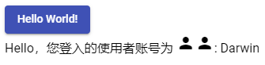
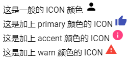
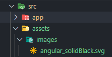
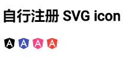
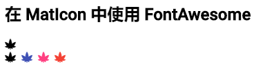

# MatIcon

官网：https://material.angular.cn/components/icon/overview

## 关于 Material Design 的 Icon

在 Material Design 这套设计语言里，将 Icon 分成 2 类：

- 产品 Icon（Product Icon）：象征着产品或服务的主要门面
- 系统 Icon（System Icon）：系统或服务里的操作行为的识别。

## 产品 Icon（Product Icon）

好的 Icon 可以让人轻松把你的产品跟 Icon 连接在一起，不好的 Icon 只会让人遗忘掉产品的存在，而 Material Design 在产品 Icon 的设计上面，给了很多建议，但是产品 Icon 不是 Angular Material 的重点，就不多做介绍，有兴趣的朋友可以看看 [Material Design 对于产品 Icon 的设计哲学跟建议](https://material.io/design/iconography/#icon-treatments)。

## 系统 Icon（System Icon）

系统 Icon 对于前段的 UI 至关重要，一套好的系统 Icon 可以完整说明系统的行为或状态，而不好的 Icon 加上没有适当的说明，就会让操作变得十分不畅。关于系统 Icon，Google 官方推出了一系列超过 900 个系统 Icons —— [Material Icons](https://material.io/resources/icons/?style=baseline)。

## 关于 Material Icons

Google 本身提供了超过 900 个系统 Icons，而且完全 Open Source，使用这些 Icon 很简单，加入 Material Icons 的CDN，在 Material Icons 官网上搜索想要的 icon，就可以得到这个 icon 所需要使用的语法。



 

*src\app\shared-material\shared-material.module.ts*

```typescript
import { NgModule } from '@angular/core';
import { MatButtonModule, MatIconModule } from '@angular/material';


@NgModule({
  imports: [MatButtonModule, MatIconModule],
  exports: [MatButtonModule, MatIconModule]
})
export class SharedMaterialModule { }

```

*src\app\app.component.html*

```html
<button mat-raised-button color="primary">Hello World!</button>

<div>
  Hello，您登入的使用者账号为
  <i class="material-icons">person</i>
  <mat-icon>person</mat-icon>: Darwin
</div>

```

 

## 关于 Angular Material 的 MatIcon

使用用 `<i class="material-icons">person</i>` 的方式来显示 Material Icon 本身已经很容易了，但对于像 Angular 这种以组件方式来开发时，这种 HTML Tag 就显得不够语义化，因此 Angular Material 在显示 Icon 上另外提供了一个组件 —— MatIcon。

使用 MatIcon，先加入 MatIconModule 到你使用的 Module 里面

```typescript
@NgModule({
  imports: [MatButtonModule, MatIconModule],
  exports: [MatButtonModule, MatIconModule]
})
export class SharedMaterialModule { }
```

MatIcon 的基本语法：

```html
<mat-icon>person</mat-icon>: Darwin
```

现在只要看到 `<mat-icon>` 就知道使用的是 Material Icon，同时以 Angular Material 为基础设计的组件，也能够有比较多的 Material Design 相关变化。

例如：预设的 MatIcon 会是我们加入的 theme 的文字颜色（currentColor），但我们可以很容易的透过 `cololr` 属性，来切换 icon 的颜色类型。

## 关于 Angular Material 的颜色简介

在[Material Design 的 System Color 指南](https://material.io/design/color/#tools-for-picking-colors)中，建议配色的选择为 2 种：

- 主要颜色（primary color）：主要的功能
- 次要颜色（secondary color）：强调可以选择的画面

另外在表单相关的组件上还加了**错误信息（error message）的颜色**。

在 Angular Material 的样式中将这三种颜色名称分别定义为：

- primary
- accent
- warn

在大部分的 Angular Material 组件中，我们可以通过 `color` 来切换这三种颜色：

*src\app\app.component.html*

```html
<div>
  这是加上 primary 颜色的 ICON
  <mat-icon color="primary">thumb_up</mat-icon>
</div>
<div>
  这是加上 accent 颜色的 ICON
  <mat-icon color="accent">info</mat-icon>
</div>
<div>
  这是加上 warn 颜色的 ICON
  <mat-icon color="warn">warning</mat-icon>
</div>
```

 

我们可以通过 CSS 来切换不同的颜色，不过在设计上这种事情尽量避免，Material Design 建议除了文字颜色和背景颜色以外，主要就使用这三种颜色，适当的搭配使用这三种颜色，可以让页面不至于发生颜色大爆炸，也能保持简单大方的设计样式，让使用者在操作时不容易被颜色搞混，这是很重要的概念！

## 使用 MatIconRegistry 扩充

MatIcon 除了能够直接使用 Material Icon 以外，还能通过 MatIconRegistry 来扩充 Icons。MatIconRegistry 具有 2 个功能：

- 直接在 MatIcon 中加入 SVG 文件
- 支持其他的 Icon Font

### 在 MatIcon 中使用 SVG

我们使用一张 SVG 图片作为示例，图标来源：[Angular 官网的 Preess Kit](https://angular.io/presskit)

在图片添加到目录：*src\assets\images\animations.svg*

 

然后注入 `MatIconRegistry` 及 `DomSanitizer`，由于 SVG icon 是在程序中通过路径加载的，为避免 XSS 攻击，比如通过 Angular 提供的 DomSanitizer service 来信任这个路径，如果你的图片放在网络上的其他来源，同时还需要注意 cors 的问题。

*src\app\app.component.ts*

```typescript
import { MatIconRegistry } from '@angular/material';
import { DomSanitizer } from '@angular/platform-browser';

@Component({
  selector: 'app-root',
  templateUrl: './app.component.html',
  styleUrls: ['./app.component.scss']
})
export class AppComponent implements OnInit {

  constructor(
    private matIconRegistry: MatIconRegistry,
    private domSanitizer: DomSanitizer
  ) { }

  ngOnInit(): void {
  }
}

```

另外为了能够在程序中下载指定 SVG 图片来扩展我们的 icon，还需要再加入 `HTTPClientModule`。

*src\app\app.module.ts*

```typescript
import { HttpClientModule } from '@angular/common/http';


@NgModule({
  declarations: [
    AppComponent
  ],
  imports: [
    ...
    HttpClientModule
  ],
  providers: [],
  bootstrap: [AppComponent]
})
export class AppModule { }
```

MatIconRegistry # addSvgIconInNamespace 方法有 3 个参数：

- namespace：icon 的 namespace，用来分类不同的 icons，避免命名冲突
- iconName：icon 名称
- url：图片路径

*src\app\app.component.ts*

```typescript
@Component({
  selector: 'app-root',
  templateUrl: './app.component.html',
  styleUrls: ['./app.component.scss']
})
export class AppComponent implements OnInit {

  constructor(
    private matIconRegistry: MatIconRegistry,
    private domSanitizer: DomSanitizer
  ) { }

  ngOnInit(): void {
    this.matIconRegistry.addSvgIconInNamespace(
      'custom-svg', 'angular',
      this.domSanitizer.bypassSecurityTrustResourceUrl('assets/images/angular_whiteTransparent.svg')
    );
  }
}
```

使用该方法就可以直接在页面中使用自定义 icon 了。更棒的是，只要 svg icon 里面没有特别设定任何颜色，我们就可以通过 `color` 属性来调整 svg icon 的颜色！

加入 svg icon 可以通过 MatIcon 的 `svgIcon` 属性来设定，必须依照 `[namespace]:[iconName]` 的方式来指定：

```html
<h2>自行注册 SVG icon</h2>
<div>
  <mat-icon svgIcon="custom-svg:angular"></mat-icon>
  <mat-icon svgIcon="custom-svg:angular" color="primary"></mat-icon>
  <mat-icon svgIcon="custom-svg:angular" color="accent"></mat-icon>
  <mat-icon svgIcon="custom-svg:angular" color="warn"></mat-icon>
</div>
```

 

### 在 MatIcon 中使用其他 Icon Font

除了自定义 svg icon 之外，还有许多现成的 icon font 可以使用，例如：知名的 [FontAwesome](https://fontawesome.com/)、[IconIcons](https://ionicons.com/) 等等，使用方式基本一致。

以 FontAwesome 为例，先在 `src\index.html` 中加入 FontAwesome 的CDN：

```html
<!-- crossorigin: 设置跨域请求 -->
<script src="https://kit.fontawesome.com/68564af61f.js" crossorigin="anonymous"></script>
```

MatIconRegistry # registerFontClassAlias 有 2 个参数：

- alias：原来 icon font class 的别名
- className：原来 icon font 的主要 class

*src\app\app.component.ts*

```typescript
import { Component, OnInit } from '@angular/core';
import { MatIconRegistry } from '@angular/material';
import { DomSanitizer } from '@angular/platform-browser';

@Component({
  selector: 'app-root',
  templateUrl: './app.component.html',
  styleUrls: ['./app.component.scss']
})
export class AppComponent implements OnInit {

  constructor(
    private matIconRegistry: MatIconRegistry,
    private domSanitizer: DomSanitizer
  ) { }

  ngOnInit(): void {
    ...
    
    this.matIconRegistry.registerFontClassAlias('fontawesome', 'fas');
  }
}

```

然后使用 MatIcon 来显示 FontAwesome，使用 Icon Font 需要设置 2 个属性：

- `fontSet`：注册的 `alias`
- `fontIcon`：真正要使用的 icon class

*src\app\app.component.html*

```html
<h2>在 MatIcon 中使用 FontAwesome</h2>
<i class="fas fa-cannabis"></i>
<div>
  <mat-icon fontSet="fontawesome" fontIcon="fa-cannabis"></mat-icon>
  <mat-icon fontSet="fontawesome" fontIcon="fa-cannabis" color="primary"></mat-icon>
  <mat-icon fontSet="fontawesome" fontIcon="fa-cannabis" color="accent"></mat-icon>
  <mat-icon fontSet="fontawesome" fontIcon="fa-cannabis" color="warn"></mat-icon>
</div>
```

 

