# 设计一个部落格 - Progress Bar、Progress Spinner

今天我们来介绍两个跟**显示进度**有关系的组件，分别是 Progress Bar 和 Progress Spinner，尽管这两个组件相对简单很多，但在 SPA 架构下，这两个组件可以说是非常核心的功能。

## 关于 Material Design 中的 Progress Bar 和 Progress Spinner

Progress Bar 和 Progress Spinner 被归纳在 [Material Design 的 Progress & activity 设计指南](https://material.io/components/progress-indicators/#)中，主要是用来提示使用者**内容正在读取中**，依照显示的位置不同，可以使用：

- 长条的显示（Progress Bar）
- 圆形的显示（Progress Spinner）

适合使用在读取（或重新整理）的资料时，告知使用者内容正在读取中。

依照使用场景不同，我们也能选择让使用者知道：

- 目前确定的进行（Determinate indicators）
- 显示不确定的进度（indeterminate indicators）

 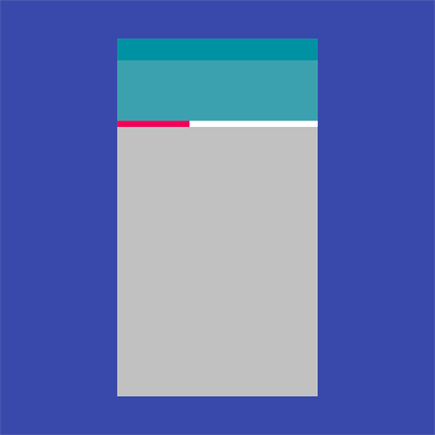

## 开始使用 Angular Material 的 Progress Bar

先从 Progress Bar 开始学习，加人 `MatProgressBarModule` 后，开始使用 Progress Bar 的相关功能。

*src\app\shared-material\shared-material.module.ts*

```typescript
@NgModule({
  exports: [
    MatProgressBarModule,
    ...
  ]
})
export class SharedMaterialModule {...}
```

### 使用 mat-progress-bar

在部落格旁边栏部分，放一个简单的 Progress Bar 看看，只需要加入 `<mat-progress-bar>` 就好。

*src\app\dashboard\blog\blog.component.html*

```html
<mat-grid-tile rowspan="22">

    <mat-grid-tile-header>
        ...
    </mat-grid-tile-header>

    <mat-grid-tile-footer>
        ...
    </mat-grid-tile-footer>

    <!-- progress：Tile 2（右边清单讯息） -->
    <div class="blog-sidebard-content">
        <h4>发文推进</h4>
        <mat-progress-bar></mat-progress-bar>
    </div>
</mat-grid-tile>
```

*src\app\dashboard\blog\blog.component.scss*

```scss
.blog-sidebard-content {
  align-self: flex-start;
  padding-top: 100px;
  width: 95%;
}

```

 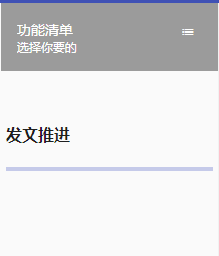

要显示进度，只需要设置 `value` 属性即可，这里没有 `min`、`max` 等属性可以设置，默认值就是 0 ~ 100，低于或超过都不会影响呈现的变化：

*src\app\dashboard\blog\blog.component.html*

```html
<div class="blog-sidebard-content">
    <h4>发文推进</h4>
    <mat-progress-bar value="85"></mat-progress-bar>
</div>
```

 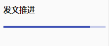

当数字在变化时，还能够看到动画效果：

*src\app\dashboard\blog\blog.component.ts*

```typescript
export class BlogComponent implements OnInit {
  progress = 85;
}
```

*src\app\dashboard\blog\blog.component.html*

```html
<div class="blog-sidebard-content">
    <h4>发文推进</h4>
    <mat-progress-bar [value]="progress"></mat-progress-bar>
    <button mat-raised-button (click)="progress = progress - 10">-10</button>
    <button mat-raised-button (click)="progress = progress + 10">+10</button>
</div>
```

 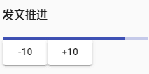

### 调整 mat-progess-bar 的模式

`<mat-progress-bar>` 有一个属性 `mode`，具有 4 种模式，分别代表不同的显示方式：

- **determinate**：默认值，依照 `value` 属性决定进度。

- **buffer**：除了原来的 `value` 以外还可以设置 `bufferValue` 属性，会在 `value` 和 `bufferValue` 之间多一块缓冲区，而空白的部分则会变成另一种效果的显示方式。

  *src\app\dashboard\blog\blog.component.html*

  ```html
  <h4>Buffer Progress Bar</h4>
  <mat-progress-bar mode="buffer" value="30" bufferValue="60"></mat-progress-bar>
  ```

   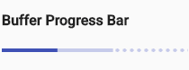

- **indeterminate**：代表不确定的进度，`value` 和 `bufferValue` 属性都不能使用，使用于进行等待的时候。

  *src\app\dashboard\blog\blog.component.html*

  ```html
  <h4>Indeterminate Progress Bar</h4>
  <mat-progress-bar mode="indeterminate"></mat-progress-bar>
  ```

   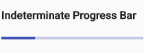

- **query**：和 indeterminate 一样，但进度的方向刚好相反，适合在 loading 之前的前置准备时使用，要进入 loading 时再调整成 `indeterminate `

  *src\app\dashboard\blog\blog.component.html*

  ```html
  <h4>Query Progress Bar</h4>
  <mat-progress-bar mode="query"></mat-progress-bar>
  ```

   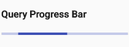

### 调整 Progress bar 的颜色

老规矩，只需要设置 `color` 为 `primary`、`accent` 和 `warn` 即可切换颜色。

```html
<h4>Primary</h4>
<mat-progress-bar mode="buffer" color="primary"></mat-progress-bar>

<h4>Accent</h4>
<mat-progress-bar mode="buffer" color="accent"></mat-progress-bar>

<h4>Warn</h4>
<mat-progress-bar mode="buffer" color="warn"></mat-progress-bar>
```

 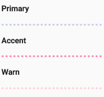

### 应用

由于是扁长型的显示方式，因此放在一些独立显示的组件，如 Card 下可以说是非常适合：

*src\app\dashboard\blog\blog.component.html*

```html

export class SharedMaterialModule {...}
```

*src\app\dashboard\blog\blog.component.html*

```html
<h4>Progress Spinner</h4>
<mat-progress-spinner [value]="progress"></mat-progress-spinner>
<button mat-raised-button (click)="progress = progress - 10">-10</button>
<button mat-raised-button (click)="progress = progress + 10">+10</button>
```

 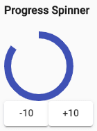

### 设置 mat-progress-spinner 的模式

`<mat-progress-spinner>` 的 `mode` 只有两个：

- **determine**：默认值，会通过 `value` 决定进度显示。

- **indeterminate**：代表进度不确定，会忽略 `value` 的设置。

  *src\app\dashboard\blog\blog.component.html*

  ```html
  <h4>Indeterminate Progress Spinner</h4>
  <mat-progress-spinner mode="indeterminate"></mat-progress-spinner>
  ```

   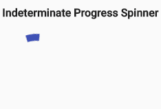

### 设置 mat-progress-spinner 的线条粗细

`<mat-progress-spinner>` 还有一个 `strokeWith` 属性，我们可以通过这个属性来调整它的线条宽度

*src\app\dashboard\blog\blog.component.ts*

```typescript
export class BlogComponent implements OnInit {
  strokeWidth = 1;
}
```


*src\app\dashboard\blog\blog.component.html*

```html
<h4>Spinner Stroke Width</h4>
<mat-progress-spinner value="60" [strokeWidth]="strokeWidth"></mat-progress-spinner>
<button mat-raised-button (click)="strokeWidth = strokeWidth - 1">-1</button>
{{ strokeWidth }}
<button mat-raised-button (click)="strokeWidth = strokeWidth + 1">+1</button>
```

 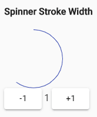

### 设置 mat-progress-spinner 的直径大小

除了线条宽度以外，通过 `diameter` 属性，我们也能调整圆圈的直径大小：

*src\app\dashboard\blog\blog.component.html*

```html
<h4>Spinner Stroke Width</h4>
<mat-progress-spinner value="60" [diameter]="diameter"></mat-progress-spinner>
<button mat-raised-button (click)="diameter = diameter - 10">-10</button>
{{ diameter }}
<button mat-raised-button (click)="diameter = diameter + 10">+10</button>
```

 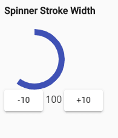

### 使用 mat-spinner

因为 `indeterminate` 模式在 spinner 实在太常用了，因此还有一个 `<mat-spinner>` 可以使用。

`<mat-spinner>` 可以想象成是 `<mat-progress-spinner mode="indeterminate">` 的缩写，因此不能额外设置 `mode` 和 `value`，不过 `strokeWidth` 和 `diameter` 依然也都可以设置：

*src\app\dashboard\blog\blog.component.html*

```html
<h4>Very Small Spinner</h4>
<mat-spinner [diameter]="50" [strokeWidth]="5"></mat-spinner>
```

 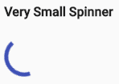

### 应用

Progress Spinner 由于体积较大的关系，通常会放置在预期有内容，但目前还没有显示的地方， 等到内容产生后再将其隐藏，例如我们可以在部落格文章读取完之前，先放上一个 Progress Spinner：

*src\app\dashboard\blog\blog.component.html*

```html
<!-- 置顶文章 loading -->
<ng-template #loading>
    <mat-grid-tile colspan="2">
        <mat-spinner></mat-spinner>
    </mat-grid-tile>
</ng-template>

<ng-container *ngIf="post$ | async as post; else loading">
    <!-- 置顶文章 -->
    <mat-grid-tile rowspan="2">
        <mat-card class="post-tile">
            <mat-card-title-group>
                <mat-card-title>置顶文章 1</mat-card-title>
                <mat-card-subtitle>2020/01/04</mat-card-subtitle>
                
            </mat-card-title-group>
            <mat-card-content>
                文章内容 1...
            </mat-card-content>
            <mat-card-actions>
                <button mat-button color="primary">继续阅读</button>
            </mat-card-actions>
        </mat-card>
    </mat-grid-tile>
    <mat-grid-tile rowspan="2">
        <mat-card class="post-tile">
            <mat-card-title-group>
                <mat-card-title>置顶文章 2</mat-card-title>
                <mat-card-subtitle>2020/02/04</mat-card-subtitle>
                
            </mat-card-title-group>
            <mat-card-content>
                文章内容 2...
            </mat-card-content>
            <mat-card-actions>
                <button mat-button color="primary">继续阅读</button>
            </mat-card-actions>
        </mat-card>
    </mat-grid-tile>

    <!-- 清单文章 -->
    <mat-grid-tile *ngFor="let post of post$ | async; let index = index" rowspan="6">
        <mat-card class="post-tile" [tabindex]="index">
            <mat-card-header>
                <mat-card-title>{{ post.title.substring(0, 15) }}...</mat-card-title>
                <mat-card-subtitle>User Id: {{ post.userId }}</mat-card-subtitle>
                
            </mat-card-header>
            
            <mat-card-content>{{ post.body.substring(0, 100) }}...</mat-card-content>
            <mat-card-actions align="end">
                <button mat-button color="primary">继续阅读</button>
                <button mat-button color="accent">编辑</button>
            </mat-card-actions>
            <mat-card-footer>
                Angular Material 系列
                <mat-progress-bar mode="indeterminate"></mat-progress-bar>
            </mat-card-footer>
        </mat-card>
    </mat-grid-tile>
</ng-container>
```

 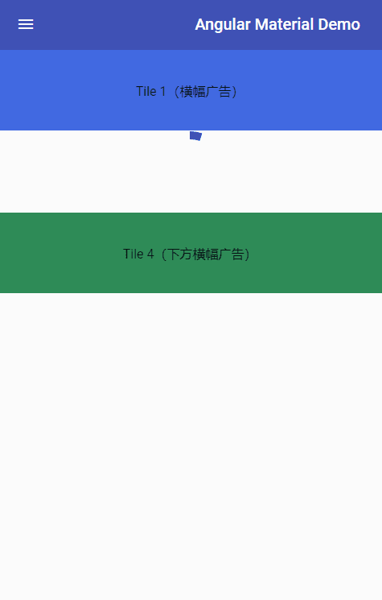