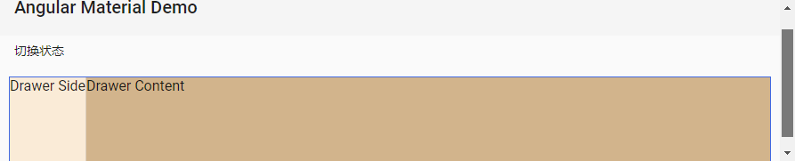
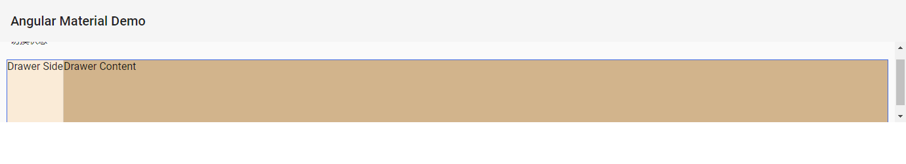
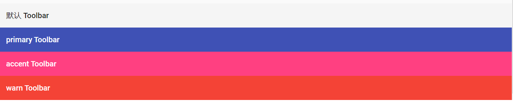
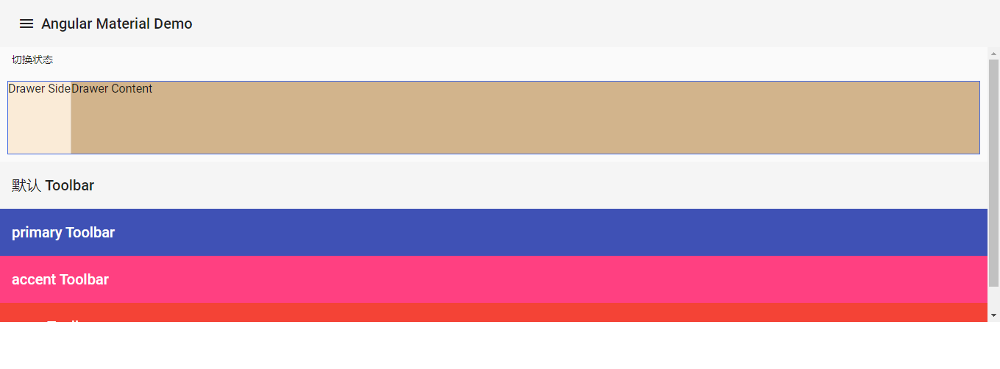
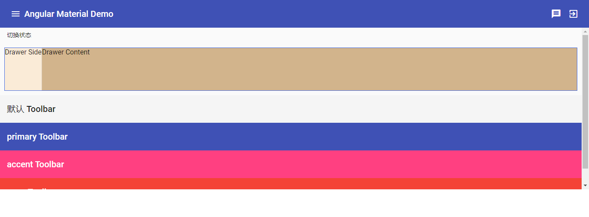
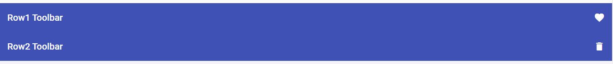

# 基本后台 - Toolbar

## Material Design 中的 Toolbar

在 [Material Design 的 Toolbar 设计指南](https://material.io/design/)中，Toolbar 通常会浮动在整个系统的正上方，所有的内容从 Toolbar 下方通过，除非是暂时性显示的组件如：dialog 等。我们可以把 Toolbar 当作整个系统的 header（或 footer）角色， 在这里放置 logo、标题和一些简单的执行操作等等。

## 开始使用 Angular Material 中的 Toolbar

引入 `MatToolbarModule`，使用`<mat-toolbar>` 在页面上呈现一个简单的 Toolbar。

*src\app\dashboard\dashboard.component.html*

```html
<mat-toolbar>
  <span>Angular Material Demo</span>
</mat-toolbar>

```



我们已经加入一个简单的 Toolbar 了，不过有点小小的问题，就是 Toolbar 没有浮动在页面的最上方，随着滚动条滚动而消失，所以需要修改一下样式：

*src\app\dashboard\dashboard.component.html*

```html
<mat-toolbar class="app-header">
  <span>Angular Material Demo</span>
</mat-toolbar>
<mat-sidenav-container class="app-container">
  <mat-sidenav #sideNav class="app-sidenav" mode="push">
    <div>我是左侧边栏菜单</div>
    <div>
      <button mat-raised-button color="warn" (click)="sideNav.toggle()">显示 / 隐藏</button>
    </div>
  </mat-sidenav>
  <mat-sidenav-content>
    <button mat-button (click)="sideNav.toggle()">切换状态</button>
    <mat-drawer-container>
      <mat-drawer mode="side" opened="true">Drawer Side</mat-drawer>
      <mat-drawer-content>Drawer Content</mat-drawer-content>
    </mat-drawer-container>
  </mat-sidenav-content>
</mat-sidenav-container>

```

*src\styles.scss*

```scss
/* You can add global styles to this file, and also import other style files */

html, body { height: 100%; }
body { margin: 0; font-family: Roboto, "Helvetica Neue", sans-serif; }

.app-header {
  position: fixed;
  z-index: 1;
}

.app-container, .app-sidenav {
  position: absolute;
  padding-top: 64px;
  height: calc(100vh - 64px);
}

```



## 设定 Toolbar 的样式

和其他 Angular Material 组件一样，可以通过 `color` 来改变 toolbar 的颜色：

```html
<mat-toolbar>默认 Toolbar</mat-toolbar>
<mat-toolbar color="primary">primary Toolbar</mat-toolbar>
<mat-toolbar color="accent">accent Toolbar</mat-toolbar>
<mat-toolbar color="warn">warn Toolbar</mat-toolbar>
```



## Toolbar 加上各种按钮

*src\app\dashboard\dashboard.component.html*

```html
<mat-toolbar class="app-header">
  <button mat-icon-button (click)="sideNav.toggle()">
    <mat-icon>{{ sideNav.opened ? 'close' : 'menu' }}</mat-icon>
  </button>
  <span>Angular Material Demo</span>
</mat-toolbar>
```




接着我们想在 toolbar 最右边加上一个登出按钮，如何将按钮推到最右边去？通过 CSS 就可以轻易实现，由于 Toolbar 内的排版是 flex，我们可以加入一个分隔用的空间，把空间后的内容都推到另外一边去。

*src\styles.scss*

```scss
.toolbar-seprator {
  flex: 1 1 auto;
}
```

接着在 toolbar 中加入这个分隔器

*src\app\dashboard\dashboard.component.html*

```html
<mat-toolbar color="primary" class="app-header">
  <button mat-icon-button (click)="sideNav.toggle()">
    <mat-icon>{{ sideNav.opened ? 'close' : 'menu' }}</mat-icon>
  </button>
  <span>Angular Material Demo</span>

  <span class="toolbar-seprator"></span>

  <button mat-icon-button>
    <mat-icon>message</mat-icon>
  </button>
  <button mat-icon-button>
    <mat-icon>exit_to_app</mat-icon>
  </button>
</mat-toolbar>
```



## 多行的 Toolbar

Toolbar 默认是单行的，在 `mat-toolbar` 中的内容默认都会在同一行显示，若在一行 toolbar 中放入太多资讯则可能会因为宽度有限的关系无法显示，这时候我们可以用多个 `<mat-toolbar-row>` 来设定多行的 toolbar。

*src\app\dashboard\dashboard.component.html*

```html
<mat-toolbar color="primary">
    <mat-toolbar-row>
        <span>第一行Toolbar</span>
        <span class="toolbar-seprator"></span>
        <mat-icon>favorite</mat-icon>
    </mat-toolbar-row>
    <mat-toolbar-row>
        第二行Toolbar
        <span class="toolbar-seprator"></span>
        <mat-icon>delete</mat-icon>
    </mat-toolbar-row>
</mat-toolbar>
```



乍看之下和用多个`<mat-toolbar>`很类似，但`<mat-toolbar-row>`本身是没有`color`可以设置的，而是跟随着`mat-toolbar`走，另外语法上也有所不同，在 CSS 比较复杂时，也可能造成页面错乱的问题，因此应该看情况决定使用。