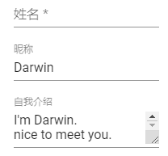
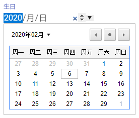
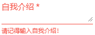
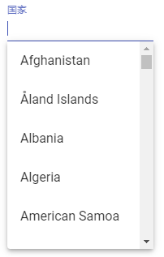
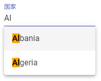
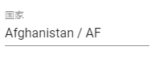
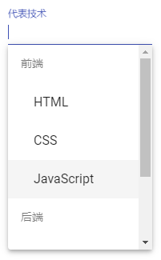

# 问卷页面 - Input、Autocomplete

下面我们来介绍 Material Design 中属于 Input，也就是文字输入框相关的功能，让我们来看看 Angular Material 的 Input、Autocomplete！

## Material Design 中的文字输入框

在 [Material Design的文字框设计指南](https://material.io/guidelines/components/text-fields.html)中，文字框就是提供使用者输入文字的一个空间，通常在表单中最常被使用。文字框可是单行或者多行，如果需要的话要提供能随着行数增加而增加的功能。另外，文字框也要能限制输入的格式，或提供选项来选择。

## 开始使用 Angular Material 的 Input

使用 Input 相关的功能，先引入 `MatInputModule`。另外，部分表单控制项，需要搭配 FormFiled 组件来使用，所以也要引入 `MatFormFieldModule`。

*src\app\shared-material\shared-material.module.ts*

```typescript
@NgModule({
  exports: [
    MatFormFieldModule,
    MatInputModule,
    ...
  ]
})
export class SharedMaterialModule { }
```

### 使用 matInput

`matInput` 是一个依附于 input 和 text 的表单基本组件上的 directive，所以我们只需在 input 或 textarea 中加入 `matInput` 这个 directive，即可替组件加上基本的 Material Design 样式，不过为了让 input 和 textarea 能更加具有意义，我们会在外面用 `<mat-form-field>` 包起来，这个 `<mat-form-field>` 可以替 input 和 textarea 等组件加上更有意义的信息，让操作更加容易。

*src\app\dashboard\survey\survey.component.html*

```html
<!-- matInput -->
<div>
    <mat-form-field>
        <input type="text" name="nickname" matInput placeholder="昵称">
    </mat-form-field>
</div>
<div>
    <mat-form-field>
        <textarea name="intro_self" matInput placeholder="自我介绍"></textarea>
    </mat-form-field>
</div>
```

 

`placeholder` 扮演了 `label` 的效果，而且默认会直接在输入框里（就跟一般的 placeholder 一样），但是当 focus 到里面时，placeholder 的内容就往上浮动成一个 label。

### matInput 支持的 input type

`matInput` 只是个 directive，使用上是直接加到相关的 input 或 textarea 元素中，因此我们依然可以使用所有已知的 input 或 textarea 的属性，来设定我们的输入框。

原生的 input type 基本上都支持，例如：

- date
- datetime-local
- email
- month
- number
- password
- search
- tel
- text
- time
- url
- week

```html
<div>
    <mat-form-field>
        <input type="date" name="birthday" matInput placeholder="生日">
    </mat-form-field>
</div>
```

 

### 使用 mat-hint 加上提示说明

有时候单使用 placeholder 属性可能无法说明输入框的意义，这时候可以使用 `<mat-hint>` 替输入框加上比较仔细地说明，例如：

```html
<div>
    <mat-form-field>
        <textarea name="intro_self" matInput placeholder="自我介绍"></textarea>
        <!-- matHint -->
        <mat-hint>简单介绍一下你的兴趣吧！</mat-hint>
    </mat-form-field>
</div>
```

 

### 使用 mat-error 加上错误信息提示

当文字框内容有问题时，需要提示错误信息时，可以用 `<mat-error>` 来显示错误信息，代码如下：

*src\app\dashboard\survey\survey.component.ts*

```typescript
@Component({
  selector: 'app-survey',
  templateUrl: './survey.component.html',
  styleUrls: ['./survey.component.scss'],
  providers: [{ provide: MatStepperIntl, useClass: MySteppIntl }]
})
export class SurveyComponent implements OnInit {

  constructor() {
    this.surveyForm = new FormGroup({
      basicQuestions: new FormGroup({
        name: new FormControl('', Validators.required),
        intro: new FormControl('', Validators.required)
      })
    });
  }
}

```

*src\app\dashboard\survey\survey.component.html*

```html
<div>
    <mat-form-field>
        <textarea name="intro_self" matInput placeholder="自我介绍" formControlName="intro" required>
        </textarea>
        <!-- matHint -->
        <mat-hint>简单介绍一下你的兴趣吧！</mat-hint>
        <!-- matError -->
        <mat-error>请记得输入自我介绍！</mat-error>
    </mat-form-field>
</div>
```

 

只要同一个 `<mat-form-field>` 区间里面的输入框有错误，这个错误信息就会跳出来。

假如我们希望针对不同的错误跳出不同的信息，只需使用 `ngIf` 或 `ngSwitch` 来依照错误类型来决定显示即可：

*src\app\dashboard\survey\survey.component.ts*

```typescript
@Component({
  selector: 'app-survey',
  templateUrl: './survey.component.html',
  styleUrls: ['./survey.component.scss'],
  providers: [{ provide: MatStepperIntl, useClass: MySteppIntl }]
})
export class SurveyComponent implements OnInit {

  constructor() {
    this.surveyForm = new FormGroup({
      basicQuestions: new FormGroup({
        name: new FormControl('', Validators.required),
        intro: new FormControl('', [Validators.required, Validators.minLength(10)])
      })
    });
  }
}

```

*src\app\dashboard\survey\survey.component.html*

```html
<div>
    <mat-form-field>
        <textarea name="intro_self" matInput placeholder="自我介绍" formControlName="intro" required>
        </textarea>
        <!-- matHint -->
        <mat-hint>简单介绍一下你的兴趣吧！</mat-hint>
        <!-- matError -->
        <mat-error *ngIf="surveyForm.get('basicQuestions').get('intro').hasError('required')">
            请记得输入自我介绍！
        </mat-error>
        <mat-error *ngIf="surveyForm.get('basicQuestions').get('intro').hasError('minlength')">
            至少输入 10 个字吧！
        </mat-error>
    </mat-form-field>
</div>
```

 

### 自己控制错误显示的时机

默认情况下，错误提示的时机必须符合dirty、touched 和 invalid 的状态，才会显示错误信息，因此以刚刚的状况来说，我们在一开始输入文字时，由于符合 dirty 和 invalid 的状态，但因为第一次进入不会是 touched 状态，因此一开始不会立刻显示错误信息，而是在离开输入框，状态也变更为 touched 后，才会显示错误。

如果希望自己决定错误提示的时机，可以实现 `ErrorStateMatcher` 的 `isErrorState` 方法，来决定何时显示，返回 true 代表显示；并在 input 的 `errorStateMatcher`（加上 `matInput` 扩展功能）指定我们自订的 matcher 即可，来看下下面的例子：

*src\app\dashboard\survey\survey.component.ts*

```typescript
export class EarlyErrorStateMatcher implements ErrorStateMatcher {

  isErrorState(control: FormControl, form: FormGroupDirective | NgForm): boolean {
    const isSubmitted = form && form.submitted;
    return control && control.invalid && control.dirty;
  }
}

@Component({
  selector: 'app-survey',
  templateUrl: './survey.component.html',
  styleUrls: ['./survey.component.scss'],
  providers: [{ provide: MatStepperIntl, useClass: MySteppIntl }]
})
export class SurveyComponent implements OnInit {

  // 切换 linear 状态
  isLinear = true;

  surveyForm: FormGroup;

  earlyErrorStateMatcher = new EarlyErrorStateMatcher();
}
```

*src\app\dashboard\survey\survey.component.html*

```html
<div>
    <mat-form-field>
        <!-- ErrorStateMatcher -->
        <textarea name="intro_self" matInput placeholder="自我介绍" formControlName="intro" required
                  [errorStateMatcher]="earlyErrorStateMatcher"></textarea>
        <!-- matHint -->
        <mat-hint>简单介绍一下你的兴趣吧！</mat-hint>
        <!-- matError -->
        <mat-error *ngIf="surveyForm.get('basicQuestions').get('intro').hasError('required')">
            请记得输入自我介绍！
        </mat-error>
        <mat-error *ngIf="surveyForm.get('basicQuestions').get('intro').hasError('minlength')">
            至少输入 10 个字吧！
        </mat-error>
    </mat-form-field>
</div>
```

 

当我们输入内容时，立即符合了我们自订的 matcher 规则，所以不用等到移出焦点编程 touched 状态，就会提早显示错误信息了！

如果要在全区域的范围套用这个规则，可以在 providers 中注入这个 macher

*src\app\dashboard\survey\survey.component.ts*

```typescript
@Component({
  selector: 'app-survey',
  templateUrl: './survey.component.html',
  styleUrls: ['./survey.component.css'],
  providers: [{ provide: MatStepperIntl, useClass: TwStepperIntl }, { provide: ErrorStateMatcher, useClass: EarlyErrorStateMatcher }]
})
export class SurveyComponent implements OnInit {}
```

### 使用 matTextareaAutosize 自动调整大小的 textarea

我们可以为 textarea 加上自动调整大小功能，只需要加入 `matTextareaAutoSize` 这个 directive 即可：

```html
<textarea name="intro_self" matInput placeholder="自我介绍" formControlName="intro" required
                    matTextareaAutosize></textarea>
```

 

## 开始使用 Angular Material 的 Autocomplete

要使用 Input 的 Autocomplete 相关功能，首先需要加入 `MatAutocompleteModule`。

*src\app\shared-material\shared-material.module.ts*

```typescript
@NgModule({
  exports: [
    MatAutocompleteModule,
    ...
  ]
})
export class SharedMaterialModule { }
```

### 使用 mat-autocomplete

下面来看 Autocomplete 的功能，在这边我们希望能完成一个「国家」的输入框，并且能够依照输入的内容选择自动完成的清单：

*src\app\app.module.ts*

```typescript
@NgModule({
  declarations: [
    AppComponent
  ],
  imports: [
    BrowserModule,
    AppRoutingModule,
    BrowserAnimationsModule,
    HttpClientModule
  ],
  providers: [],
  bootstrap: [AppComponent]
})
export class AppModule { }
```

*src\app\dashboard\survey\survey.component.ts*

```typescript
@Component({
  selector: 'app-survey',
  templateUrl: './survey.component.html',
  styleUrls: ['./survey.component.scss'],
  providers: [
    { provide: MatStepperIntl, useClass: MySteppIntl },
    { provide: ErrorStateMatcher, useClass: EarlyErrorStateMatcher }
  ]
})
export class SurveyComponent implements OnInit {

  // 切换 linear 状态
  isLinear = true;

  surveyForm: FormGroup;

  earlyErrorStateMatcher = new EarlyErrorStateMatcher();

  countries$: Observable<any[]>;

  constructor(private httpClient: HttpClient) {
    this.surveyForm = new FormGroup({
      basicQuestions: new FormGroup({
        name: new FormControl('', Validators.required),
        intro: new FormControl('', [Validators.required, Validators.minLength(10)]),
        country: new FormControl('')
      })
    });
  }

  ngOnInit() {
    this.countries$ = this.httpClient.get<any[]>('assets/countries.json');
  }

}
```

*src\app\dashboard\survey\survey.component.html*

```html
<!-- 使用 mat-autocomplete -->
<div>
    <mat-form-field>
        <input type="text" name="country" matInput placeholder="国家" formControlName="country" 
               [matAutocomplete]="countries">
    </mat-form-field>
    <mat-autocomplete #countries="matAutocomplete">
        <mat-option *ngFor="let country of countries$ | async" [value]="country.code">
            {{ country.name }}
        </mat-option>
    </mat-autocomplete>
</div>
```

 

从上面的代码，我们使用 2 种组件，一个是文字输入框，使用简单的 input；一个是 Autocomplete 清单，使用 `<mat-autocomplete>` 以及 `<mat-option>` 的组合来简历这组清单。并把清单数据存档 *src\assets\countries.json* 中，然后再组件中使用 `HTTPClient` 抓取清单数据。最后，在页面上设置 input 的 `matAutocomplete` 属性，指定 autocomplete 的来源。

### 过数据料来源

我们可能会希望过滤已经输入的内容，避免从冗长的清单中选取，由于我们目前使用的是 ReactiveForm，因此我们可以使用 `valueChanges`，在资料变更时重新筛选要列出的清单：

```typescript
ngOnInit() {
    this.surveyForm
        .get('basicQuestions').get('country')
        .valueChanges.pipe(debounceTime(300)).subscribe(value => {
          this.countries$ = this.httpClient.get('assets/countries.json').pipe(map((countries: any[]) => {
            const list = countries.filter(country => country.name.indexOf(value) >= 0);
            return list;
          }));
        });
  }
```

另外，我们可以把已经过滤的资料内容做点修饰，依照我们输入的内容变成粗体显示：

```typescript
highlightFiltered(countryName: string) {
    const inputCountry = this.surveyForm.get('basicQuestions').get('country').value;
    return countryName.replace(inputCountry, `<span class="autocomplete-highlight">${inputCountry}</span>`);
  }
```

在 *src\styles.scss* 中加入样式：

```scss
.autocomplete-highlight {
    font-weight: bold;
    background: orange;
}
```

> 由代码生成的元素所带的样式都会出现在页面上，样式属于全局

最后调整页面：

```html
<!-- 使用 mat-autocomplete -->
<div>
    <mat-form-field>
        <input type="text" name="country" matInput placeholder="国家" formControlName="country" 
               [matAutocomplete]="countries">
    </mat-form-field>
    <mat-autocomplete #countries="matAutocomplete">
        <mat-option *ngFor="let country of countries$ | async" [value]="country.code">
            <!-- {{ country.name }} -->
            <span [innerHTML]="highlightFiltered(country.name)"></span>
        </mat-option>
    </mat-autocomplete>
</div>
```

 

### 通过 displayWith 决定最终显示内容

我们可以通过设置 `<mat-autocomplete>` 的 `displayWith` 属性来指定一个 function，这个 function 可以改变要显示的内容：

*src\app\dashboard\survey\survey.component.ts*

```typescript
displayCountry(country: any) {
    if (country) {
        return `${country.name} / ${country.code}`;
    }
    return '';
}
```

*src\app\dashboard\survey\survey.component.html*

```html
<mat-form-field>
    <input type="text" name="country" matInput placeholder="国家" formControlName="country" 
           [matAutocomplete]="countries">
</mat-form-field>
<mat-autocomplete #countries="matAutocomplete" [displayWith]="displayCountry">
    <mat-option *ngFor="let country of countries$ | async" [value]="country">
        <span [innerHTML]="highlightFiltered(country.name)"></span>
    </mat-option>
</mat-autocomplete>
```

这里 我们把原来的 `[value]` 改为传入整个 country 数据，好让 `displayWith` 指定的 function 可以通过选择的数据决定文字呈现的内容。

 

可以看到在选择完国家后，通过 `displayWith`，我们自动为选择的内容加上了国家的编码。

### 使用 mat-optgroup 显示分组数据

`<mat-option>` 既然是清单型的选项资料，有个 `<mat-optgroup>` 作为分组好像也是合理的事，使用起来和 select 的 optgroup 大同小异。

*src\app\dashboard\survey\survey.component.ts*

```typescript
export class SurveyComponent implements OnInit {
    
  majorTechList: any[];
    
  constructor(private httpClient: HttpClient) {
     this.majorTechList = [
      {
        name: '前端', items: ['HTML', 'CSS', 'JavaScript']
      },
      {
        name: '后端', items: ['Java', 'NodeJS', 'Go']
      }
    ];
  }
}
```

*src\app\dashboard\survey\survey.component.html*

```html
<!-- 使用 mat-optgroup 显示分组数据 -->
<div>
    <mat-form-field>
        <input type="text" name="majorTech" matInput placeholder="代表技术" formControlName="majorTech"
               [matAutocomplete]="majorTeches">
    </mat-form-field>
    <mat-autocomplete #majorTeches="matAutocomplete">
        <mat-optgroup *ngFor="let majorTech of majorTechList" [label]="majorTech.name">
            <mat-option *ngFor="let item of majorTech.items" [value]="item">
                {{ item }}
            </mat-option>
        </mat-optgroup>
    </mat-autocomplete>
</div>
```

 