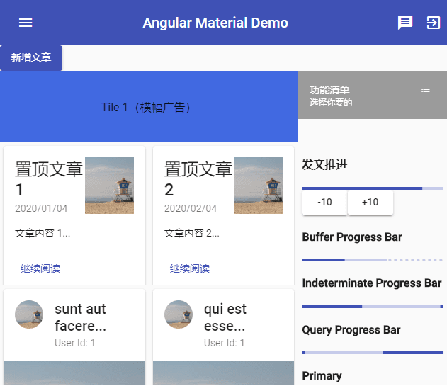
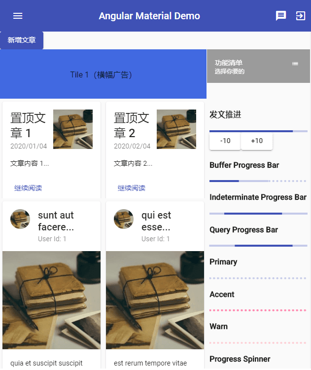
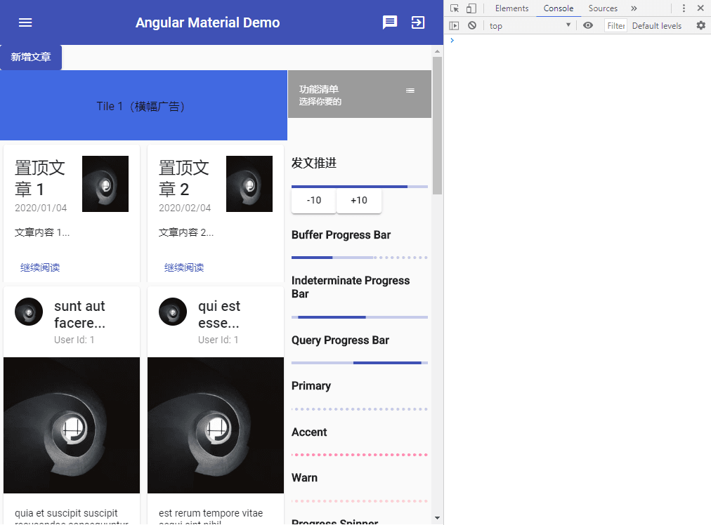
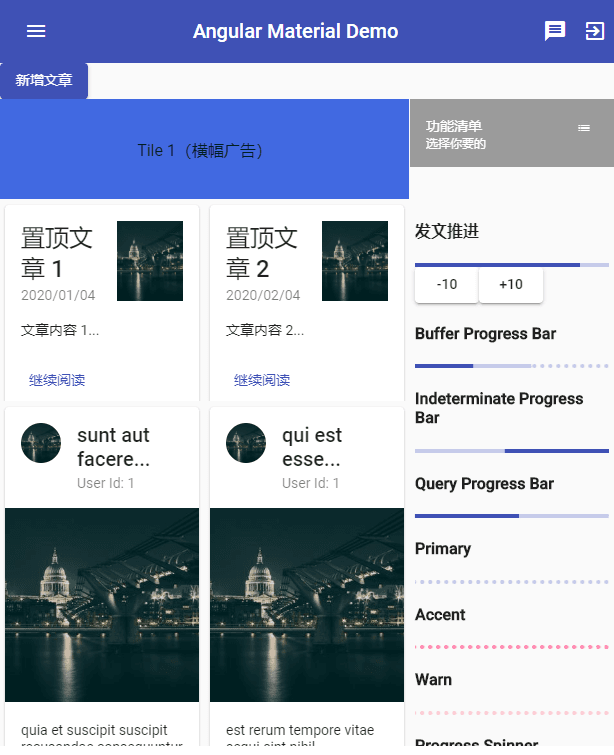
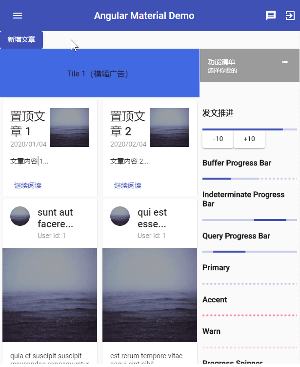
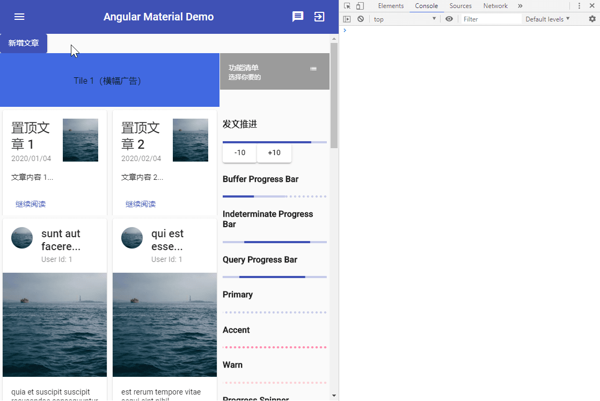
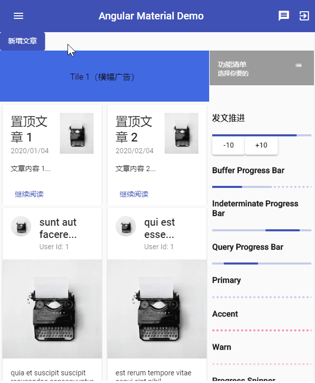

# 设计一个部落格 - Dialog

来介绍一下写程序多于写 HTML 的 Dialog，不管在不在 SPA 架构，Dialog 都是经典且极为重要的组件。

## 关于 Material Design 中的 Dialog

在 [Material Design 的 Dialogs 设计指南](https://material.io/components/dialogs/)中，Dialog 的作用是用来提醒使用者需要进行的一些特定工作，同时可能包含了重要的提示信息，或是需要做一些决定等等。因此我们会有非常多机会在里面放是 表单组件、或是特性信息等等。

Dialog 的主要几个常见用途如下：

- **产生提示**：用来立即中断使用者目前的行为，并告知使用者目前的状态或所需要知道的信息等。
- **简易的选择**：提供一些基本选项让使用者选取。
- **确认用**：需要使用者明确的进行一个确认性的选择。

Dialog 是很基础的组件，可以说是让页面呈现变得更加立体的关键，例如：以前介绍的 Datepicker、Select、Menu 等等，都是 Dialog 的一种应用结果。

## 开始使用 Angular Material 的 Dialog

要使用 Dialog，当然需要加入 `MatDialogModule`。

*src\app\shared-material\shared-material.module.ts*

```typescript
@NgModule({
  exports: [
    MatDialogModule,
    ...
  ]
})
export class SharedMaterialModule {...}
```

### 先让一个 Dialog 可以显示吧！

Dialog 不像是其他 Angular Material 组件，只要单纯的使用即可，需要一些比较复杂的动作，但也不是多困难，让我们一步一步来说明：

新建组件 `AddPostDialogComponent`；

```sh
ng g c dashboard/blog/add-post-dialog
```

添加一个按钮，显示 Dialog；
在对应 component.ts 中，注入 `MatDialog` 这个 Service；
使用这个 `MatDialog` 对象，打开 Dialog；

*src\app\dashboard\blog\blog.component.html*

```html
<!-- open dialog -->
<button mat-raised-button color="primary" (click)="showAddPostDialog()">新增文章</button>

<!-- Card -->
<mat-grid-list cols="3" rowHeight="100px">
    ...
</mat-grid-list>
```

*src\app\dashboard\blog\blog.component.ts*

```typescript
@Component({
  selector: 'app-blog',
  templateUrl: './blog.component.html',
  styleUrls: ['./blog.component.scss']
})
export class BlogComponent implements OnInit {

  constructor(..., public dialog: MatDialog) { }

  showAddPostDialog() {
    this.dialog.open(AddPostDialogComponent);
  }
}
```

由于这种方式是 动态产生组件的，我们需要在所属 Module 中的 `entryComponents` 中加入要产生的 component；

*src\app\dashboard\dashboard.module.ts*

```typescript
@NgModule({
  entryComponents: [AddPostDialogComponent],
  ...
})
export class DashboardModule { }
```

看来步骤比较多，但其实只有两个重点：

- 建立要当做 Dialog 的 component
- 使用注入的 `MatDialog` 对象把它打开

 

> 在 Dialog 中这个灰底的部分称为 `backdrop`。

### 使用 mat-dialog-xxx 丰富 Dialog 内容

在 `MatDialogModule` 中，定义了几个重要的 directives，这些 directives 可以帮助我们丰富 dialog 里的内容，同时还能够减少一些不必要的代码，让我们简单介绍一下：

- **mat-dialog-title**：dialog 标题，尽管因为  dialog 的内容高度太长而造成滚动，依然会固定在整个 dialog 的最上方。
- **mat-dialog-content**：dialog 内容，当内容长度超过 dialog 可以容纳的高度时，就会变成可以滚动的模式。
- **mat-dialog-actions**：用来放置行动按钮的区域，显示位置刚好与 `mat-dialog-title` 相反，会固定在页面的最下方，一般会在这里放置一些如：**确认**、**取消**的按钮。
- **mat-dialog-close**：只允许在 button 上使用的 directive，这个 directive 会使得 button 变成一个可以关闭目前 dialog 的按钮。

*src\app\dashboard\blog\add-post-dialog\add-post-dialog.component.html*

```html
<h2 mat-dialog-title>新增文章</h2>

<mat-dialog-content class="post-form">
  <mat-form-field>
    <input matInput placeholder="标题">
  </mat-form-field>
  <mat-form-field>
    <textarea matInput placeholder="文章内容" rows="3"></textarea>
  </mat-form-field>
  <p *ngFor="let item of list; let i = index">条款{{ i | number: '2.0-0' }}</p>
</mat-dialog-content>

<mat-dialog-actions>
  <button mat-button color="primary">发表</button>
  <button mat-button color="warn" mat-dialog-close>取消</button>
</mat-dialog-actions>

```

*src\app\dashboard\blog\add-post-dialog\add-post-dialog.component.scss*

```scss
.post-form mat-form-field {
  width: 100%;
}

```

*src\app\dashboard\blog\add-post-dialog\add-post-dialog.component.ts*

```typescript

export class AddPostDialogComponent implements OnInit {

  list = [];

  constructor() {
    for (let index = 0; index < 10; index++) {
      this.list.push(index + 1);
    }
  }
}
```

 

一个标准的 dialog 就诞生了！除了依照 title、content 和 actions 切割空间之外，按下取消的按键就能够关闭 dialog，另外当高度超过可以自动延展的范围（Angular Material 中的 dialog 设置为 `65vh`）时，就会变成可以滚动的状态。

dialog 的效果，可以看到以下几个亮点：

- dialog 显示时，默认会 **focus 到第一个表单控制项**
- 当使用 `tab / shift + tab` 切换 focus 状态时，**永远不会跳出 dialog 的范围，只会在 dialog 内移动**。
- **不只按下取消按钮可以开关 dialog**，按下 `ESC` 键也可以。

以上特色在介绍 Angular CDK 时，可以通过 Angular CDK 来帮助我们在自己设计的组件中达到一样的功能！

### 关于 MatDialog Service

在一开始介绍如何打开一个 dialog 时，我们注入了 `MatDialog` 这个 Service，下面我们来介绍一下这个 Service 的属性及方法。

#### MatDialog 的属性

MatDialog 有 3 个属性：

- `afterAllClosed() Observable<void>`：会在所有页面上的 dialog 都被关闭时，才会触发的一个 Observable。

  **没错！Dialog 是可以多开的！**只要使用 `MatDialog.open()` 方法即可

- `afterOpen() Observable<MatDialogRef<any>>`：当一个 dialog 开启时，就会触发一次，并告知目前开启的 dialog。

- `openDialogs() MatDialogRef<any>[]`：单纯的记录目前所有开启中的 dialog。

简单实例：

新建二级 dialog：

```sh
ng g c dashboard/blog/add-post-confirm-dialog
```

*src\app\dashboard\blog\add-post-confirm-dialog\add-post-confirm-dialog.component.html*

```html
<h2 mat-dialog-title>
  确认新增
</h2>

<mat-dialog-content>
  确定要新增这篇文章？
</mat-dialog-content>

<mat-dialog-actions>
  <button mat-button color="primary" (click)="confirm()">确认</button>
  <button mat-button color="warn" mat-dialog-close>取消</button>
</mat-dialog-actions>

```

*src\app\dashboard\blog\add-post-confirm-dialog\add-post-confirm-dialog.component.ts*

```typescript
@Component({
  selector: 'app-add-post-confirm-dialog',
  templateUrl: './add-post-confirm-dialog.component.html',
  styleUrls: ['./add-post-confirm-dialog.component.scss']
})
export class AddPostConfirmDialogComponent implements OnInit {

  constructor(private dialog: MatDialog) { }

  ngOnInit() {
  }

  confirm() {
    this.dialog.closeAll();
  }
}
```

*src\app\dashboard\dashboard.module.ts*

```typescript
@NgModule({
  entryComponents: [..., AddPostConfirmDialogComponent],
  ...
})
export class DashboardModule { }
```

修改 一级 dialog来开启多个 dialog 的程序只需要调用注入的 `MatDialog` 的 `open()` 方法，就可以打开一个新的 dialog。

*src\app\dashboard\blog\add-post-dialog\add-post-dialog.component.html*

```html
<h2 mat-dialog-title>新增文章</h2>

<mat-dialog-content class="post-form">
  ...
</mat-dialog-content>

<mat-dialog-actions>
  <button mat-button color="primary" (click)="doPost()">发表</button>
  <button mat-button color="warn" mat-dialog-close>取消</button>
</mat-dialog-actions>

```

*src\app\dashboard\blog\add-post-confirm-dialog\add-post-confirm-dialog.component.ts*

```typescript
@Component({
  selector: 'app-add-post-dialog',
  templateUrl: './add-post-dialog.component.html',
  styleUrls: ['./add-post-dialog.component.scss']
})
export class AddPostDialogComponent implements OnInit {

  constructor(private dialog: MatDialog) {...}

  doPost() {
    this.dialog.open(AddPostConfirmDialogComponent);
  }
}
```



#### MatDialog 的方法

MatDialog 有 3 个方法，可以让我们自由地控制 dialog：

- `closeAll`：顾名思义，就是关闭所有的 dialog

- `getDialogById`：每个 dialog 都有自己的 id，我们也可以自定义 id，无论哪种方式，只要有 id，就能在任何时候使用 `getDialogById(id)`，来取得某个 dialog，如果无法取得的话，会回传 `undefined`。

- `open`：最重要的一个方法，包含 2 个参数

  - `componentOrTemplateRef: ComponentType<T> | TemplateRef<T>`：必填，要显示的 dialog，可以是 component 或 templateRef。

    ```html
    <ng-template #dialogByTemplate>
      ...
    </ng-template>
    ```

    ```typescript
    @ViewChildren('dialogByTemplate') dialogByTemplate;
    open() {
        this.dialog.open(this.dialogByTemplate);
    }
    ```

    > 直接将 `<ng-template>` 当做 dialog 显示，会减少设计太多的 component 反而难以管理

  - `config?: MatDialogConfig<D>`：非必填，用来设置一些显示数据。

#### 自定义 MatDialogConfig

我们可以通过 `MatDialogConfig` 设置一些 dialog 打开时的数据，由于属性众多，以下挑几个重要的来介绍：

##### data

**超重要**，我们不可能永远只单纯地打开一个 dialog，一定会有需要传入一些数据的时候，这时可以使用 data 参数来传入一些数据：

*src\app\dashboard\blog\add-post-dialog\add-post-dialog.component.html*

```html
<h2 mat-dialog-title>新增文章</h2>

<mat-dialog-content class="post-form">
  <mat-form-field>
    <input matInput placeholder="标题" [(ngModel)]="title">
  </mat-form-field>
  ...
</mat-dialog-content>

<mat-dialog-actions>
  ...
</mat-dialog-actions>

```

*src\app\dashboard\blog\add-post-dialog\add-post-dialog.component.ts*

```typescript
@Component({
  selector: 'app-add-post-dialog',
  templateUrl: './add-post-dialog.component.html',
  styleUrls: ['./add-post-dialog.component.scss']
})
export class AddPostDialogComponent implements OnInit {

  title: string;

  doPost() {
    this.dialog.open(AddPostConfirmDialogComponent, {
      data: { title: this.title }
    });
  }
}
```

*src\app\dashboard\blog\add-post-confirm-dialog\add-post-confirm-dialog.component.html*

```html
<h2 mat-dialog-title>
  确认新增
</h2>

<mat-dialog-content>
  确定要新增这篇文章？<br>
  （标题：{{ title }}）
</mat-dialog-content>

<mat-dialog-actions>
  ...
</mat-dialog-actions>

```

*src\app\dashboard\blog\add-post-confirm-dialog\add-post-confirm-dialog.component.ts*

```typescript
@Component({
  selector: 'app-add-post-confirm-dialog',
  templateUrl: './add-post-confirm-dialog.component.html',
  styleUrls: ['./add-post-confirm-dialog.component.scss']
})
export class AddPostConfirmDialogComponent implements OnInit {

  get title() {
    return this.data.title;
  }

  constructor(
    ...,
    @Inject(MAT_DIALOG_DATA) private data: any
    ) { }
}
```

 

##### autoFocus

当 dialog 打开时，是否要自动 focus 在第一个控制项

##### id

可以为每个 dialog 自定义一个唯一的 ID

##### 高度与宽度

我们可以使用 `height`、`width`、`minHeight`、`minWidth`、`maxHeight` 和 `maxWidth` 来设置 dialog 的尺寸大小，除了 `height` 和 `width` 一定要用字符串表示以外，其他属性可以给予数值，当给予数值而非字符串时，默认单位为 `px`。

##### hasBackdrop

是否要使用一个灰色的底来隔绝 dialog 与下面的页面，也就是 backdrop，如果设置为 `false`，则依然可以和 dialog 后面的组件互动。

*src\app\dashboard\blog\blog.component.ts*

```typescript
@Component({
  selector: 'app-blog',
  templateUrl: './blog.component.html',
  styleUrls: ['./blog.component.scss']
})
export class BlogComponent implements OnInit {

  showAddPostDialog() {
    this.dialog.open(AddPostDialogComponent, { hasBackdrop: false });
  }
}
```

 

##### position

可以设置：

- `top`
- `bottom`
- `left`
- `right`

来决定 dialog 显示的位置。

##### disableClose

默认情况下我们可以使用 `ESC` 键关闭 dialog，通过设置 `disableClose`为 `true`，可以取消这个功能，但要注意可能影响使用者的使用习惯。

#### 使用 MatDialogRef

所有的 dialog 开始后，多会产生一个对应的 `MatDialogRef<T>`，其中的 `T` 代表实际产生的 component 或 templateRef，取得这个 DialogRef 的方式很多，主要有：

1. 使用 `MatDialog` 的 `open()` 时，回传的值

   例如，以下程序实例，可以通过取得开启对 component 的 MatDialogRef，来处理原来组件的事件：

   *src\app\dashboard\blog\add-post-dialog\add-post-dialog.component.ts*

   ```typescript
   @Component({
     selector: 'app-add-post-dialog',
     templateUrl: './add-post-dialog.component.html',
     styleUrls: ['./add-post-dialog.component.scss']
   })
   export class AddPostDialogComponent implements OnInit {
   
     doPost() {
       const confirmDialogRef = this.dialog.open(AddPostConfirmDialogComponent, {
         data: { title: this.title }
       });
   
       confirmDialogRef.componentInstance.doConfirm.subscribe(() => {
         console.log(`Close Dialog Button Click`);
       });
     }
   }
   ```

   *src\app\dashboard\blog\add-post-confirm-dialog\add-post-confirm-dialog.component.ts*

   ```typescript
   @Component({
     selector: 'app-add-post-confirm-dialog',
     templateUrl: './add-post-confirm-dialog.component.html',
     styleUrls: ['./add-post-confirm-dialog.component.scss']
   })
   export class AddPostConfirmDialogComponent implements OnInit {
   
     doConfirm = new EventEmitter<any>();
   
     confirm() {
       this.dialog.closeAll();
       this.doConfirm.emit();
     }
   }
   ```

   

2. 使用 `MatDialog` 的 `getDialogById` 取得

3. 在我们当做 dialog 的 component 中，注入取得

   *src\app\dashboard\blog\add-post-dialog\add-post-dialog.component.html*

   ```html
   <h2 mat-dialog-title>新增文章</h2>
   
   <mat-dialog-content class="post-form">
     ...
   </mat-dialog-content>
   
   <mat-dialog-actions>
     <button mat-button color="primary" (click)="doPost()">发表</button>
     <button mat-button color="primary" (click)="move()">移动位置</button>
     <button mat-button color="warn" mat-dialog-close>取消</button>
   </mat-dialog-actions>
   
   ```

   *src\app\dashboard\blog\add-post-dialog\add-post-dialog.component.ts*

   ```typescript
   
   export class AddPostDialogComponent implements OnInit {
   
     constructor(..., private dialogRef: MatDialogRef<AddPostDialogComponent>) {
       ...
     }
   
     move() {
       this.dialogRef.updatePosition({ top: '0', left: '0' });
     }
   }
   ```

    

