# Angular Material开始

## Develop 分支安装

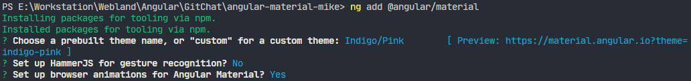

在 Angular 6.0 的时候，@angular/cli 新增内置了 `add` 命令。这个命令主要解决引用一些第三方的 UI 库或者工具库。整个过程都是自动化的，以下这些事情 ng add 都会帮你自动完成：

- 自动修改：package.json
- 自动使用 npm 安装依赖包
- 自动修改相关的配置文件，如果有的话
- 自动修改对应的模板引用文件
- 自动修改一些 CSS 样式文件

## 自动安装

官网：https://material.angular.io/guide/getting-started

自动引入 @angular/material 库，在项目根目录里执行

```bash
ng add @angular/material
```

### 设置主题

 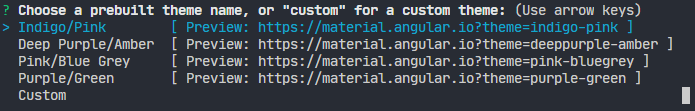

*angular.json*

 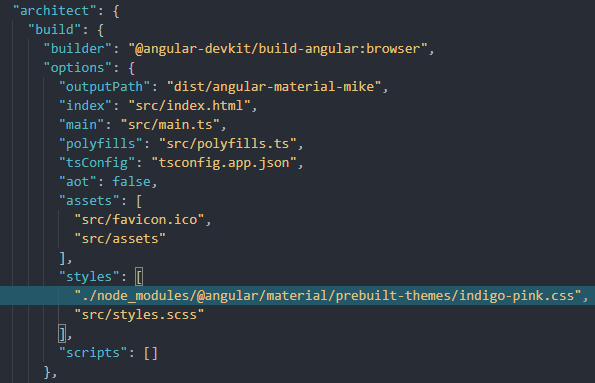

*src\index.html*

 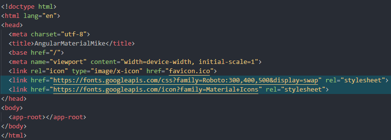

*src\styles.scss*

 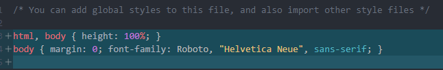

### 设置手势支持

 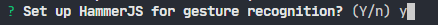

*src\styles.scss*

 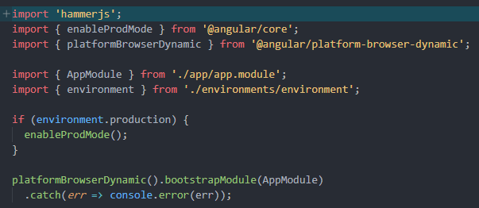

### 加入动画

 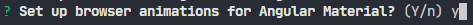

### package.json

 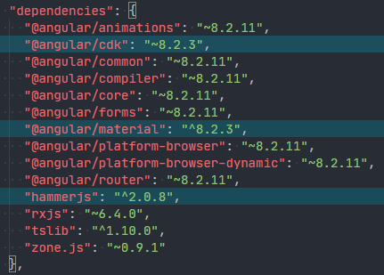

### AppModule

 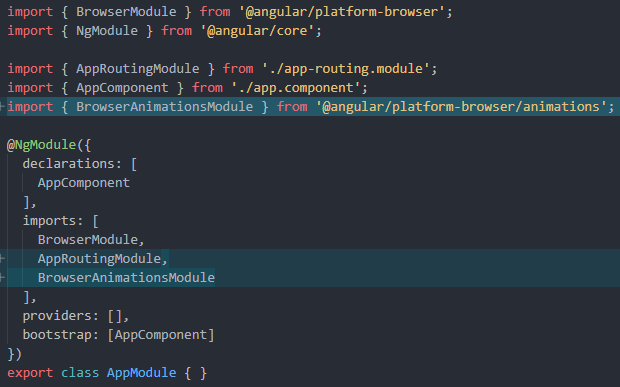

## 手动安装

### 动画

```bash
npm install --save @angular/animations
```

*package.json*

 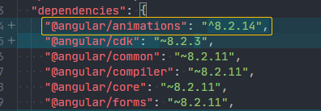

然后在 AppModule 中的 `imports` 中加入 `BrowserAnimationsModule`

*src\app\app.module.ts*

```typescript
import { BrowserAnimationsModule } from '@angular/platform-browser/animations';

@NgModule({
  declarations: [
    AppComponent
  ],
  imports: [
    ...
    BrowserAnimationsModule
  ],
  providers: [],
  bootstrap: [AppComponent]
})
export class AppModule { }
```

这样动画效果会画面更加丰富，但也有可能带来性能问题，并且不是每个人都喜欢那么多特效，想要取消特效的话，可以更改引入 `NoopAnimationsModule`

*src\app\app.module.ts*

```typescript
import { NoopAnimationsModule } from '@angular/platform-browser/animations';

@NgModule({
  declarations: [
    AppComponent
  ],
  imports: [
    ...
    NoopAnimationsModule
  ],
  providers: [],
  bootstrap: [AppComponent]
})
export class AppModule { }
```

#### 关于 @angular/animations

@angular/animations 使用了 [Web Animations API](https://developer.mozilla.org/zh-CN/docs/Web/API/Web_Animations_API)，但不是所有浏览器都支持，如果希望尽可能让所有浏览器都支持，可以安装 `web-animations.js` 插件。

```bash
npm install --save web-animations-js
```

在 *src\polyfills.ts* 中取消注释 `import 'web-animations-js'`。

### 主题

Angular Material 包含 4 种内建的样式，在 *node_modules\@angular\material\prebuilt-themes* 中可以找到。

 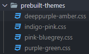

### 手势

某些组件中，会依照浏览器的终端的不同而有不同的互动，例如 tooltip 在一般 PC 端上只要滑动鼠标移过去就会显示，但在移动端中，则需要长按才会出现，这部分 Angular Material 搭配了 [Hammer JS](http://hammerjs.github.io/)，为 UI 加上移动端手势支持，如果开发的网页需要在移动端上达到最好的体验，就必须在程序中载入 Hammer JS。

```bash
npm install --save hammerjs
```

*src\main.ts*

```typescript
import 'hammerjs';
```

### Material Icons

Material Icons 是搭配 Material Design 出来的一些列 icon set，在 Angular Material 中，我们也可以透过 MatIcon 来统一显示 icon 的逻辑，以现代化网页设计来说，想要使用 Material Icons 最简单的方式，就是直接在 index.html 中加入相关 Icon Font 的CND：

*src\index.html*

```html
<link href="https://fonts.googleapis.com/css?family=Roboto:300,400,500&display=swap" rel="stylesheet">
<link href="https://fonts.googleapis.com/icon?family=Material+Icons" rel="stylesheet">
```

