# 设计一个部落格 - Card

今天我们要介绍一个 Material Design 中被使用频率非常高，且很经典的组件 —— Card。利用 Card 来当做部落格列表的呈现方式。

## 关于 Material Design 中的 Card

在[Material Design 的 Cards 设计指南](https://material.io/components/cards/#)中，Card 是用来针对某一**主题**放置图片、文字或链接的地方，它能够把这些图片、文字或链接都整合到一个卡片之中，而这个卡片就代表了我们的目标主题。

由于 Card 是 Material Design 中最主要的资料显示方式，因此里面的资料呈现也有很多不同丰富的变化，建议可以直接进去说明文档里看，会对于 Card 的呈现方式更加的有感觉。

## 开始使用 Angular Material 的 Card

### 调整一下 Grid List

我们先将原来的 Grid List 排版做点调整，预期结果如下：

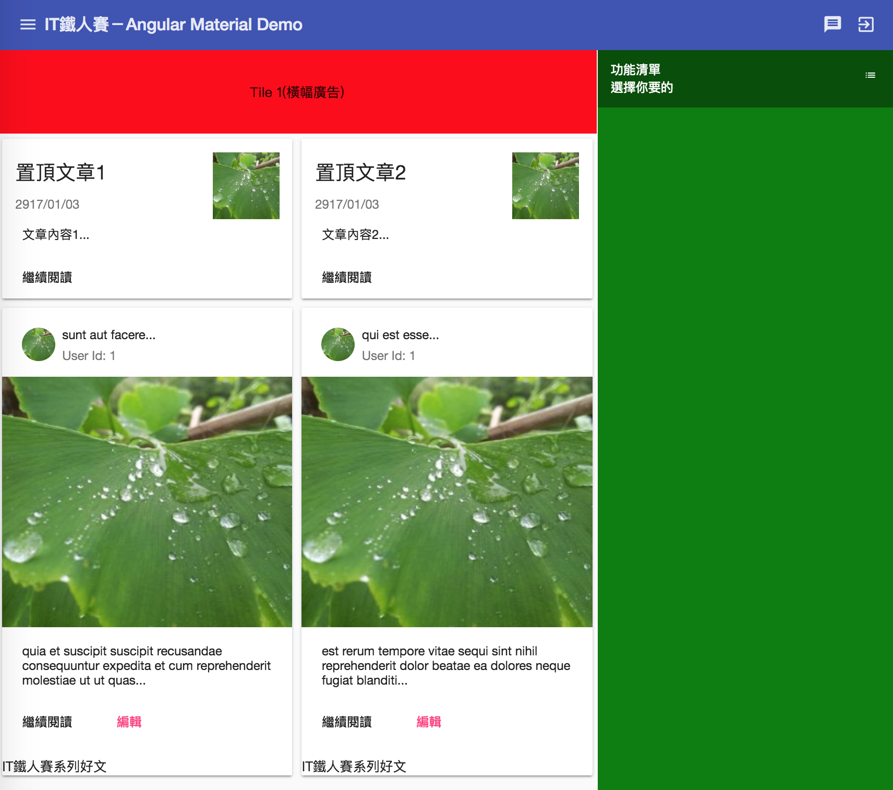

在主要的文章清单中，最上方位有 2个*置顶文章*，而下面会显示 6 篇*清单文章*，每篇宽度占 1格cell。
高度在规划后，*置顶文章* 需要占掉 2格cell，*清单文章* 需要占掉 6格cell。
6篇 *清单文章* 共 3列，就会用掉 18格cell的高度，加上 *置顶文章* 的 2格，共 20格cell的高度。
另外加上 *上下横幅* 各1格，加起来**总共会用 22格cell的高度**。
因此原来放置右边菜单的 Tile2 该高度会重新设置为 `rowspan="22"`。

*src\app\dashboard\blog\blog.component.html*

```html
<mat-grid-list cols="3" rowHeight="100px" gutterSize="20px">
  <mat-grid-tile style="background: royalblue;" colspan="2">Tile 1（横幅广告）</mat-grid-tile>
  
  <mat-grid-tile style="background: teal;" rowspan="22">
    <mat-grid-tile-header>...</mat-grid-tile-header>
    <mat-grid-tile-footer>...</mat-grid-tile-footer>
    Tile 2（右边清单讯息）
  </mat-grid-tile>

  <mat-grid-tile style="background: slateblue;" colspan="2" rowspan="3">
    Tile 3（文章内容区）
  </mat-grid-tile>
  <mat-grid-tile style="background: seagreen;" colspan="2">
    Tile 4（下方横幅广告）
  </mat-grid-tile>
</mat-grid-list>
```

另外，我们将 Tile 3 当做整个放文章的容器，但目前 `<mat-grid-list>` 是没办法直接巢状使用的，也就是在 `<mat-grid-list>` 中，我们无法加上 `<mat-grid-list> `的，虽然不会出错，但也不会显示内容（实际上跑掉了），比较简单的方式就是重新规划好 `cols` 及 `rowHeight`，每个 Tile 里面就直接放置内容就好。

另外，拿掉 `gutterSize`，以免影响内容显示，调整后的程序大致如下：

*src\app\dashboard\blog\blog.component.ts*

```typescript
export class BlogComponent implements OnInit {

  post$: Observable<any>;

  constructor(private httpClient: HttpClient) { }

  ngOnInit() {
    this.post$ = this.httpClient.get<any[]>('https://jsonplaceholder.typicode.com/posts')
        .pipe(map(post => {
	      return post.slice(0, 6);
    	})
    );
  }
}
```

> 资料来源：https://jsonplaceholder.typicode.com/guide.html

*src\app\dashboard\blog\blog.component.html*

```html
<mat-grid-list cols="3" rowHeight="100px">
  <mat-grid-tile style="background: royalblue;" colspan="2">Tile 1（横幅广告）</mat-grid-tile>
  <mat-grid-tile style="background: teal;" rowspan="22">

    <mat-grid-tile-header>...</mat-grid-tile-header>

    <mat-grid-tile-footer>...</mat-grid-tile-footer>
    Tile 2（右边清单讯息）
  </mat-grid-tile>

  <mat-grid-tile style="background: slateblue;" rowspan="2">
    置顶文章 1
  </mat-grid-tile>
  <mat-grid-tile style="background: slateblue;" rowspan="2">
    置顶文章 2
  </mat-grid-tile>

  <mat-grid-tile style="background: slateblue;" *ngFor="let post of post$ | async" rowspan="6">
    {{ post.title }}
  </mat-grid-tile>

  <mat-grid-tile style="background: seagreen;" colspan="2">
    Tile 4（下方横幅广告）
  </mat-grid-tile>
</mat-grid-list>
```

 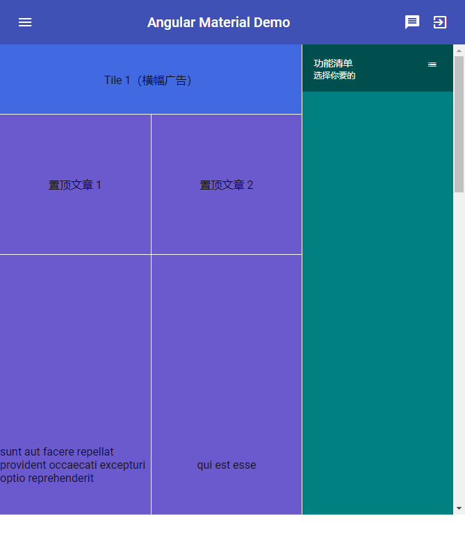

接下来在加入 `MatCardModule` 之后，我们就正式开始用 Card 组件来填满我们的 tile 吧！

*src\app\shared-material\shared-material.module.ts*

```typescript
@NgModule({
  exports: [
    MatCardModule,
    ...
  ]
})
export class SharedMaterialModule {...}
```

### 使用 mat-card 建立卡片

我们可以使用 `<mat-card>` 立刻建立一个简单的卡片，如下：

*src\app\dashboard\blog\blog.component.html*

```html
![mat-card-title](C:/Users/Administrator/Desktop/mat-card-title.png<mat-grid-tile *ngFor="let post of post$ | async" rowspan="6">
    <mat-card>
        {{ post.title }}
    </mat-card>
</mat-grid-tile>
```

 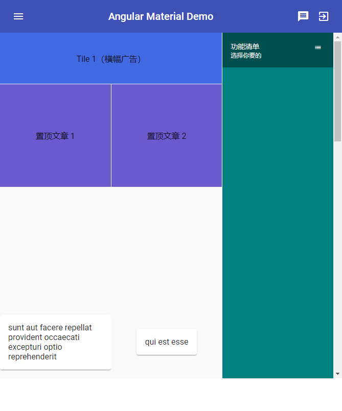

不过目前可以看到排版有点奇怪，由于 `<mat-grid-tile>` 会把资料都居中，因此卡片的位置也会放在正中间，并随着内容变宽变高，这个问题不难，用 CSS 调整一下：

*src\app\dashboard\blog\blog.component.scss*

```scss
.post-tile {
  align-self: flex-start;
  width: 100%;
  margin: 5px;
}

```

*src\app\dashboard\blog\blog.component.html*

```html
<mat-grid-tile *ngFor="let post of post$ | async" rowspan="6">
    <mat-card class="post-tile">
        {{ post.title }}
    </mat-card>
</mat-grid-tile>
```

 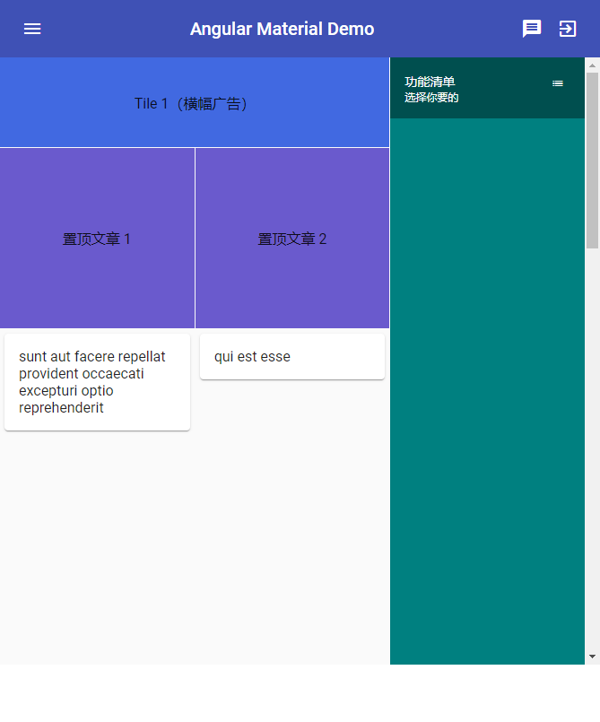

### 其他 mat-card 内可用的功能

在 `<mat-card>` 内，有一些内建的 directive，如下：

- `<mat-card-title>`：卡片标题
- `<mat-card-subtitle>`：卡片子标题
- `<mat-card-content>`：卡片主要内容，会在四周留下一些空白来放置文字
- ``：卡片图片，会随着卡片大小自动延展
- `<mat-card-actions>`：卡片底部用来放置一些执行动作按钮的区块
- `<mat-card-footer>`：卡片的最底部

这些 directives 可以为卡片内的内容加上一些内建的显示样式，我们直接将这些 directives 加到卡片中：

*src\app\dashboard\blog\blog.component.html*

```html
<mat-grid-tile *ngFor="let post of post$ | async" rowspan="6">
    <mat-card class="post-tile">
        <mat-card-title>{{ post.title.substring(0, 15) }}...</mat-card-title>
        <mat-card-subtitle>User Id: {{ post.userId }}</mat-card-subtitle>
        
        
        <mat-card-content>{{ post.body.substring(0, 100) }}...</mat-card-content>
        <mat-card-actions>
            <button mat-button color="primary">继续阅读</button>
            <button mat-button color="accent">编辑</button>
        </mat-card-actions>
        <mat-card-footer>Angular Material 系列</mat-card-footer>
    </mat-card>
</mat-grid-tile>
```

> 使用的图片服务：https://picsum.photos，图片每次都是随机的。

 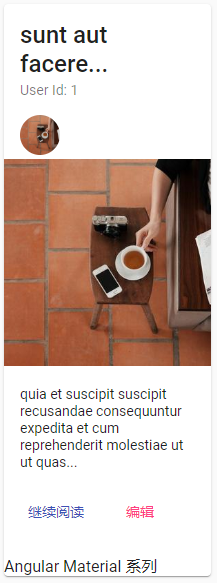

这样一张内容丰富的卡片就完成了！

另外针对 `<mat-card-actions>`，我们可以设置 `align` 为 `start`（默认值）或 `end`，来决定按钮的对齐方向。

*src\app\dashboard\blog\blog.component.html*

```html
<mat-card-actions align="end">
    <button mat-button color="primary">继续阅读</button>
    <button mat-button color="accent">编辑</button>
</mat-card-actions>
```

 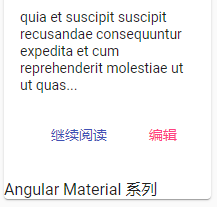

### 使用 mat-card-header

在上面的卡片有一个看起来奇怪的地方，就是 `<mat-card-title>`、`<mat-card-subtitle>` 和 `` 是一列一列显示的。

 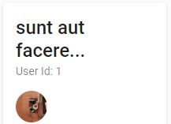

这有点不符合我们的期待，太占用空间了，这时候我们可以使用 `<mat-card-header>` 这个组件把上述 directives 包起来：

*src\app\dashboard\blog\blog.component.html*

```html
<mat-card-header>
    <mat-card-title>{{ post.title.substring(0, 15) }}...</mat-card-title>
    <mat-card-subtitle>User Id: {{ post.userId }}</mat-card-subtitle>
    
</mat-card-header>
```

 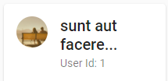

### 调整 mat-card-image 显示方式

关于 `mat-card-image`，由于图片默认以**正方形呈现**，且随着卡片大小自动延伸，但是 `<mat-grid-tile>`高度是固定的，这时候可能反而会因为图片太大而造成卡片下方的资料无法完整显示。

如果有显示完整资料，不介意图片形状被改变的话，可以通过设置 CSS 来固定图片的高度，例如：

*src\app\dashboard\blog\blog.component.scss*

```scss
.post-tile {
  align-self: flex-start;
  width: 100%;
  margin: 5px;

  .mat-card-image {
    max-height: 300px;
  }
}

```

所有 `<mat-card>` 的 directive 加入后都会自动加入一个名称相同的 class。

> 实际上所有的 Angular Material 组件都会这样，方便自定义样式

因此 `` 在显示时实际上会是 ``。

 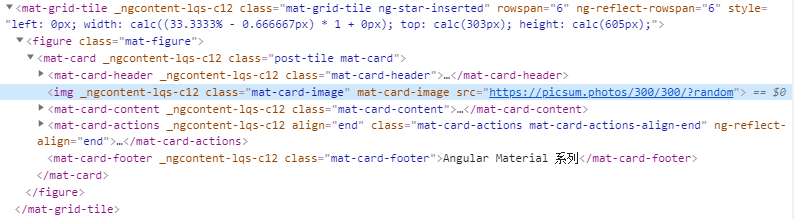

### 使用 mat-card-title-group

刚刚使用了 `<mat-card-header>` 来组合 `<mat-card-title>`、`<mat-card-subtitle>` 和 ``，而 `` 主要是用来放置使用者的头像，在 Material Design 中对于卡片还有另外一种显示方式，是把缩略图放在标题的右边，如下图：

 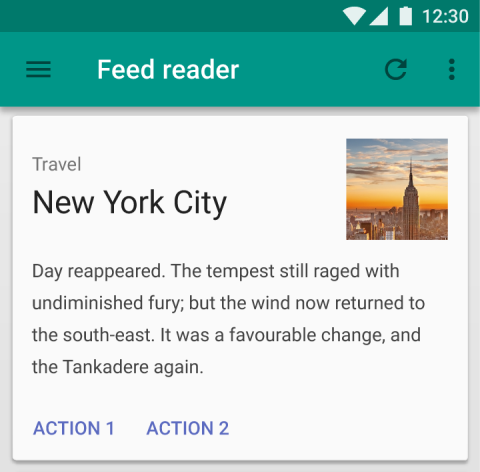

这个功能我们可以使用 `<mat-card-title-group>` 来实现，`<mat-card-title-group>`可以组合以下 directive：

- `<mat-card-title>`
- `<mat-card-subtitle>`
- 以下其中一个
  - ``：80 x 80
  - ``：112 x 112
  - ``：152 x 152

我们可以试试把预期放置顶文章的部分，用这种方式显示资料：

*src\app\dashboard\blog\blog.component.html*

```html
<mat-grid-tile rowspan="2">
    <mat-card class="post-tile">
        <mat-card-title-group>
            <mat-card-title>置顶文章 1</mat-card-title>
            <mat-card-subtitle>2020/01/04</mat-card-subtitle>
            
        </mat-card-title-group>
        <mat-card-content>
            文章内容 1...
        </mat-card-content>
        <mat-card-actions>
            <button mat-button color="primary">继续阅读</button>
        </mat-card-actions>
    </mat-card>
</mat-grid-tile>
```

 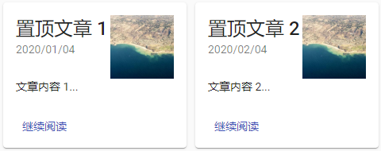

设置 tabindex 让卡片可以 focus

`<mat-card>`是可以被 focus 的，我们只要设置好它的 `tabindex` 即可，通过这种设置我们可以让卡片跟清单一样，拥有**被选择**的功能：

*src\app\dashboard\blog\blog.component.html*

```html
<mat-grid-tile *ngFor="let post of post$ | async; let index = index" rowspan="6">
    <mat-card class="post-tile" [tabindex]="index">
        ...
    </mat-card>
</mat-grid-tile>
```

*src\app\dashboard\blog\blog.component.scss*

```scss
mat-card:focus {
  background: antiquewhite;
}
```

 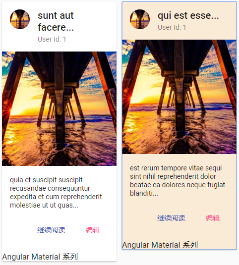

可以看到被 focus 的 `<mat-card>` 不仅拥有浏览器内建被选择的提示框，还可以直接使用 `:focus` 的 css.selector 来设置它的样式。