# 问卷页面 - Checkbox、Radio 和 Slide Toggle

今天我们来介绍 3 个相对简单但是使用频率也非常高的组件：CheckBox、Radio 和 Slide Toggle，这三个组件有很多类似的地方，因此很适合放在一起学习。

## 关于 Material Design 的 CheckBox 与 Radio

在 Material Design 中，CheckBox、Radio 和 Slide Toggle 都被归类在 [Selection controls](https://material.io/guidelines/components/selection-controls.html) 中，基本上的概念跟我们使用 HTML 原生的 CheckBox 和 Radio 没什么不同；CheckBox 主要是用来提供使用者选择多个选项使用的，而 Radio 则是提供使用者进行单一选项的选择。

不同的是，Material Design 对于 focused 和 pressed 状态提出了更容易被识别的效果，如下图：

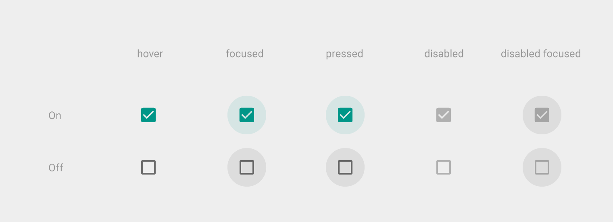

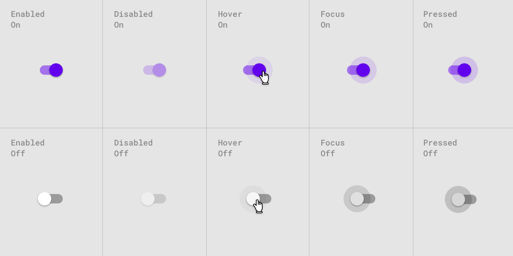

另外在 Selection Controls 中还有提到一个组件 - Switch，跟同时开关型的 CheckBox 类似，但建议上 **CheckBox 是提供多个选项时使用，而 Switch 则是单纯的状态开跟关**而已。

例如 `兴趣` 可以选择很多种，这时候就可以用 `Checkbox`；而某个 `功能的关闭或打开`，则适合使用 `Switch`。

## 使用 Angular Material 的 Checkbox

在 Angular Material 中 Checkbox 的功能包装在一个 `<mat-checkbox>` 组件中，要使用和这个组件必须先载入 `MatCheckboxModule` 模块。

*src\app\shared-material\shared-material.module.ts*

```typescript
@NgModule({
  exports: [
    MatCheckboxModule,
    ...
  ]
})
export class SharedMaterialModule {}
```

### 使用 mat-checkbox

`<mat-checkbox>` 是表单组件的一种，因此支持和 `FormModule` 或 `ReactiveFormsModule` 搭配使用，这里我们使用 ReactiveFormsModule 先建立一个资料模型，再使用 `<mat-checkbox>` 来 binding 这些资料， 大致内容如下：

*src\app\dashboard\survey\survey.component.ts*

```typescript
export class SurveyComponent implements OnInit {
    
    constructor(private httpClient: HttpClient) {
        this.surveyForm = new FormGroup({
          ...,
          mainQuestions: new FormGroup({
            payForBook: new FormControl(false),
            payForMusic: new FormControl(false),
            payForMovie: new FormControl(true)
          })
        });
    }
}
```

*src\app\dashboard\survey\survey.component.html*

```html
<!-- 使用 mat-checkbox -->
<div>
    <div>除了生活消费外，您最常花费在哪些项目上？</div>
    <mat-checkbox formControlName="payForBook">书籍</mat-checkbox>
    <mat-checkbox formControlName="payForMusic">音乐</mat-checkbox>
    <mat-checkbox formControlName="payForMovie">电影</mat-checkbox>
</div>
```

 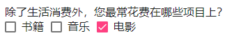

### 调整 label 的位置

在 `<mat-checkbox>` 中，我们不需要跟 `<inout type="checkbox">` 一样需要特地用一个 `<label>` 设定标签内容，只需要在 `<mat-checkbox>` 里面写入要显示的 `label` 内容即可，不过这样一来我们就无法控制 label 和 checkbox 谁要在前面谁要在后面了吗？还好 Angular Material 早就想到这一点了，我们可以通过设定 `labelPosition` 属性为 `after`（默认）或 `before` 来决定 label 要显示在 checkbox 的后面还是前面。

*src\app\dashboard\survey\survey.component.html*

```html
<!-- 使用 mat-checkbox -->
<div>
    <div>除了生活消费外，您最常花费在哪些项目上？</div>
    <mat-checkbox formControlName="payForBook" labelPosition="before">书籍</mat-checkbox>
    <mat-checkbox formControlName="payForMusic">音乐</mat-checkbox>
    <mat-checkbox formControlName="payForMovie">电影</mat-checkbox>
</div>
```

 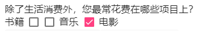

### 设置 Indeterminate 状态

Indeterminate 是 checkbox 一种有趣的状态，这种状态**代表的是介于“选取”和“未选取”之间**，常常使用在一个 checkbox 代表`全选/取消全选 `的时候，通过 Indeterminate 可以得知目前的状态是“部分全选”。

下面例子，我们加上一个全选的 checkbox，并设置 `indeterminate` 状态及一些事件绑定：

*src\app\dashboard\survey\survey.component.ts*

```typescript
export class SurveyComponent implements OnInit {
    
    indeterminateSelectedPayFor: boolean;
    
    constructor(private httpClient: HttpClient) {
        this.surveyForm = new FormGroup({
          ...,
          mainQuestions: new FormGroup({
            payForAll: new FormControl(false),
            payForBook: new FormControl(false),
            payForMusic: new FormControl(false),
            payForMovie: new FormControl(true)
          })
        });
    }
    
    checkAllChange($event: MatCheckboxChange) {
        const mainQuestions: FormGroup = this.surveyForm.get('mainQuestions') as FormGroup;
        mainQuestions.get('payForBook').setValue($event.checked);
        mainQuestions.get('payForMusic').setValue($event.checked);
        mainQuestions.get('payForMovie').setValue($event.checked);
        // setValue 不会触发 payForChange
    }

    payForChange() {
        console.log('payForChange');
        this._setSelectAllState();
    }

    private _setSelectAllState() {
        const mainQuestions: FormGroup = this.surveyForm.get('mainQuestions') as FormGroup;
        const payForBookValue = mainQuestions.get('payForBook').value ? 1 : 0;
        const payForMusicValue = mainQuestions.get('payForMusic').value ? 1 : 0;
        const payForMovieValue = mainQuestions.get('payForMovie').value ? 1 : 0;
        const count = payForBookValue + payForMusicValue + payForMovieValue;
        mainQuestions.get('payForAll').setValue(count === 3);
        this.indeterminateSelectedPayFor = count > 0 && count < 3;
    }
}
```

*src\app\dashboard\survey\survey.component.html*

```html
<!-- 使用 mat-checkbox -->
<div>
    <div>除了生活消费外，您最常花费在哪些项目上？</div>
    <mat-checkbox formControlName="payForAll" 
                  [indeterminate]="indeterminateSelectedPayFor" (change)="checkAllChange($event)">
        全部
    </mat-checkbox>|
    <mat-checkbox formControlName="payForBook" labelPosition="before" (change)="payForChange()">
        书籍
    </mat-checkbox>
    <mat-checkbox formControlName="payForMusic" (change)="payForChange()">音乐</mat-checkbox>
    <mat-checkbox formControlName="payForMovie" (change)="payForChange()">电影</mat-checkbox>
</div>
```

 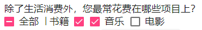

### 设置 Checkbox 点击后的默认行为

`<mat-checkbox>` 默认点击的行为如下：

- 改变 `checked` 状态，原来为开会变成关，反之亦然
- 改变 `indeterminate` 状态，不管原来是 `true` 或 `false`，只要使用者鼠标点击，都会变成 `false`

我们可以通过设置 `MAT_CHECKBOX_CLICK_ACTION` 来改变这个行为，例如：

*src\app\dashboard\survey\survey.component.ts*

```typescript
@Component({
  selector: 'app-survey',
  templateUrl: './survey.component.html',
  styleUrls: ['./survey.component.scss'],
  providers: [
    ...,
    { provide: MAT_CHECKBOX_CLICK_ACTION, useValue: 'noop' }
  ]
})
export class SurveyComponent implements OnInit {}
```

 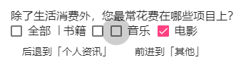

设置 `MAT_CHECKBOX_CLICK_ACTION` 为 `noop`，代表按下去时除了特效以外什么都不会做，因此我们必须自己加上 click 事件来调整状态。另外 `MAT_CHECKBOX_CLICK_ACTION` 有 3 种状态可以设定：

- **noop**：按下去后什么都不做，必须在 click 事件完成该处理，最麻烦但最容易扩展。
- **check**：只会切换 `checked` 状态，而不会改变 `indeterminate` 状态。
- **check-indeterminate**：默认值，会切换 `checked` 状态以及把 `indeterminate` 设为 `false`。

### 改变 mat-checkbox 颜色

跟其他 Angular Material 的组件一样，只要加上 `color` 属性即可：

*src\app\dashboard\survey\survey.component.html*

```html
<mat-checkbox formControlName="payForBook" labelPosition="before" (change)="payForChange()" color="primary">书籍</mat-checkbox>
<mat-checkbox formControlName="payForMusic" (change)="payForChange()" color="accent">音乐</mat-checkbox>
<mat-checkbox formControlName="payForMovie" (change)="payForChange()" color="warn">电影</mat-checkbox>
```

 

## 使用 Angular Material 的 Radio

下面来看 Radio 的使用方式，加入 `MatRadioModule` 后，搭配 `<mat-radio-group>` 和 `<mat-radio-button>`来完成一组单选题。

*src\app\shared-material\shared-material.module.ts*

```typescript
@NgModule({
  exports: [
    MatRadioModule,
    ...
  ]
})
export class SharedMaterialModule {}
```

### 使用 mat-radio-group 和 mat-radio-button

由于 `<mat-radio>` 是单选的状态，为了避免页面上所有的 `<mat-radio>` 只能有一个被选择，我们还需要再使用 `<mat-radio-group>` 来包住 `<mat-radio>`，在 `<mat-radio-group>` 中，只能会有一个 `<mat-radio>` 被选取。这样的概念跟 `<select>` 和 `<option>` 的组合很像，因此实际上的表单组件是 `<mat-radio-group>`。

*src\app\dashboard\survey\survey.component.ts*

```typescript
export class SurveyComponent implements OnInit {
    constructor(private httpClient: HttpClient) {
        this.surveyForm = new FormGroup({
          ...,
          mainQuestions: new FormGroup({
            ...,

            angularLikeScore: new FormControl(5),
            angularMaterialLikeScore: new FormControl(5),
          })
        });
    }
}
```

*src\app\dashboard\survey\survey.component.html*

```html
<!-- 使用 Angular Material 的 Radio -->
<br>
<div>
    <div>对于 Angular，你的评价是？</div>
    <mat-radio-group formControlName="angularLikeScore">
        <mat-radio-button [value]="1">超讨厌</mat-radio-button>
        <mat-radio-button [value]="2">讨厌</mat-radio-button>
        <mat-radio-button [value]="3">普通</mat-radio-button>
        <mat-radio-button [value]="4">喜欢</mat-radio-button>
        <mat-radio-button [value]="5">超喜欢</mat-radio-button>
    </mat-radio-group>
</div>
<br>
<div>
    <div>对于 Angular Material，你的评价是？</div>
    <mat-radio-group formControlName="angularMaterialLikeScore">
        <mat-radio-button [value]="1">超讨厌</mat-radio-button>
        <mat-radio-button [value]="2">讨厌</mat-radio-button>
        <mat-radio-button [value]="3">普通</mat-radio-button>
        <mat-radio-button [value]="4">喜欢</mat-radio-button>
        <mat-radio-button [value]="5">超喜欢</mat-radio-button>
    </mat-radio-group>
</div>
```

 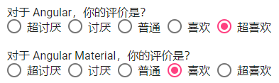

### 调整 label 的位置

和前面的 `<mat-checkbox>` 一样，我们可以使用 `labelPosition` 来调整 label 的位置，而且在 `<mat-radio-group>` 和 `<mat-radio-button>` 中都可以使用；在 `<mat-radio-group>` 设置的话，里面所有的 `<mat-radio-button>` 都会照着这个规则走；在 `<mat-radio-button>` 设置的话，则会覆盖 `<mat-radio-group>` 的设置。

*src\app\dashboard\survey\survey.component.html*

```html
<div>
    <div>对于 Angular，你的评价是？</div>
    <mat-radio-group formControlName="angularLikeScore" labelPosition="before">
        <mat-radio-button [value]="1">超讨厌</mat-radio-button>
        <mat-radio-button [value]="2">讨厌</mat-radio-button>
        <mat-radio-button [value]="3">普通</mat-radio-button>
        <mat-radio-button [value]="4">喜欢</mat-radio-button>
        <mat-radio-button [value]="5" labelPosition="after">超喜欢</mat-radio-button>
    </mat-radio-group>
</div>
```

 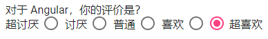

### 改变 radio 的颜色

和前面的 `<mat-checkbox>` 一样，调整 `color` 即可，不过目前无法针对 `<mat-radio-group>` 整个群组一起调整，有点可惜；只能单一调整每个 `<mat-radio-button>`。

*src\app\dashboard\survey\survey.component.html*

```html
<mat-radio-button [value]="1" color="primary">超討厭</mat-radio-button>
<mat-radio-button [value]="2" color="accent">討厭</mat-radio-button>
<mat-radio-button [value]="3" color="warn">普通</mat-radio-button>
```

## 使用 Angular Material 的 Slide Toggle

最后我们来讲 Material Design 的 Switch 功能，这个功能在 Angular Material 被设计成 `mat-slide-toggle` 组件，因此我们必须先加入 `MatSlideToggleModule`。

*src\app\shared-material\shared-material.module.ts*

```typescript
@NgModule({
  exports: [
    MatSlideToggleModule,
    ...
  ]
})
export class SharedMaterialModule {}
```

### 使用 mat-slide-toggle

*src\app\dashboard\survey\survey.component.ts*

```typescript
export class SurveyComponent implements OnInit {
    constructor(private httpClient: HttpClient) {
        this.surveyForm = new FormGroup({
          ...,
          mainQuestions: new FormGroup({
            ...,

            subscribeAngular: new FormControl(true),
            subscribeAngularMaterial: new FormControl(true),
            subscribeNgRx: new FormControl(false)
          })
        });
    }
}
```

*src\app\dashboard\survey\survey.component.html*

```html
<!-- 使用 mat-slide-toggle -->
<div>
    <div>订阅电子报</div>
    <div><mat-slide-toggle formControlName="subscribeAngular">Angular 技巧全集</mat-slide-toggle></div>
    <div><mat-slide-toggle formControlName="subscribeAngularMaterial">Angular Material 全攻略</mat-slide-toggle></div>
    <div><mat-slide-toggle formControlName="subscribeNgRx">NgRx 入门班</mat-slide-toggle></div>
</div>
```

 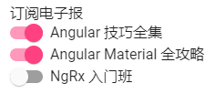

> `<mat-slide-toggle>` 没有 `indeterminate` 状态

### 设置 label 位置

通过 `labelPosition` 就可以达成了。

*src\app\dashboard\survey\survey.component.html*

```html
<mat-slide-toggle formControlName="subscribeAngular" labelPosition="before">
    Angular 技巧全集
</mat-slide-toggle
```

 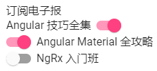

### 设置 mat-slide-toggle 的颜色

加上 `color`

*src\app\dashboard\survey\survey.component.html*

```html
<mat-slide-toggle formControlName="subscribeAngular" labelPosition="before" color="primary">
    Angular 技巧全集
</mat-slide-toggle>
<mat-slide-toggle formControlName="subscribeAngularMaterial" color="accent">
    Angular Material 全攻略
</mat-slide-toggle>
<mat-slide-toggle formControlName="subscribeNgRx" color="warn">NgRx 入门班</mat-slide-toggle>
```

 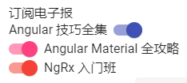