# 问卷页面 - Datepicker

之前提到 Input 介绍当 `<input type>` 设为 date 时，会依照浏览器的不同生产不一样的日期显示方式，为了消除这种浏览器间的差异，我们会选择不使用原生的页面，而是自己画（或找三方的）的组件来选择日期。

而在日期选择方面，Material Design 也有指出一些设计参考，同时 Angular Material 提供了一个 Datepicker，方便我们可以快速的选择日期。

## Material Design 中的 Pickers

在 [Material Design 的 Pickers 设计指南](https://material.io/guidelines/components/pickers.html)中，针对时间和日期，都提供了一些设计的参考，主要的方向是提供一个给使用者选择日期或时间的工具，选择的方式必须直接好理解。

在移动端可以用 dialog 的方式显示；在屏幕比较大的页面，可以在输入框下直接显示。


## 开始使用 Angular Material 的 Datepicker

使用 Datepicker，必须先引入 `MatDatepickerModule`。

不过对于 Datepicker 来说，这样不太够，因为**跟日期有关的部分虽然 JavaScript 有原生的 Date 类型，但 Date 在不同浏览器中有不同的实现方式，而且还会遇到语系问题等等**，因此比较常见的做法是使用 [Moment.js](https://momentjs.com/) 来处理日期相关的资讯，这部分 Angular Material 也都设计好了，对于日期处理的部分，我们可以选择要使用原生的处理日期方式 `MatMomentDateModule`，为了让页面对日期显示有更好的支持，我们选择使用 `MatMomentDateModule`，不过 `MatMomentDateModule` 没有内建在 Angular Material 中，需要通过 npm 安装：

```sh
npm i @angular/material-moment-adapter moment --save
```

安装完成后再讲 `MatMomentDateModule` 加入我们共用的 Module 中！

*src\app\shared-material\shared-material.module.ts*

```typescript
import { MatDatepickerModule } from '@angular/material';
import { MatMomentDateModule } from '@angular/material-moment-adapter';

@NgModule({
  exports: [
    MatMomentDateModule,
    MatDatepickerModule,
    ...
  ]
})
export class SharedMaterialModule { }
```

## 使用 mat-datepicker 选择日期

和 Autocomplete 一样，我们需要一个 `<input>` 作为文字输入的主题，而 Datepicker 则可以使用 `<mat-datepicker>` 组件，我们只要在 input 中设定 `[matDatepicker]` 属性及可指定 input 要显示的 Datepicker 来源，另外我们加上一个 `<mat-datepicker-toggle>` 来开关 `<mat-datepicker>` 的显示方式。

*src\app\dashboard\survey\survey.component.html*

```html
<!-- 使用 mat-datepicker 选择日期 -->
<div>
    <mat-form-field>
        <input type="text" name="birthday" matInput placeholder="生日" 
               [matDatepicker]="birthdayPicker">
        <mat-datepicker-toggle [for]="birthdayPicker" matSuffix></mat-datepicker-toggle>
        <mat-datepicker #birthdayPicker></mat-datepicker>
    </mat-form-field>
</div>
```

 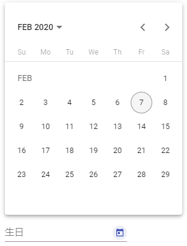

`matSuffix` directive 是属性后缀，决定日历图标的位置。

> 此时样式与 `MatNativeDateModule` 一直

### 设置 Datepicker 语系

在 moment.js 强力支持下，为 Angular Material 的 Datepicker 套上中文的语系十分简单，只需要在 providers 中为 `MAT_DATE_LOCALE` 注入目标语系的值即可：

*src\app\shared-material\shared-material.module.ts*

```typescript
@NgModule({
  exports: [
    MatMomentDateModule,
    // MatNativeDateModule,
    MatDatepickerModule,
    ...
  ],
  providers: [
    { provide: MAT_DATE_LOCALE, useValue: 'zh-CN' }
  ]
})
export class SharedMaterialModule { }
```

 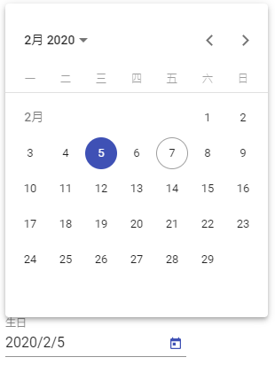

### 设置 Datepicker 显示格式

Datepicker 会依照不同语系设置不同的显示格式，这样有可能会造成不必要的混淆，我们也能够自行决定显示的格式，方法与变更语系类似，注入 `MAT_DATE_FORMATS` 的设置即可：

*src\app\shared-material\shared-material.module.ts*

```typescript
export const MY_FORMATS = {
  parse: {
    dateInput: 'YYYY-MM-DD'
  },
  display: {
    dateInput: 'YYYY-MM-DD',
    monthYearLabel: 'YYYY MMM',
    dateA11yLabel: 'YYYY/MM/DD',
    monthYearA11Label: 'YYYY MMM'
  }
};

@NgModule({
  exports: [
    MatMomentDateModule,
    // MatNativeDateModule,
    MatDatepickerModule,
    ...
  ],
  providers: [
    { provide: MAT_DATE_LOCALE, useValue: 'zh-CN' },
    { provide: MAT_DATE_FORMATS, useValue: MY_FORMATS }
  ]
})
export class SharedMaterialModule { }
```

 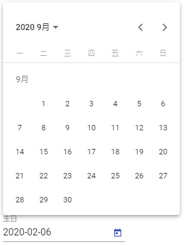

我们分别设定了解析（parse）与显示（display）的规则，`monthYearLabel` 是 picker 左上方选择`年 月`的显示格式，`A11y`相关的设定则是在使用屏幕朗读程序时（或 Mac 的 voiceover）使用的格式。

### 调整 Datepicker 起始界面

Datepicker 默认打开的界面会是日历形式的日期选择，我们可以将 `<mat-datepicker>` 的 `startView` 属性设定为 `year`（默认为 `month`），则会先出现一整年的可选月份，选择月份后才选择日期：

```html
<mat-datepicker #birthdayPicker startView="year"></mat-datepicker>
```

 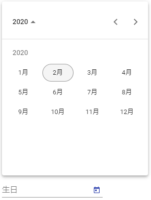

### 调整 Datepicker 起始时间

糊了起始界面之外，我们也可以设置 `startAt` 属性，来决定 Datepicker 的打开时间：

*src\app\dashboard\survey\survey.component.ts*

```typescript
export class SurveyComponent implements OnInit {
    startDate = moment(new Date(2020, 1, 7)); // 2020-2-7
}
```

*src\app\dashboard\survey\survey.component.html*

```html
<mat-datepicker #birthdayPicker [startAt]="startDate"></mat-datepicker>
```

 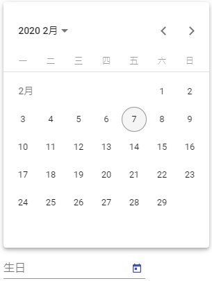

### 设定 Datepicker 可以选择的范围

我们可以使用 `min` 和 `max` 属性，来设定一个 input 的最小值和最大值，当在使用 Datepicker 时，也会根据这 2 个值来决定 picker 可选择的范围，例如：

*src\app\dashboard\survey\survey.component.ts*

```typescript
export class SurveyComponent implements OnInit {
    
    startDate: moment.Moment;
    minDate: moment.Moment;
    maxDate: moment.Moment;
    
    constructor(private httpClient: HttpClient) {
        this.startDate = moment(new Date(2020, 1, 7)); // 2020-2-7
        this.minDate = moment('2020-1-1');
        this.maxDate = moment('2020-2-29');
    }
}
```

*src\app\dashboard\survey\survey.component.html*

```html
<!-- 使用 mat-datepicker 选择日期 -->
<div>
    <mat-form-field>
        <input type="text" name="birthday" matInput placeholder="生日"
               [matDatepicker]="birthdayPicker" [min]="minDate" [max]="maxDate">
        <mat-datepicker-toggle [for]="birthdayPicker" matSuffix></mat-datepicker-toggle>
        <mat-datepicker #birthdayPicker [startAt]="startDate"></mat-datepicker>
    </mat-form-field>
</div>
```

 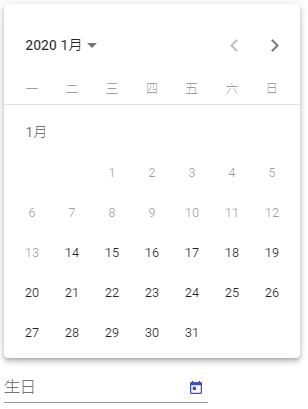

可以看到 2020/01/14 之前的日期已经变成灰底无法选择，这就固定住 Datepicker 的可选范围。

### 使用 filter 过滤不可以被选择的日期

我们也可以使用 `matDatepickerFilter` 来指定一个过滤可用日期的 function，这个 function 返回 true 或 false 来告知 Datepicker 什么时间是不可选的，例如每周二和周五不可选，代码如下：

*src\app\dashboard\survey\survey.component.ts*

```typescript
familyDayFilter(date: moment.Moment) {
    const day = date.day();
    return day !== 2 && day !== 5;
}
```

*src\app\dashboard\survey\survey.component.html*

```html
<!-- 使用 mat-datepicker 选择日期 -->
<div>
    <mat-form-field>
        <input type="text" name="birthday" matInput placeholder="生日"
               [matDatepicker]="birthdayPicker" [min]="minDate" [max]="maxDate"
               [matDatepickerFilter]="familyDayFilter">
        <mat-datepicker-toggle [for]="birthdayPicker" matSuffix></mat-datepicker-toggle>
        <mat-datepicker #birthdayPicker [startAt]="startDate"></mat-datepicker>
    </mat-form-field>
</div>
```

 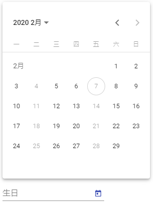

### 关于 Datepicker 的 input 和 change 相关事件

文字输入框（`<input type="xxx" />`）都会有原生的 input 和 change 事件，不过这些事件都只在使用者跟 input 本身互动时才会触发，因此下面的代码得到的事件对象只是一般的 InputEvent：

*src\app\dashboard\survey\survey.component.html*

```html
<input type="text" name="birthday" matInput placeholder="生日"
                [matDatepicker]="birthdayPicker" [min]="minDate" [max]="maxDate"
                [matDatepickerFilter]="familyDayFilter"
                (input)="logDateInput($event)" (change)="logDateChange($event)">
```

*src\app\dashboard\survey\survey.component.ts*

```typescript
logDateInput($event: any) {
    console.log('logDateInput');
    console.log($event);
}

logDateChange($event: any) {
    console.log('logDateChange');
    console.log($event);
}
```

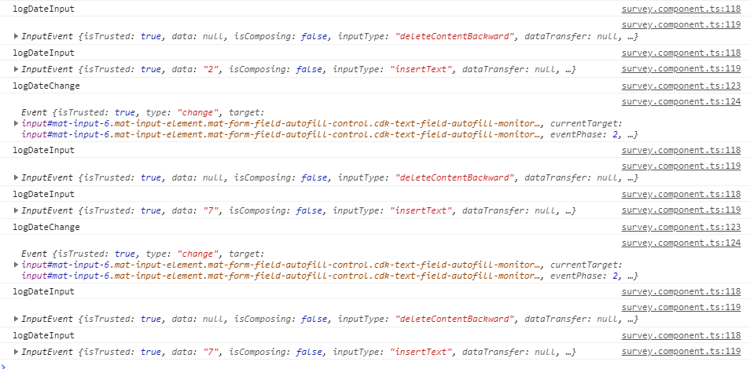

> `<input>` 的 change 事件仅在 input 失去焦点时触发，当选中日期时不会触发任何事件

若希望记录的是真实的日期选择变化，则可以使用 `dateInput` 和 `dateChange` 事件，传入的时间会是 `MatDatepickerInputEvent<T>`，`<T>` 则看我们使用处理时间的 Module 是`MatMomentDateModule` 还是 `MatNativeDateModule`，如果是 `MatNativeDateModule`会使用 `Date`，`MatMomentDateModule` 则是 Moment 类型：

*src\app\dashboard\survey\survey.component.ts*

```typescript
logDateInput($event: MatDatepickerInputEvent<moment.Moment>) {
    console.log($event);
}

logDateChange($event: MatDatepickerInputEvent<moment.Moment>) {
    console.log($event);
}
```

*src\app\dashboard\survey\survey.component.html*

```html
<input type="text" name="birthday" matInput placeholder="生日"
                [matDatepicker]="birthdayPicker" [min]="minDate" [max]="maxDate"
                [matDatepickerFilter]="familyDayFilter"
                (dateInput)="logDateInput($event)" (dateChange)="logDateChange($event)">
```

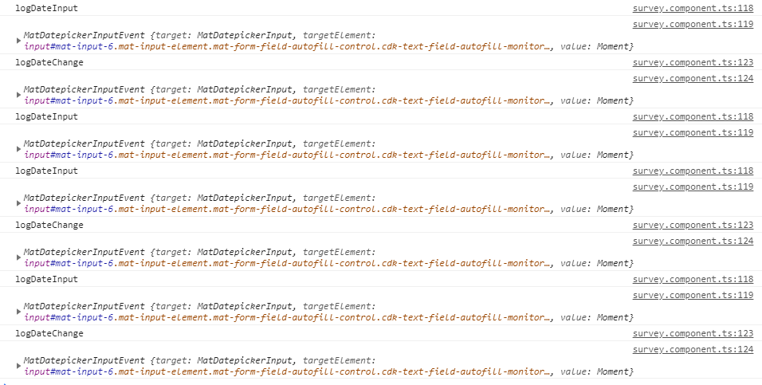

> 选择日期时会触发事件

### 关于 Datepicker 的 disabled 模式说明

#### 整个 Input 进行 disabled

在 input 中设定 disabled 状态其实不难，但配上 Datepicker 则有了些不同的变化，例如：

*src\app\dashboard\survey\survey.component.ts*

```typescript
constructor(private httpClient: HttpClient) {
    this.surveyForm = new FormGroup({
      basicQuestions: new FormGroup({
        ...,
        birthday: new FormControl({ value: '', disabled: true })
      })
    });
}
```

*src\app\dashboard\survey\survey.component.html*

```html
<input type="text" name="birthday" matInput placeholder="生日" formControlName="birthday"
                [matDatepicker]="birthdayPicker" [min]="minDate" [max]="maxDate"
                [matDatepickerFilter]="familyDayFilter"
                (dateInput)="logDateInput($event)" (dateChange)="logDateChange($event)">
```

 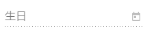

#### 只 disabled mat-datepicker-toggle 按钮

我们可以针对 `mat-datepicker-toggle` 单独设置 disabled 状态，先把 birthday 的 disabled 状态改掉，然后 `mat-datepicker-toggle` 设置 disabled：

*src\app\dashboard\survey\survey.component.ts*

```typescript
constructor(private httpClient: HttpClient) {
    this.surveyForm = new FormGroup({
      basicQuestions: new FormGroup({
        ...,
        birthday: new FormControl({ value: '', disabled: false })
      })
    });
}
```

*src\app\dashboard\survey\survey.component.html*

```html
<mat-datepicker-toggle [for]="birthdayPicker" matSuffix disabled></mat-datepicker-toggle>
```

 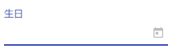

日历 icon 图标已置灰点击不可弹出日期菜单，但是 input 文字框依然是可以输入的。

#### disabled 文字 input，但 picker 不做 disabled

另一种变形的做法是，我们可以把 input 文字框 disabled 掉，但依然保留 picker 的可选状态，这么做的好处是，**可以避免使用者随意输入不必要的内容，造成后续处理的麻烦；**先在 *survey.component.ts* 中将 birthday 的状态设置为 disabled，此时原本是不可输入，也没有 picker 可用，然后我们将 `mat-datepicker` 的 `disabled` 状态设为 `false`，就会变成 picker 可以使用的状态了：

*src\app\dashboard\survey\survey.component.ts*

```typescript
constructor(private httpClient: HttpClient) {
    this.surveyForm = new FormGroup({
      basicQuestions: new FormGroup({
        ...,
        birthday: new FormControl({ value: '', disabled: true })
      })
    });
}
```

*src\app\dashboard\survey\survey.component.html*

```html
<mat-form-field>
    <input type="text" name="birthday" matInput placeholder="生日" formControlName="birthday"
           [matDatepicker]="birthdayPicker" [min]="minDate" [max]="maxDate"
           [matDatepickerFilter]="familyDayFilter"
           (dateInput)="logDateInput($event)" (dateChange)="logDateChange($event)">
    <mat-datepicker-toggle [for]="birthdayPicker" matSuffix></mat-datepicker-toggle>
    <mat-datepicker #birthdayPicker [startAt]="startDate" disabled="false"></mat-datepicker>
</mat-form-field>
```

 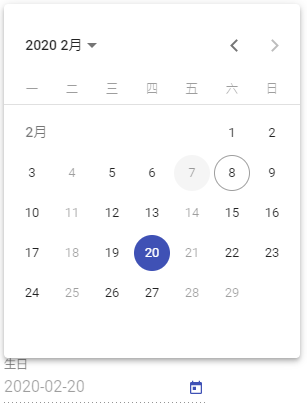

### 设置 Touch UI 模式

默认情况下，Datepicker 是依附在 input 之下的，这在一般桌面应用上没有问题，但是在移动端尤其屏幕较小的触摸屏上就会显得不好操作，这时候我们可以替 `<mat-datepicker>` 设置 `touchUi`，就会变成适合触摸屏的模式：

*src\app\dashboard\survey\survey.component.html*

```html
<mat-form-field>
    <input type="text" name="birthday" matInput placeholder="生日" formControlName="birthday"
           [matDatepicker]="birthdayPicker" [min]="minDate" [max]="maxDate"
           [matDatepickerFilter]="familyDayFilter"
           (dateInput)="logDateInput($event)" (dateChange)="logDateChange($event)">
    <mat-datepicker-toggle [for]="birthdayPicker" matSuffix></mat-datepicker-toggle>
    <mat-datepicker #birthdayPicker [startAt]="startDate" touchUi></mat-datepicker>
</mat-form-field>
```

 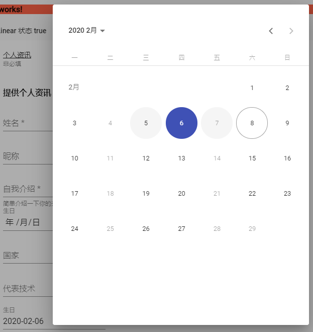

> 更进阶的做法是，检测浏览器的可用宽度，当宽度低的时候，自动切换 Touch UI 模式，这部分 Angular Material 将这样的功能切到了 Angular CDK中。

### 自行在程序中打开 Datepicker

`<mat-datepicker>` 本身就是一个 component，因此我们不一定非要搭配 `<mat-datepicker-toggle>` 来切换，也能自行在程序中处理，只要去设定 `<mat-datepicker>` 的 `opened` 属性即可：

*src\app\dashboard\survey\survey.component.html*

```html
<div>
	<mat-form-field>
	  <input type="text" name="birthday" matInput placeholder="生日" formControlName="birthday"
			[matDatepicker]="birthdayPicker" [min]="minDate" [max]="maxDate"
			[matDatepickerFilter]="familyDayFilter"
			(dateInput)="logDateInput($event)" (dateChange)="logDateChange($event)">
	  <mat-datepicker-toggle [for]="birthdayPicker" matSuffix disabled></mat-datepicker-toggle>
	  <mat-datepicker #birthdayPicker [startAt]="startDate" touchUi></mat-datepicker>
	</mat-form-field>
	<button mat-raised-button (click)="birthdayPicker.opened = true">打开 Datepicker</button>
</div>
```

 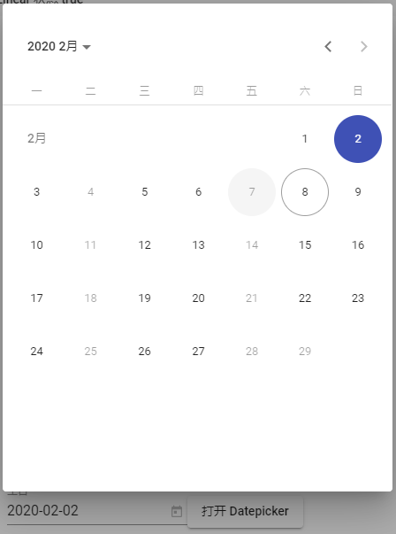