# 问卷页面 - From Field

前几天我们介绍了几个 Angular Material 常见的文字型表单控件，如 Input、Autocomplete、Datepicker 和 Select。这些控制项在 Angular 有一些特点，就是他们都会使用一个 `<mat-form-field> `组件包起来，这个组件到底是有什么作用，让这些表单栏位都离不开它呢？让我继续看下去吧！

## 简介 Angular Material 的 Form Field

`<mat-form-field>`被用来包住几个常见的文字栏，根据[「Material Design中的text fields設計指南」](https://material.io/guidelines/components/text-fields.html)来替这些栏位加上如底线、label 和提示信息等功能等，并符合 Material Design 中的建议，让我们不需要重新造轮子，就能用一致的显示方式来打造我们的界面。

下面几种功能在设计上都能够搭配`<mat-form-field>`使用：

- `<input matInput>` 和 `<textarea matInput>`
- `<mat-select>`
- `<mat-clip-list>`：我们在未来的文章中继续介绍

下面我们所提到的每个 Form Field 的功能，在以上 3 种状况下，都可以使用。

## Form Field 功能介绍

要使用 `<mat-form-field>` 必须加入 MatFormFieldModule，在之前的文章我们也应该都已经加入！

*src\app\shared-material\shared-material.module.ts*

```typescript
@NgModule({
  exports: [
    MatFormFieldModule,
    ...
  ]
})
export class SharedMaterialModule {}
```

### 设置 float label

在 Material Design 中针对这些输入型的栏位有个很特殊的设计，称之为 floating label，也就是我们常用的 label 位置可以放在 input 里面，像是 placeholder 一样，如下：

 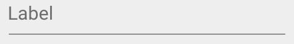

当组件被 focus 的时候，这个 label 会自动浮到上面去，如下：

 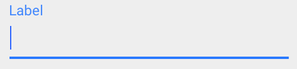

也因此在 Angular Material中，我们不需要特别去加一个 `<label>`，直接设置 `placeholder` 属性即可，它同时就兼具了 placeholder 和 label 的作用，非常方便。

这个效果其实是可以自己设置的，可以通过设置 `floatLabel`，来决定这个 label 的显示模型，目前有以下几种：

- **auto**：默认值，当 focus 时，label 会自动向上浮起来变成 label 的角色。
- **always**：代表永远都是浮起来的状态，这时候可以直接将它视为一个单纯的 label 存在。
- **never**：代表永远不要浮起来，这时候可以把它直接当做一个单纯的 placeholder。

我们可以修改一下之前问卷调查的程序，随意找几个 `<mat-form-field>` 包起来的组件来设置，例如：

*src\app\dashboard\survey\survey.component.html*

```html
<!-- floatLabel: always、never -->
<mat-form-field floatLabel="always">
    <input type="text" name="name" matInput placeholder="姓名" formControlName="name" required>
</mat-form-field>
<div>
    <mat-form-field floatLabel="never">
        <input type="text" name="nickname" matInput placeholder="昵称">
    </mat-form-field>
</div>
```

 

### 设置全域的 float label

如果希望所有的 `<mat-form-field>` 都保持一样的显示方式，不需要一个一个组件设定，只需要注入`MAT_LABEL_GLOBAL_OPTIONS` 即可，例如：

*src\app\dashboard\survey\survey.component.ts*

```typescript
@Component({
  selector: 'app-survey',
  templateUrl: './survey.component.html',
  styleUrls: ['./survey.component.scss'],
  providers: [
    { provide: MAT_LABEL_GLOBAL_OPTIONS, useValue: { float: 'always' } }
  ]
})
export class SurveyComponent implements OnInit {...}
```

 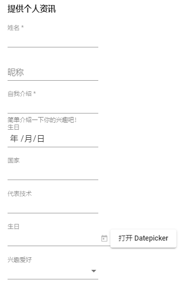

可以看到除了我们自己设置`never`的栏位以外，其他没设置的都变成了`always`的模式了！

### 隐藏设置 required 所显示的星号(*)

默认情况下，只要我们的表单组件加上 `required`，在显示文字时都会加上一个星号(*)，这是必填项的用法，如果不想显示这个星号，可以设定`hideRequiredMarker`属性。

```html
<mat-form-field floatLabel="always" [hideRequiredMarker]="true">
    <input type="text" name="name" matInput placeholder="姓名" formControlName="name" required>
</mat-form-field>
```

原本的姓名栏旁边多了一个星号(*)

 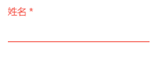

设置后就不会显示了

 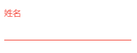

尽管不提示星号，但当有 invalid 状态时，还是会变成红色提示。

### 使用 mat-placeholder 提供更细致的 placeholder

一般来说我们可以直接使用 `placeholder` 属性提供文字描述，同时具有 label 的角色，但毕竟通过 `<label>` 标签可以提供更复杂的 label 显示，如果希望 placeholder 也能提供更复杂的样式，可以改成在 `<mat-form-field>` 中加入 `<mat-placeholder>` 这个组件。

*src\app\dashboard\survey\survey.component.html*

```html
<mat-form-field floatLabel="always" [hideRequiredMarker]="false">
    <input type="text" name="name" matInput placeholder="姓名" formControlName="name" required>
    <mat-placeholder>
        <mat-icon>person</mat-icon>请输入您的名字
    </mat-placeholder>
</mat-form-field>
```

 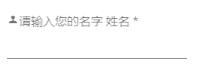

这时候的页面上的姓名两个字重复出现了，这是因为 `placeholder` 和 `<mat-placeholder>` 同时出现的关系，这时候我们还能再开发者工具中看到以下错误信息：

 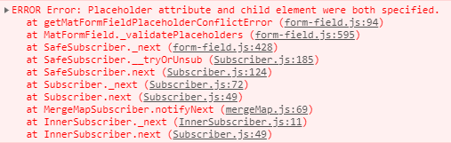

提醒了我们 `placeholder` 和 `<mat-placeholder>` 不应该同时出现，虽然看起来还是都会显示，但也不能保证就一定会正常，还是先把 `placeholder` 属性拿掉保留 `<mat-placeholder>` 就好！

```html
<mat-form-field floatLabel="always" [hideRequiredMarker]="false">
    <input type="text" name="name" matInput formControlName="name" required>
    <mat-placeholder>
        <mat-icon>person</mat-icon>请输入您的名字
    </mat-placeholder>
</mat-form-field>
```

 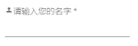

### 使用 hintLabel 属性或 mat-hint 设置提示文字

在之前介绍 `matInput` 的时候，我们已经用过 `<mat-hint>`了，通过 `<mat-hint>` 我们可以为组件提供基础的说明文字，我们也能够直接设置 `<mat-form-field>` 的 `hintLabel` 达到同样的效果，不过 `hintLabel` 比较适合用在单纯的文字显示上，而 `<mat-hint>` 则可以做更复杂的显示。

除此之外 `<mat-hint>` 还可以设定 `align` 属性，透过设定为 `start` 或 `end` 来决定对齐的方向，而 `hintLabel` 无法设置 `align`，只会出现在 `start` 的位置。

*src\app\dashboard\survey\survey.component.html*

```html
<mat-form-field floatLabel="always" [hideRequiredMarker]="false" hintLabel="最多输入 5 个字">
    <input type="text" name="name" matInput formControlName="name" required>
    <mat-placeholder>
        <mat-icon>person</mat-icon>请输入您的名字
    </mat-placeholder>
    <!-- mat-hint -->
    <mat-hint align="end">
        已输入：{{ surveyForm.get('basicQuestions')?.get('name')?.value?.length || 0 }} / 5
    </mat-hint>
</mat-form-field>
```

 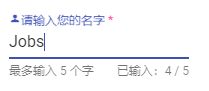

> **提示**：`align` 不能复用，否则会产生错误信息，虽然目前看起来还是会显示只是排版可能会乱掉，但还是尽量避免。
>
>  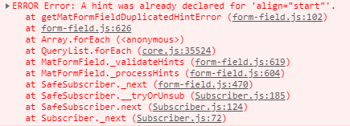

### 使用 mat-error 提示错误信息

之前的 input 我们介绍了，可以使用 `<mat-error>` 来提示错误信息，这个 `<mat-error>` 只有在 `<mat-form-field>` 发生错误时才会显示，因此在简单的情况下我们可以少写一些 `ngIf` 或 `ngSwitch`：

*src\app\dashboard\survey\survey.component.html*

```html
<mat-form-field floatLabel="always" [hideRequiredMarker]="false" hintLabel="最多输入 5 个字">
    <input type="text" name="name" matInput formControlName="name" required>
    <mat-placeholder>
        <mat-icon>person</mat-icon>请输入您的名字
    </mat-placeholder>
    <!-- mat-error -->
    <mat-error>姓名有误！</mat-error>
</mat-form-field>
```

 

当然比较复杂例如需要依照显示不同错误提示的时候，还是需要搭配 `ngIf` 或 `ngSwitch`来显示。

### 使用 color 改变整个 mat-form-field 的 focus 颜色

之前我们提示过，Angular Material 中特别定义了 `primary`、`accent` 和 `warn`，而大多数的 Angular Material 组件都可以直接通过 `color="xxx"` 的方式，来改变颜色，`<mat-form-field>` 当然也不例外：

*src\app\dashboard\survey\survey.component.html*

```html
<mat-form-field floatLabel="never" color="accent">
    <input type="text" name="nickname" matInput placeholder="昵称">
</mat-form-field>
```

 

当昵称栏位被 focus，原本默认应该显示 `primary` 的颜色，但因为我们设置了 `color="accent"` 的关系，变成了另一种颜色。

### 设置 prefix 和 suffix

最后我们再看一个表单中常用的功能，**在输入控制项前后加上 icon 图标**。我们可以通过 `matPrefix` 和 `matSuffix`，把元素放到输入控制项的前面或后面，如下：

*src\app\dashboard\survey\survey.component.html*

```html
<!-- prefix 和 suffix -->
<div>
    <mat-form-field>
        <input type="number" matInput placeholder="请问您的平均日常消费?">
        <mat-icon matPrefix>attach_money</mat-icon>
        <span matSuffix>RMB</span>
    </mat-form-field>
</div>
```

 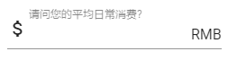

## 小提示

在 `<mat-form-field>` 中，至少需要加入一个 `MatFormFieldControl`，也就是 `<mat-form-field>` 所能支持的控制项，否则会出现错误信息：

```
Error: mat-form-field must contain a MatFormFieldControl
```

