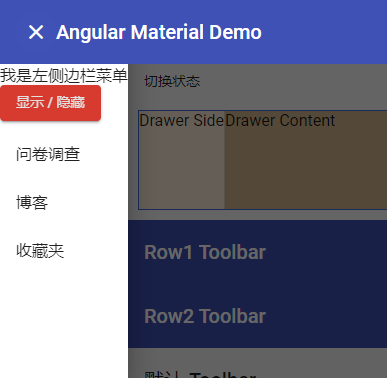
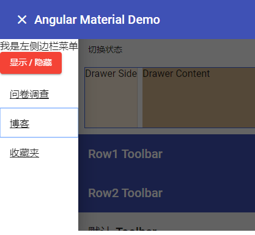
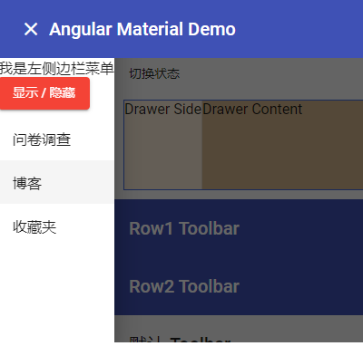
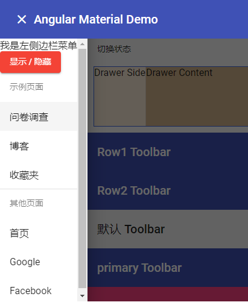
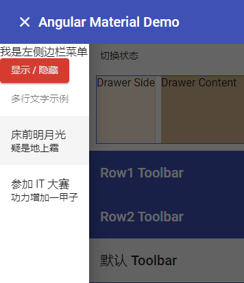
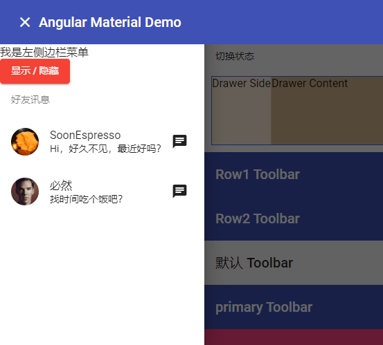
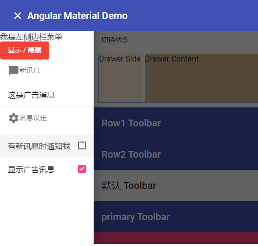
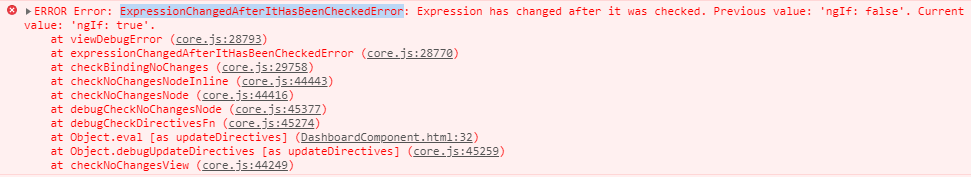

# 基本后台 - Toolbar

今天我们要来学习使用 Angular Material 的 List 组件来填满 SideNav。

## 关于 Material Design 中的 List

在 [Material Design的List 设计指南](https://material.io/components/lists/)中，List 是在一栏中呈现多个资料列，每一列就是一组资料，在资料列中我们能够清楚的呈现相关的资讯，如果有需要，也能够对这些资讯进行一些额外的操作。

一个资料列基本上会包含 3 种资料，非必要但可以参考：

1. **Avatar**：可以是一个头像或是 Icon，用来作为这笔资料的基本代表；在页面上我们应该能从这里立即得了解资讯的大致含义。
2. **内容**：主要的文字内容，通常是单行文字，必要的时候多行文字也没有问题，只要页面能清楚呈现即可。
3. **行动 or 资讯**：代表资料的补充讯息，可能是个警告的 icon，或是一个按下去会有其他行为的按钮等等。

 

## 开始使用 Angular Material 的 List 组件

### 使用 mat-list 及 mat-list-item

使用 List 组件前，我们必须加入 `MatListModule`，之后可以使用 `<mat-list>`及`<mat-list-item>`的组合来完成一个基本的List：

*src\app\shared-material\shared-material.module.ts*

```typescript
import { NgModule } from '@angular/core';
import { ..., MatListModule } from '@angular/material'


@NgModule({
  imports: [
    MatListModule, ...
  ],
  exports: [
    MatListModule, ...
  ]
})
export class SharedMaterialModule { }

```

*src\app\dashboard\dashboard.component.html*

```html
<mat-sidenav #sideNav class="app-sidenav" mode="push">
    <div>我是左侧边栏菜单</div>
    <div>
      <button mat-raised-button color="warn" (click)="sideNav.toggle()">显示 / 隐藏</button>
    </div>
    <mat-list>
      <mat-list-item>问卷调查</mat-list-item>
      <mat-list-item>博客</mat-list-item>
      <mat-list-item>收藏夹</mat-list-item>
    </mat-list>
  </mat-sidenav>
<mat-sidenav-content>
```

 

这是一个很简单的清单资料，不过在 SideNav 中，希望是能够点击的 Link，好在 `<mat-list-item>` 不仅仅是 component，也能够以 directive 的方式呈现，因此我们稍微做点调整：

*src\app\dashboard\dashboard.component.html*

```html
<mat-sidenav #sideNav class="app-sidenav" mode="push">
    <div>我是左侧边栏菜单</div>
    <div>
        <button mat-raised-button color="warn" (click)="sideNav.toggle()">显示 / 隐藏</button>
    </div>
    <mat-list>
        <a [routerLink]="['/', 'dashboard', 'survey']" mat-list-item>问卷调查</a>
        <a [routerLink]="['/', 'dashboard', 'blog']" mat-list-item>博客</a>
        <a [routerLink]="['/', 'dashboard', 'inbox']" mat-list-item>收藏夹</a>
    </mat-list>
</mat-sidenav>
```

 

当我们展开菜单时，默认会 focus 在第一个项目，同时我们可以使用 `tab` 来切换，更棒的是使用 `tab` 切换时，不会切换到 List 之外的内容，只会在 List 之内循环，许多清单类型的 Angular Material 都具有这样的特性，让使用键盘操作时更加灵活。

### 使用 mat-nav-list

上面的例子在导航列的菜单链接中有底线，这有违我们一般的习惯，我们可以使用 CSS 来调整，但 Angular Material 提供了更优质的做法，也就是另一个组件 `mat-nav-list`，这个组件可以使用在导航用的 list 中：

*src\app\dashboard\dashboard.component.html*

```html
<mat-nav-list>
    <a [routerLink]="['/', 'dashboard', 'survey']" mat-list-item>问卷调查</a>
    <a [routerLink]="['/', 'dashboard', 'blog']" mat-list-item>博客</a>
    <a [routerLink]="['/', 'dashboard', 'inbox']" mat-list-item>收藏夹</a>
</mat-nav-list>
```

 

### 使用 matSubheader 及 mat-divider

当清单很多时，需要将资料分类显示，这时可以使用 `matSubheader`，替每组资料标上一个分类名称。除此之外，我们可以使用 `<mat-divider>` 这个来分隔不同群组的资料。

*src\app\dashboard\dashboard.component.html*

```html
<mat-nav-list>
    <h3 matSubheader>示例页面</h3>
    <a [routerLink]="['/', 'dashboard', 'survey']" mat-list-item>问卷调查</a>
    <a [routerLink]="['/', 'dashboard', 'blog']" mat-list-item>博客</a>
    <a [routerLink]="['/', 'dashboard', 'inbox']" mat-list-item>收藏夹</a>

    <mat-divider></mat-divider>

    <h3 matSubheader>其他页面</h3>
    <a [routerLink]="['/']" mat-list-item>首页</a>
    <a [routerLink]="['/']" mat-list-item>Google</a>
    <a [routerLink]="['/']" mat-list-item>Facebook</a>
</mat-nav-list>
```

 

### 使用 matLine 让清单资料以多行方式显示

`<mat-list-item>` 默认是一行文字，但当有需要的时候，我们可以使用 `matLine` 来建立多行文字。

*src\app\dashboard\dashboard.component.html*

```html
<mat-nav-list>
    <h3 matSubheader>多行文字示例</h3>
    <mat-list-item>
        <p matLine>床前明月光</p>
        <p matLine>疑是地上霜</p>
    </mat-list-item>
    <mat-list-item>
        <p matLine>参加 IT 大赛</p>
        <p matLine>功力增加一甲子</p>
    </mat-list-item>
</mat-nav-list>
```

 

可以发现第一行的文字会比较大，因为第一行文字通常代表的是主要讯息，之后的文字则是以补充为主，因此会小一点点。

### 使用 matListAvatar 显示头像

在清单中使用头像是很常见的一种应用，想是许多通讯软件都会采用这种设计方式，要在清单中使用头像可以在头像加上 `matListAvatar`

*src\app\dashboard\dashboard.component.html*

```html
<mat-nav-list>
    <h3 matSubheader>好友讯息</h3>
    <mat-list-item>
        
        <p matLine>SoonEspresso</p>
        <p matLine>Hi，好久不见，最近好吗？</p>
        <button mat-icon-button><mat-icon>chat</mat-icon></button>
    </mat-list-item>
    <mat-list-item>
        <!-- icon button 放在前面，也会被往后推 -->
        <button mat-icon-button><mat-icon>chat</mat-icon></button>
        
        <p matLine>必然</p>
        <p matLine>找时间吃个饭吧？</p>
    </mat-list-item>
</mat-nav-list>
```

 

### 可复选的 mat-selection-list

在 List 中，还有一个比较复杂的 component，`<mat-selection-list>` 及 `<mat-list-option>`，可以让清单变成可复选的列表，并自动在清单列后方加一个 CheckBox，在一些功能设定的页面非常好用。

*src\app\dashboard\dashboard.component.html*

```html
<mat-nav-list>
    <h3 matSubheader><mat-icon>chat_bubble</mat-icon>新讯息</h3>
    <mat-list-item *ngIf="optNew.selected">这是新消息</mat-list-item>
    <mat-list-item *ngIf="optAds.selected">这是广告消息</mat-list-item>

    <mat-divider></mat-divider>

    <h3 matSubheader><mat-icon>settings</mat-icon>讯息设定</h3>
    <mat-selection-list>
        <mat-list-option [value]="1" selected="true" #optNew>有新讯息时通知我</mat-list-option>
        <mat-list-option [value]="2" #optAds>显示广告讯息</mat-list-option>
    </mat-selection-list>
</mat-nav-list>
```

 

> 更多 `<mat-selection-list>` 和 `<mat-list-option>` 的 API 可以参考：
> https://material.angular.io/components/list/api#MatListOption

#### Expression has changed after it was checked

```html
<mat-selection-list>
	<mat-list-option [value]="1" selected="true" #optNew>有新讯息时通知我</mat-list-option>
</mat-selection-list>
```

此时修改了 optNew 的 `selected` 属性时

```html
<mat-list-item *ngIf="optNew.selected">这是新消息</mat-list-item>
```

会报错：



修改方式：

1. 将当前模式改为生产模式，在 npm 运行：`ng serve --open --prod` 或者修改：

   *src\environments\environment.ts*

   ```typescript
   export const environment = {
     production: true
   };
   ```

2. *src\app\dashboard\dashboard.component.html*

   ```html
   <mat-selection-list>
       <mat-list-option [value]="1" #optNew>有新讯息时通知我</mat-list-option>
   </mat-selection-list>
   ```

   *src\app\dashboard\dashboard.component.ts*

   ```typescript
   import { Component, OnInit, AfterViewInit, ViewChild } from '@angular/core';
   import { MatListOption } from '@angular/material';
   
   @Component({
     selector: 'app-dashboard',
     templateUrl: './dashboard.component.html',
     styleUrls: ['./dashboard.component.scss']
   })
   export class DashboardComponent implements OnInit, AfterViewInit {
   
     @ViewChild('optNew', { static: false })
     optNew: MatListOption;
   
     constructor() { }
   
     ngOnInit() {
     }
   
     ngAfterViewInit(): void {
       setTimeout(() => {
         this.optNew._setSelected(true);
       });
     }
   }
   
   ```

   