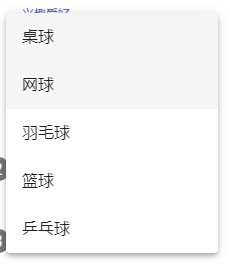
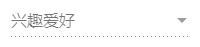
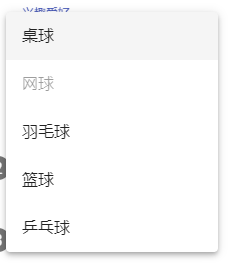
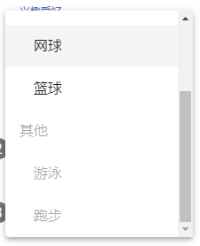
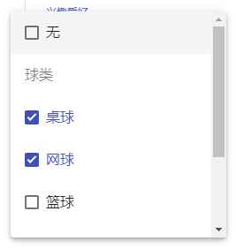
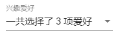
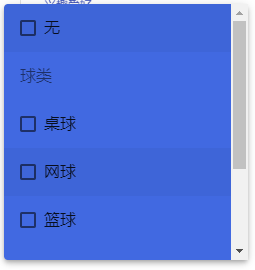

# 问卷页面 - Select

今天我们用比较轻松的步伐来介绍另一个常用组件 —— Select。

## 关于 Angular Material 的 Select

在 Angular Material 中，Select 的设计师依循这 [menus 这个组件](https://material.io/components/menus/)来设计的，毕竟 select 与 menu 本质上是大同小异的，都是用来从多个选项中选择一个或多个答案，所以在设计上风格也差不多，这是 menu 的概念偏向于**选择后执行某个动作**，而 select 则是在作为**表单中保存资料的一个组件**，因此跟 menu 最大不同的是，select 支持 `ngModel` 和 `formControlName` 这类的**表单绑定功能**。

## 开始使用 Angular Material 的 Select

在 Angular Material 中，Select 跟 Input 组件一样，都需要跟 `<mat-form-field>` 一起使用，Select 组件在 `MatSelectModule` 之中，加入这个 Module 之后，我们可以简单地组合使用 `<mat-select>` 和 `<mat-option>` 来达到类似的 `<select>` 功能，但**更具有 Material Design 的风格**。

*src\app\shared-material\shared-material.module.ts*

```typescript
@NgModule({
  exports: [
    MatSelectModule,
    ...
  ]
})
export class SharedMaterialModule {...}
```

### 使用 mat-select 和 mat-option

`<mat-select>` 和 `<mat-option>` 使用上非常类似于 HTML 的 `<select>` 和 `<option>`，因此使用上非常容易上手：

*src\app\dashboard\survey\survey.component.ts*

```typescript
export class SurveyComponent implements OnInit {
    
    interestList: any[];
    
    constructor(private httpClient: HttpClient) {
        this.interestList = [
          { id: 1, name: '桌球' },
          { id: 2, name: '网球' },
          { id: 3, name: '羽毛球' },
          { id: 4, name: '篮球' },
          { id: 5, name: '乒乓球' }
        ];
    }
}
```

*src\app\dashboard\survey\survey.component.html*

```html
<!-- 使用 mat-select 和 mat-option -->
<div>
    <mat-form-field>
        <mat-select formControlName="interest">
            <mat-option *ngFor="let item of interestList" [value]="item.id">
                {{ item.name }}
            </mat-option>
        </mat-select>
    </mat-form-field>
</div>
```

 

> 小技巧：如果没有要搭配表单的话，可以直接使用`[(value)]`来达到 two way binding 的效果。

### 设置 placeholder 属性

在原生的 `select` 是没有 placeholder 可以使用的，比较常见的技巧是通过一个 `<option [value]="null">text</option>` 来**假装**成 placeholder，但在 Angular Material 中我们可以在 `<mat-select>` 组件中直接使用 `placeholder`，十分方便！

```html
<mat-form-field>
    <mat-select formControlName="interest" placeholder="兴趣爱好">
        <mat-option *ngFor="let item of interestList" [value]="item.id">
            {{ item.name }}
        </mat-option>
    </mat-select>
</mat-form-field>
```

 

### 设置 disabled 属性

不管是 `<mat-select>` 还是 `<mat-option>`，都能通过 `disabled` 来设定其允许被选取的状态。

先看看在 `<mat-select>` 加上 `disabled` 属性后的样式：

```html
<mat-form-field>
    <mat-select formControlName="interest" placeholder="兴趣爱好" disabled>
        <mat-option *ngFor="let item of interestList" [value]="item.id">{{ item.name }}</mat-option>
    </mat-select>
</mat-form-field>
```

 

再看看 `<mat-option>` 加上 `disabled` 属性后的结果：

```html
<mat-form-field>
    <mat-select formControlName="interest" placeholder="兴趣爱好">
        <mat-option *ngFor="let item of interestList; let index = index;"
                    [value]="item.id" [disabled]="index === 1">
            {{ item.name }}
        </mat-option>
    </mat-select>
</mat-form-field>
```

 

### 还原 mat-select 的选取状态

目前设置好 `<mat-option>` 并进行选择后，是无法取消目前的选取状态的，这会使选项非必填无法反悔，这时候我们可以加入一个没有设定 `[value]`（其实就是 `[value]="undefined"`）的 `<mat-option>`，当选到这个选项时，就会自动跳回没有选择任何选项的模式，也就是还看得到 placeholder 的状态：

```html
<mat-form-field>
    <mat-select formControlName="interest" placeholder="兴趣爱好">
            <mat-option [value]="undefined">无</mat-option>
            <mat-option *ngFor="let item of interestList; let index = index;"
                    [value]="item.id" [disabled]="index === 1">
                {{ item.name }}
            </mat-option>
    </mat-select>
</mat-form-field>
```

当选择「无」的时候，就会自动换成最原始显示 placeholder 的状态了。

### 使用 mat-optgroup 群组为选项分群组

HTML 的 select 可以使用 `<optgroup label="xxx">` 来为 `<option>` 分组放置，Angular Material 中可以使用 `<mat-optgroup>` 来达到一样的功能，要设定整个群组的 disabled 状态也完全没有问题！

*src\app\dashboard\survey\survey.component.ts*

```typescript
export class SurveyComponent implements OnInit {
    
    nestInterestList: any[];
    
    constructor(private httpClient: HttpClient) {
        this.nestInterestList = [
            {
                id: 1,
                name: '球类',
                subItems: [
                    { id: 11, name: '桌球' },
                    { id: 12, name: '网球' },
                    { id: 13, name: '篮球' }
                ]
            },
            {
                id: 2,
                name: '其他',
                subItems: [
                    { id: 21, name: '游泳' },
                    { id: 22, name: '跑步' }
                ]
           }
        ];
    }
} 
```

 

### 设定 multiple 变更多项状态

跟原生的 select 一样，我们可以通过设置 `mutiple` 属性，让 `<mat-select>` 变为可复选状态，此时 binding 的数据将会变成一个数组，同时选择 `[value]="undefined"` 的 `mat-option` 也只会让数组中多一个 undefined 元组而已，要还原成原来的状态只需要**不勾选任何选项即可**。

```html
<mat-form-field>
    <mat-select formControlName="interest" placeholder="兴趣爱好" multiple>
        ...
    </mat-select>
</mat-form-field>
```

 

> 在 `mutiple` 中属性有一点值得注意的是，**这个属性不可为动态的**，也就是无法以设定 `[multiple]="isMultiple"` 这样的方式来切换 单选/ 多选 状态，因为这个状态会影响显示的逻辑，因此是在组件产生时就决定好了，若需要切换 mutiple 状态，请使用 `ngIf` 或 `ngSwitch` 来变换，例如：
>
> ```html
> <mat-select *ngIf="isMultiple" multiple>
>   ...
> </mat-select>
> <mat-select *ngIf="!isMultiple">
>   ...
> </mat-select>
> ```

### 使用 mat-select-trigger 自定义 label 显示资料

`<mat-select>` 有自己的显示资料的方式，这部分我们可以通过 `<mat-select-trigger>` 覆盖掉原来的显示资料方式：

```html
<mat-form-field>
    <mat-select formControlName="interest" #selectInterest placeholder="兴趣爱好" multiple>
        <mat-select-trigger>
            一共选择了 {{ selectInterest.selected['length'] }} 项爱好
        </mat-select-trigger>
        ...
    </mat-select>
</mat-form-field>
```

 

### 取消 ripple 特效

预设的 `<mat-select>` 在选取时会有一个涟漪的效果，如果不喜欢可以设定 `disableRipple`

```html
<mat-form-field>
  <mat-select ... disableRipple>
    ...
  </mat-select>
</mat-form-field>
```

### 自定义下拉 panel 的样式

`<mat-select>` 提供了 `panelClass` 属性，方便我们自定义下拉菜单的样式，可以先在`<mat-select>` 中设置这样属性：

```html
<mat-form-field>
  <mat-select ... panelClass="blue-dropdown">
    ...
  </mat-select>
</mat-form-field>
```

接着需要提醒的是，由于这些功能都被拉倒共用的 Angular CDK 的关系，这个 panel 其实会被放在我们使用的 component 之外，因此若直接在 component.css 中设置会无效果，除非额外设定 `ViewEncapsulation`，或是直接在全域的 style.css 中加入就好：

```scss
.blue-dropdown.mat-select-panel {
  background: royalblue;
}
```

 