# MatButton、MatButtonToggle 和 MatRipple

按钮是一切互动界面的基本，今天让我们看看 Material Design 中按钮的设计思维，以及如何在 Angular Material 达到这些设计的目标！

## 关于 Material Design 的按钮

在 [Material Design 的 Button 的设计指南](https://material.io/components/buttons/)中，按钮主要分为 3 种类型：

1. **扁平化按钮（Flat Button）**：一个基本的文字矩形，通常使用在 dialog、toolbar 之中，颜色简单，在不以按钮为主的组件中这些按钮扮演配角的角色，让你不会过度注意它，但在需要时又能明显知道其存在。
2. **凸起按钮（Raised Button）**：有阴影且明显的按钮，在画面上会比较有立体感，甚至是一个明显的色块，会跟其他扁平化的元素产生不同控件的感觉，因此在视觉上会非常具有存在感，适合用在需要提醒使用者按下的地方，例如：加入购物车这种场景。
3. **浮动动作按钮（Floating Action Button）**：Floating Action Button 是 Material Design 中非常重要且独特的一种设计方式，重要到在官方的设计指南中有[独立的一个完整篇章](https://material.io/components/buttons-floating-action-button/)来介绍，它通常会固定在整个屏幕或者某个功能区的固定位置，用来提醒使用者这个按钮具有（或包含）页面上最常用的功能，这是一种捷径的概念。为了凸显这种按钮的存在，又避免存在的突兀感，通常设计成**圆形但不会太占空间的按钮**，因此基本上按钮只会放置 Icon，比较少会放置文字。

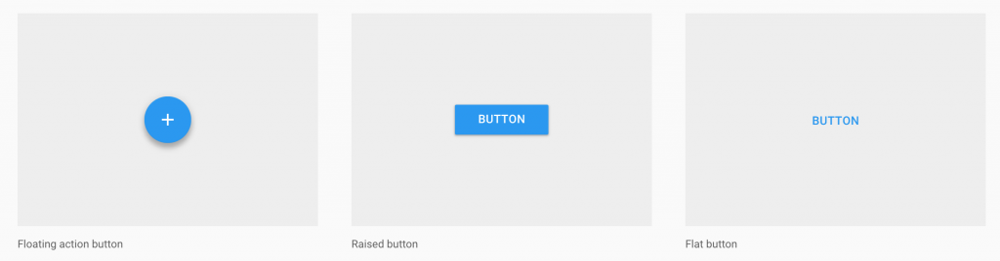

除了扁平化按钮是为了在页面上有协调感之外，其他按钮设计都是为了凸显本身的存在，因此在设计上也都会呈现阴影感，让视觉更加清楚。

## 在 Angular Material 中使用按钮

在 Angular Material 中，所有的按钮都放置在 MatButtonModule 中：

*src\app\shared-material\shared-material.module.ts*

```typescript
@NgModule({
  imports: [MatButtonModule],
  exports: [MatButtonModule]
})
export class SharedMaterialModule { }
```

由于按钮在网页上的存在极具意义，Angular Material 在设计上并未把按钮封装成 component，而是以 directive 的方式附着在 `<button>` 或 `<a>` 标签上，并通过样式的变化让原来的 `<button>` 或 `<a>` 标签具有 Material Design 的风格。

### 扁平化按钮（mat-button）

扁平化按钮是最基本的按钮样式，使用上非常简单，在原来的 `<button>` 或 `<a>` 标签上添加 `mat-button` 即可：

```html
<button mat-button>我是按钮</button>
```

 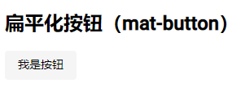

此时页面上看起来会完全没有按钮的感觉，只有文字的存在，但当鼠标移动至按钮时，则会看到比较深色的背景，按下会产生互动的涟漪效果。

我们也可以使用 `color` 属性来改变按钮的颜色，同时也可以使用 `disabled` 属性禁用按钮。

*src\app\app.component.html*

```html
<h2>扁平化按钮（mat-button）</h2>
<div>
  <button mat-button>我是按钮</button>
  <button mat-button color="primary">Primary</button>
  <button mat-button color="accent">Accent</button>
  <button mat-button color="warn">Warn</button>
  <button mat-button disabled>Disabled</button>
  <a mat-button>Link</a>
</div>

```

 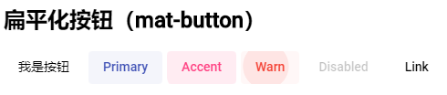

### 凸起按钮（mat-raised-button）

比起扁平化的按钮，凸起的按钮会有明显的反差，也会有比较深的阴影效果，以凸显按钮的存在，凸起的按钮需要加上 `mat-raised-button`。

*src\app\app.component.html*

```html
<h2>凸起按钮（mat-raised-button）</h2>
<div>
  <button mat-raised-button>我是 Raised 按钮</button>
  <button mat-raised-button color="primary">Primary</button>
  <button mat-raised-button color="accent">Accent</button>
  <button mat-raised-button color="warn">Warn</button>
  <button mat-raised-button disabled>Disabled</button>
  <a mat-raised-button>Link</a>
</div>
```

 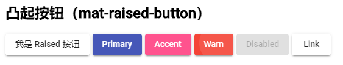

### Icon 按钮

在按钮上加 Icon 是一件很简单的事情，在标签内加上 `<mat-icon>` 就可以了

*src\app\app.component.html*

```html
<h2>Icon 按钮</h2>
<div>
  <button mat-raised-button color="primary">
    <mat-icon>thumb_up</mat-icon> 我的 Icon
  </button>
  <button mat-raised-button color="primary">
    <mat-icon>thumb_up</mat-icon>
  </button>
</div>
```

 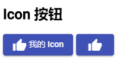

如果只想要 icon 的按钮可以使用专门为了呈现 icon 的 `mat-icon-button`，如果又希望凸显这个 icon 按钮，可以先用 `mat-raised-button` 将它变成更明显的按钮，再使用 `mat-icon-button`。

*src\app\app.component.html*

```html
<h2>Icon 按钮</h2>
<div>
  ...
  <button mat-icon-button color="primary">
    <mat-icon>thumb_up</mat-icon>
  </button>
  <button mat-raised-button mat-icon-button color="primary">
    <mat-icon>thumb_up</mat-icon>
  </button>
</div>
```

 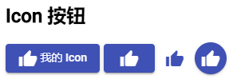

### 浮动动作按钮（mat-fab / mat-min-fab）

圆形的 floating action button，使用 `mat-fab` 这个 directive：

*src\app\app.component.html*

```html
<h2>mat-fab</h2>
<div>
  <button mat-fab><mat-icon>thumb_up</mat-icon></button>
  <button mat-fab color="primary"><mat-icon>thumb_up</mat-icon></button>
  <button mat-fab color="accent"><mat-icon>thumb_up</mat-icon></button>
  <button mat-fab color="warn"><mat-icon>thumb_up</mat-icon></button>
  <button mat-fab disabled><mat-icon>thumb_up</mat-icon></button>
</div>
```

 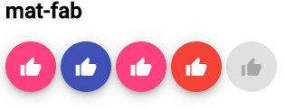

在没有指定颜色的时候，`mat-fab` 的样式与 accent 颜色一致，可见在 floating action button 本身的设计理念就是将其凸显存在感，这刚好与 accent 的概念是用来强调这里有东西的颜色概念一致，不得不佩服 Angular Material 的设想周到。

`mat-fab` 本身为圆形凸显效果，整个按钮看起来会比较大，对于较小的区域中的使用太过突兀，此时可以使用 `mat-mini-fab` 来产生比较小的 floating action button。

*src\app\app.component.html*

```html
<h2>mat-mini-fab</h2>
<div>
  <button mat-mini-fab><mat-icon>thumb_up</mat-icon></button>
  <button mat-mini-fab color="primary"><mat-icon>thumb_up</mat-icon></button>
  <button mat-mini-fab color="accent"><mat-icon>thumb_up</mat-icon></button>
  <button mat-mini-fab color="warn"><mat-icon>thumb_up</mat-icon></button>
  <button mat-mini-fab disabled><mat-icon>thumb_up</mat-icon></button>
  <button mat-raised-button mat-icon-button color="primary">
    <mat-icon>thumb_up</mat-icon>
  </button>
</div>
```

 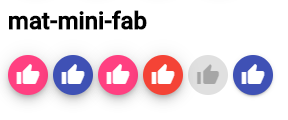

`mat-mini-fab` 产生的按钮样式跟一般的按钮高度一样，看起来像 `mat-raised-button` 加上 `mat-icon-button` 的组合，但语义上则不一样。

## 按钮开关（button toggle）

按钮开关基本不是按钮，比价像 CheckBox，但又不想 CheckBox 是表单控制项，可以搭配 ngModel 使用，因此单一的按钮开关没有意义，使用一个群组的按钮开关应用层比较广。

### 基本的 Button Toggle（mat-button-toggle）

`mat-button-toggle` 放在 MatButtonToggleModule 中，使用前引入此 Module：

*src\app\shared-material\shared-material.module.ts*

```typescript
import { NgModule } from '@angular/core';
import { MatButtonModule, MatIconModule, MatButtonToggleModule } from '@angular/material';

@NgModule({
  imports: [
    ...
    // 按钮开关
    MatButtonToggleModule
  ],
  exports: [..., MatButtonToggleModule]
})
export class SharedMaterialModule { }

```

*src\app\app.component.html*

```html
<h2>按钮开关</h2>
<mat-button-toggle>我是按钮开关</mat-button-toggle>
```

 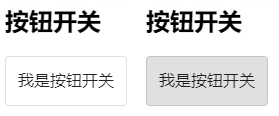

每次点下去，就有切换开关的效果。`mat-button-toggle` 这个 component 本身还有 `checked`、`value`、`disabled`等属性。

### 搭配 Button Toggle Group（mat-button-toggle-group）

`mat-button-toggle-group` 可以放置多个 `mat-button-toggle`，并依照被选取的 mat-button-toggle 来决定自己的值：

*src\app\app.component.html*

```html
<h2>按钮开关组</h2>
<mat-button-toggle-group #formatAlignGroup="matButtonToggleGroup">
  <mat-button-toggle value="left">
    <mat-icon>format_align_left</mat-icon>
  </mat-button-toggle>
  <mat-button-toggle value="center" checked="true">
    <mat-icon>format_align_center</mat-icon>
  </mat-button-toggle>
  <mat-button-toggle value="right">
    <mat-icon>format_align_right</mat-icon>
  </mat-button-toggle>
  <mat-button-toggle value="justify" disabled>
    <mat-icon>format_align_justify</mat-icon>
  </mat-button-toggle>
</mat-button-toggle-group>
<div style="margin-top: 10px;">对齐方式为：{{ formatAlignGroup.value }}</div>
```

 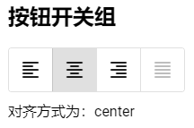

现在在 ButtonToggleGroup 中加入 `mutiple`，让里面的 Button Toggle 可以复选，另外加上 `vertical="true"` 改变排列方式，不过在复选时我们无法直接使用 buttonToggleGroup.value 来取得值，只能各自取得里面的 Button Toggle 的选取状态。

*src\app\app.component.html*

```html
<h2>按钮开关组（复选）</h2>
<mat-button-toggle-group multiple vertical="true" #formatTextGroup="matButtonToggleGroup">
  <mat-button-toggle value="bold" #buttonToggleBold>
    <mat-icon>format_bold</mat-icon>
  </mat-button-toggle>
  <mat-button-toggle value="italic" checked="true" #buttonToggleItalic>
    <mat-icon>format_italic</mat-icon>
  </mat-button-toggle>
  <mat-button-toggle value="underlined" checked="true" #buttonToggleUnderlined>
    <mat-icon>format_underlined</mat-icon>
  </mat-button-toggle>
</mat-button-toggle-group>
<div style="margin-top: 10px;">
  <p>粗体：{{ buttonToggleBold.checked }}</p>
  <p>斜体：{{ buttonToggleItalic.checked }}</p>
  <p>底线：{{ buttonToggleUnderlined.checked }}</p>
</div>
```

 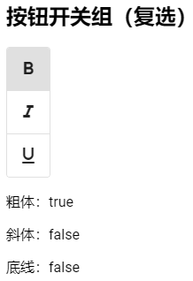

当 ButtonToggleGroup 中 `mutiple` 没有加上时，此时可以直接取用其中的 value，来得到被选取的状态，同时也支持使用 ngModel；加上 `mutiple` 后，由于不会有值传入 value，因此 ngModel 无法使用。

> 详细其他属性参考：https://material.angular.io/components/button-toggle/api

## 涟漪效果（mat-ripple）

这个效果主要用于按钮上，实际上这个特效有写成一个 directive。首先加入 MatRippleModule，在一个 div 上加入 `mat-ripple` 这个 directive。

*src\app\shared-material\shared-material.module.ts*

```typescript
import { NgModule } from '@angular/core';
import { MatButtonModule, MatIconModule, MatButtonToggleModule, MatRippleModule } from '@angular/material';


@NgModule({
  imports: [
    ...,
    // 涟漪效果
    MatRippleModule
  ],
  exports: [..., MatRippleModule]
})
export class SharedMaterialModule { }

```

*src\app\app.component.html*

```html
<h2>涟漪效果（mat-ripple）</h2>
<div class="demo-ripple-container" mat-ripple></div>
```

*src\app\app.component.scss*

```scss
.demo-ripple-container {
   	height: 100px;
    width: 200px;
    border: 1px solid black;
}
```

 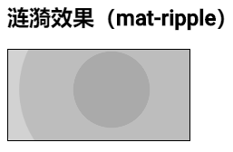

### mat-ripple 的其他属性

`mat-ripple` 的主要属性：

- `matRippleCentered`：从中间产生涟漪
- `matRippleDisabled`：取消涟漪效果
- `matRippleUnbounded`：涟漪效果超过组件之外
- `matRippleRadius`：涟漪半径
- `matRippleColor`：涟漪颜色

*src\app\app.component.html*

```html
<h2>涟漪效果（mat-ripple）</h2>
<div class="demo-ripple-container" mat-ripple
  [matRippleCentered]="false"
  [matRippleDisabled]="false"
  [matRippleUnbounded]="false"
  [matRippleRadius]="10"
  [matRippleColor]="'pink'"
></div>
<br><br>
```

 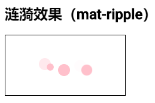

### 从程序触发涟漪效果

我们也可以在程序里直接触发涟漪效果：

*src\app\app.component.ts*

```typescript
import { Component, ViewChild, OnInit } from '@angular/core';
import { MatRipple } from '@angular/material';

@Component({
  selector: 'app-root',
  templateUrl: './app.component.html',
  styleUrls: ['./app.component.scss']
})
export class AppComponent implements OnInit {

  @ViewChild(MatRipple, { static: false }) ripple: MatRipple;

  ngOnInit(): void {
    this.ripple.launch(0, 0);
  }

  triggerRipple() {
    const point1 = this.ripple.launch(0, 0, 
		{ color: 'pink', centered: true, persistent: true, radius: 50 }
	);
    const point2 = this.ripple.launch(0, 0, 
		{ color: 'yellow', centered: true, persistent: true, radius: 20 }
	);

    setTimeout(() => {
      point1.fadeOut();
    }, 500);
  }

  clearRipple() {
    this.ripple.fadeOutAll();
  }
}

```

*src\app\app.component.html*

```html
<h2>涟漪效果（mat-ripple）</h2>
<div class="demo-ripple-container" mat-ripple
  [matRippleCentered]="false"
  [matRippleDisabled]="false"
  [matRippleUnbounded]="false"
  [matRippleRadius]="10"
  [matRippleColor]="'pink'"
></div>
<button mat-raised-button (click)="triggerRipple()">触发涟漪</button>
<button mat-raised-button (click)="clearRipple()">清除涟漪</button>
```

 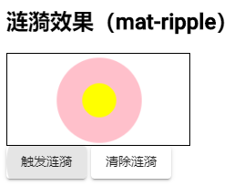

`ripple.launch` 的前 2 个参数为涟漪点产生位置，第三个为相关属性配置。由于 `centered: true` 产生位置被忽略，另外 `persistent: true` 表示涟漪产生后不会自动淡出，可以通过 `fadeOutAll()` 把所有涟漪点都淡出。

