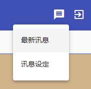
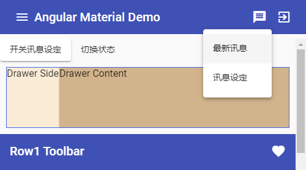
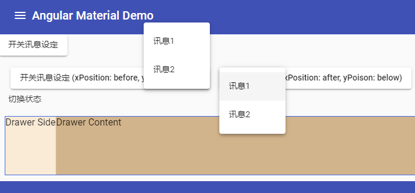
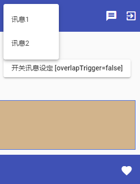
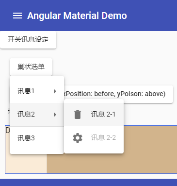

# 基本后台 - Menu

当一些列的选择要浓缩在一个范围内时，就是使用 Menu 的好时机。

## 关于 Material Design 中的 Menu

在 [Material Design 的 Menu 设计指南](https://material.io/guidelines/components/menus.html)中，Menu 可以用来显示一些列的选项，每一行就是一个选项，通常由一个按钮，或一个简单的文字 label 开始，在画面上进行立体的呈现，而不会影响到其他元素的排版。

在桌面应用上 Menu 可以是多层串接的，在移动端或平板上则建议一层简单的 Menu 就好，另外 Menu 的选项也应该是可以被 disabled 的。


## 使用 Angular Material 的 Menu 组件

首先加入 `MatMenuModule`。

### 使用 mat-menu

*src\app\dashboard\dashboard.component.html*

```html
<button mat-icon-button [matMenuTriggerFor]="messageMenu" #menuTrigger="matMenuTrigger">
    <mat-icon>message</mat-icon>
</button>
<mat-menu #messageMenu="matMenu">
    <button mat-menu-item>最新讯息</button>
    <button mat-menu-item>讯息设定</button>
</mat-menu>
```

 

上面的程序通过 `matMenuTriggerFor` 来设定这个按钮会触发哪一个 menu 组件。并且使用上下键来切换 focus 的选项，也可以按下 Enter 键来触发按钮的 Click 事件。

### 在程序中开启选单

在程序中开启选单很容易，只要找到 `matMenuTriggerFor`，再触发它的 `openMenu()` 方法就可以打开 menu，通过 `closeMenu()` 则能够动态的关闭 menu，另外我们也可以通过 `toggleMenu()` 来开关 menu 的显示状态。

*src\app\dashboard\dashboard.component.html*

```html
<button mat-raised-button (click)="menuTrigger.toggleMenu()">开关讯息设定</button>
```

 

## 使用 xPosition 和 yPoison 调整选单出现位置

`<mat-menu>` 通过 `xPosition` 和 `yPosition`来控制选单生长的方向。

*menu-positions.d.ts*

```typescript
export declare type MenuPositionX = 'before' | 'after';
export declare type MenuPositionY = 'above' | 'below';
```

- xPosition
  - `after`（默认值）：从左到右
  - `before`：从右到左
- yPosition
  - `below`（默认值）：从上到下
  - `above`：从下到上

*src\app\dashboard\dashboard.component.html*

```html
<div style="text-align: center;">
    <button mat-raised-button [matMenuTriggerFor]="positionMenuBA">
        开关讯息设定 (xPosition: before, yPoison: above)
    </button>
    <mat-menu #positionMenuBA="matMenu" xPosition="before" yPosition="above" [overlapTrigger]="true">
        <button mat-menu-item>讯息1</button>
        <button mat-menu-item>讯息2</button>
    </mat-menu>
    &nbsp;
    <button mat-raised-button [matMenuTriggerFor]="positionMenuAB">
        开关讯息设定 (xPosition: after, yPoison: below)
    </button>
    <mat-menu #positionMenuAB="matMenu" xPosition="after" yPosition="below" [overlapTrigger]="true">
        <button mat-menu-item>讯息1</button>
        <button mat-menu-item>讯息2</button>
    </mat-menu>
</div>
```

 

另外，我们可以设置 `[overlapTrigger]="false"`，来使选单不会遮挡我们的 trigger，`overlapTrigger` 属性默认为 false，且当此时 `yPosition` 不会有效。

*src\app\dashboard\dashboard.component.html*

```html
<div style="text-align: center; margin-top: 20px;">
    ...
    &nbsp;
    <button mat-raised-button [matMenuTriggerFor]="positionMenu">
        开关讯息设定 [overlapTrigger=false]
    </button>
    <mat-menu #positionMenu="matMenu" xPosition="after" yPosition="above" [overlapTrigger]="false">
        <button mat-menu-item>讯息1</button>
        <button mat-menu-item>讯息2</button>
    </mat-menu>
</div>
```

 

## 巢状 Menu

menu 选单可以是巢状的，要使用巢状的选单没有什么新技巧，把子选单使用 `<mat-menu-item>` 设计好，然后在原来的选单项目中加入 `matMenuTriggerFor` 即可：

*src\app\dashboard\dashboard.component.html*

```html
<div style="margin-left: 20px; margin-top: 20px;">
    <button mat-raised-button [matMenuTriggerFor]="positionMenuNest">巢状选单</button>
    <mat-menu #positionMenuNest="matMenu">
        <button mat-menu-item [matMenuTriggerFor]="subMenu1">讯息1</button>
        <button mat-menu-item [matMenuTriggerFor]="subMenu2">讯息2</button>
        <mat-divider></mat-divider>
        <button mat-menu-item>讯息3</button>
    </mat-menu>

    <mat-menu #subMenu1="matMenu">
        <button mat-menu-item><mat-icon>person</mat-icon>讯息 1-1</button>
        <button mat-menu-item><mat-icon>favorite</mat-icon>讯息 1-2</button>
        <button mat-menu-item><mat-icon>thumb_up</mat-icon>讯息 1-2</button>
    </mat-menu>
    <mat-menu #subMenu2="matMenu">
        <button mat-menu-item><mat-icon>delete</mat-icon>讯息 2-1</button>
        <button mat-menu-item disabled><mat-icon>settings</mat-icon>讯息 2-2</button>
    </mat-menu>
</div>
```

 

这里搭配 `<mat-icon>` 以及尝试为 button 加入 `disabled` 属性，可以看到搭配没有问题，同时也能使用左右键切换子菜单。另外，使用一个 divider 分隔以减少子项目那一分类的烦恼。