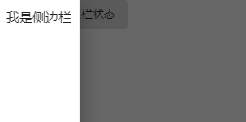
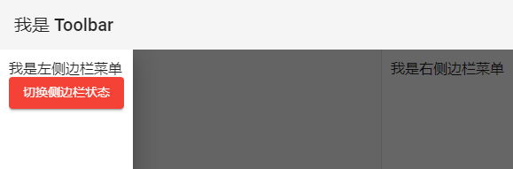

# 基本后台 - SideNav

我们终于要开始做一个后台（dashboard）页面啦！首先我们先会使用 Angular Material 的 SideNav 组件，把侧边栏的空间切分出来，这个空间通常是用来放置主菜单的空间。

## 关于 Material Design 的基本系统架构

在 [Material Design 架构指南](https://material.io/design/layout/responsive-layout-grid.html)中，一个应用程序无论是移动端还是桌面浏览器，基本上页面都可以分为 3 块：

- **Toolbar**：通常放置基本的品牌 logo、简单搜索、常用功能和切换左右 sidenav 按钮等等
- **SideNav**：放置使用者资讯，或主要功能选项等，可以常显在左右两侧，也可以隐藏起来需要的时候再动态打开。
- **Content**：主要功能显示界面

 

## 使用 Angular Material 的 SideNav

引入 `MatSidenavModule`后开始使用，基本上 SideNav 分为 3 个区域：

- `<mat-sidenav-container>`：代表整个包含侧边栏导航的容器
- `<mat-sidenav>`：侧边栏导航的内容
- `<mat-sidenav-content>`：导航以外的实际内容

*src\app\dashboard\dashboard.component.html*

```html
<mat-sidenav-container>
  <mat-sidenav #sideNav>
    我是侧边栏
  </mat-sidenav>
  <mat-sidenav-content>
    <button mat-button (click)="sideNav.toggle()">切换左边侧边栏状态</button>
  </mat-sidenav-content>
</mat-sidenav-container>

```

 

Angular Material 预设的 `<mat-sidenav>` 是隐藏的，我们可以通过 sideNav 的 `toggle()` 方法来切换侧边栏导航的显示状态。

### 控制 SideNav 的显示状态

我们可以通过 `open()`、`close()` 和 `toggle()` 来控制 SideNav 的显示状态，这些方法都会传入一个 `Promise<MatDrawerToggleResult>` 来告诉你 SideNav 的显示状态。

*src\app\dashboard\dashboard.component.html*

```html
<mat-sidenav-container>
  <mat-sidenav #sideNav>
    <div>我是侧边栏</div>
    <div>
      <button mat-raised-button color="warn" (click)="toggleSideNav(sideNav)">切换侧边栏状态</button>
    </div>
  </mat-sidenav>
  <mat-sidenav-content>
    <button mat-button (click)="toggleSideNav(sideNav)">切换侧边栏状态</button>
  </mat-sidenav-content>
</mat-sidenav-container>

```

*src\app\dashboard\dashboard.component.ts*

```typescript
import { Component, OnInit } from '@angular/core';
import { MatSidenav, MatDrawerToggleResult } from '@angular/material';

@Component({
  selector: 'app-dashboard',
  templateUrl: './dashboard.component.html',
  styleUrls: ['./dashboard.component.scss']
})
export class DashboardComponent implements OnInit {

  ...

  toggleSideNav(sideNav: MatSidenav) {
    sideNav.toggle().then((result: MatDrawerToggleResult) => {
      console.log(`侧边栏状态：${ result }`)
    });
  }

}

```

 

除此之外 SideNav 还有 `opened` 和 `closed`，2 个 output，当 SideNav 被打开或关闭时，就会触发。

```html
<mat-sidenav #sideNav (opened)="opened()" (closed)="closed()">
```

 

### SideNav 的常用 Input 属性

#### mode

`<mat-side-nav>` 有一个 mode 属性，可以用来决定 SideNav 的呈现方式，目前有 3 个值可以设定：

- **over**：默认值，SideNav 浮动在页面之上，背后会出现一个灰底的 backdrop，点击 SideNav 以外的地方（或按 ESC）会隐藏
- **push**：和 over 类似，但显示的时候会把界面向另一侧腿，同时也会有一个灰底的 backdrop，适合在屏幕较大的设备上同时浏览 SideNav 和选单。
- **side**：类似于 push，但不会出现灰底的 backdrop，因此可以同时操作主要的 content 界面以及 SideNav 的内容。

```typescript
export declare class MatDrawer {
    /** Mode of the drawer; one of 'over', 'push' or 'side'. */
    mode: 'over' | 'push' | 'side';
}
```

*src\app\dashboard\dashboard.component.html*

```html
<mat-sidenav #sideNav mode="side">
```

#### opened

通过 `opened` 属性，我们可以不需要使用组件的 `open()` 或 `toggle()` 方法来打开，只需要设定这个属性即可变更显示状态，true 代表显示，false 代表隐藏。

> 当我们需要一个固定在旁边的导航菜单时，可以设置 mode 为side，opened 为 true，即可让导航菜单常驻在旁边，只要不在程序中切换状态，就不会被隐藏。

*src\app\dashboard\dashboard.component.html*

```html
<mat-sidenav #sideNav mode="side" opened="true">
```

 

#### position

SideNav 支持显示在页面的起始（`start`，默认值，左边）或者结束（`end`，右边），可以通过设定 `position` 决定 SideNav 要放在哪边，同时也能左右各提供一个导航菜单。

*src\app\dashboard\dashboard.component.html*

```html
<mat-sidenav #sideNav mode="side" opened="true" (opened)="opened()" (closed)="closed()">
    <div>我是左侧边栏菜单</div>
    <div>
        <button mat-raised-button color="warn" (click)="toggleSideNav(sideNav)">切换侧边栏状态</button>
    </div>
</mat-sidenav>
<mat-sidenav #sideNavEnd opened="true" mode="side" position="end">
    <div>我是右侧边栏菜单</div>
</mat-sidenav>
```

 

#### disableClose

在 mode 设置为 `over` 或 `push` 时，默认会出现一个 backdrop，点击 backdrop 或按下 `ESC` 时则会自动隐藏 SideNav，如果希望不自动隐藏，则可以设置 `disabledClose`，有了这个属性就必须另外在可点选的范围内加上程序设定隐藏 SideNav。

*src\app\dashboard\dashboard.component.html*

```html
<mat-sidenav #sideNav mode="over" disableClose (opened)="opened()" (closed)="closed()">
    <div>我是左侧边栏菜单</div>
    <div>
        <button mat-raised-button color="warn" (click)="toggleSideNav(sideNav)">切换侧边栏状态</button>
    </div>
</mat-sidenav>
```

#### fixedInViewPort / fixedTopGap / fixedBottomGap

当页面上有一个 toolbar 在顶层时，默认 SideNav 显示不会遮挡 toolbar

*src\app\shared-material\shared-material.module.ts*

```typescript
import { NgModule } from '@angular/core';
import { MatSidenavModule, MatButtonModule, MatToolbarModule } from '@angular/material';


@NgModule({
  imports: [
    ..., MatToolbarModule
  ],
  exports: [..., MatToolbarModule]
})
export class SharedMaterialModule { }

```

*src\app\dashboard\dashboard.component.html*

```html
<mat-toolbar>我是 Toolbar</mat-toolbar>
<mat-sidenav-container>
  <mat-sidenav #sideNav mode="over" disableClose (opened)="opened()" (closed)="closed()">
    <div>我是左侧边栏菜单</div>
    <div>
      <button mat-raised-button color="warn" (click)="toggleSideNav(sideNav)">切换侧边栏状态</button>
    </div>
  </mat-sidenav>
  <mat-sidenav #sideNavEnd opened="true" mode="side" position="end">
    <div>我是右侧边栏菜单</div>
  </mat-sidenav>
  <mat-sidenav-content>
    <button mat-button (click)="toggleSideNav(sideNav)">切换侧边栏状态</button>
  </mat-sidenav-content>
</mat-sidenav-container>

```

 

这时候可以设定 `fixedInViewport="true"`，让 SideNav 能够显示在 Toolbar 之上。另外也能设定 `fixedTopGap` 和 `fixedBottomGap`，保留一定程度的上下空间。

*src\app\dashboard\dashboard.component.html*

```html
<mat-sidenav #sideNav mode="over" fixedInViewport="true" fixedTopGap="20" fixedBottomGap="20">
```

 

## 关于 MatDrawer

除了 SideNav 之外，Angular Material 还提供了一个类似的组件 —— `<mat-drawer>`。比起 SideNav 是设计给整个界面使用的，Drawer 则是提供给放在组件里面小范围区块使用。除了不支持 `fixedInViewport`（毕竟没有需要遮挡的 toolbar 了）以外，这个 drawer 组件使用上基本和 sidenav 完全相同。

*src\app\dashboard\dashboard.component.html*

```html
<mat-toolbar>我是 Toolbar</mat-toolbar>
<mat-sidenav-container>
  <mat-sidenav #sideNav mode="over" fixedInViewport="true" fixedTopGap="20" fixedBottomGap="20"
              disableClose (opened)="opened()" (closed)="closed()">
    <div>我是左侧边栏菜单</div>
    <div>
      <button mat-raised-button color="warn" (click)="toggleSideNav(sideNav)">切换侧边栏状态</button>
    </div>
  </mat-sidenav>
  <mat-sidenav #sideNavEnd opened="true" mode="side" position="end">
    <div>我是右侧边栏菜单</div>
  </mat-sidenav>
  <mat-sidenav-content>
    <button mat-button (click)="toggleSideNav(sideNav)">切换侧边栏状态</button>

    <mat-drawer-container>
      <mat-drawer mode="side" opened="true">Drawer Side</mat-drawer>
      <mat-drawer-content>Content</mat-drawer-content>
    </mat-drawer-container>

  </mat-sidenav-content>
</mat-sidenav-container>

```

 