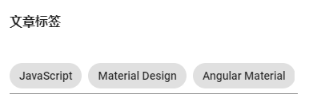
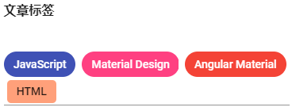

# 设计一个部落格 - Chip、Tooltip、Snackbar

今天要一口气介绍 3 个组件，分别是：

- Chip：适合用来当做类似标签的功能；
- Tooltip：提示时使用
- Snackbar：提示时使用

## 关于 Material Design 中的 Chip

在 [Material Design 的 Chips 设计指南](https://material.io/components/chips/#)中，Chip 主要用来**把复杂的实体分成多个小区块显示**，像是联络人清单等等的咨询，就很适合用 Chips 存放。

Chip 是可以被选择的，当被选择时，我们应该要提供更多关于这个 Chip 的咨询；当然，既然可以选择，应该也是要能够提供直觉的删除 Chip 的方法。

## 开始使用 Angular Material 的 Chip

我们可以在加入 `MatChipsModule` 后，使用 `<mat-chip-list>` 和 `<mat-chip>` 的组合，即可完成一个基本清单。

*src\app\shared-material\shared-material.module.ts*

```typescript
@NgModule({
  exports: [
    MatChipsModule,
    ...
  ]
})
export class SharedMaterialModule {...}

```

### 使用 mat-chip-list 和 mat-chip

*src\app\dashboard\blog\add-post-dialog\add-post-dialog.component.html*

```html
<h2 mat-dialog-title>新增文章</h2>

<mat-dialog-content class="post-form">
  ...
  <h4>文章标签</h4>
  <mat-form-field>
    <mat-chip-list>
      <mat-chip>JavaScript</mat-chip>
      <mat-chip>Material Design</mat-chip>
      <mat-chip>Angular Material</mat-chip>
    </mat-chip-list>
  </mat-form-field>
  ...
</mat-dialog-content>

<mat-dialog-actions>
  ...
</mat-dialog-actions>
```

 

### 替 mat-chip 加上选取状态

只需要加上 `select="true"` 即可

*src\app\dashboard\blog\add-post-dialog\add-post-dialog.component.html*

```html
<h2 mat-dialog-title>新增文章</h2>

<mat-dialog-content class="post-form">
  ...
  <h4>文章标签</h4>
  <mat-form-field>
    <mat-chip-list>
      <mat-chip selected="true">JavaScript</mat-chip>
      <mat-chip>Material Design</mat-chip>
      <mat-chip>Angular Material</mat-chip>
    </mat-chip-list>
  </mat-form-field>
  ...
</mat-dialog-content>

<mat-dialog-actions>
  ...
</mat-dialog-actions>
```

 

###  变更选取的 mat-chip 颜色

设置 `color` 并不会改变整个 chip 的颜色，只会改变被选取时的颜色，目前没有办法在不被选取的状态下通过 `color` 属性改变颜色的，只能直接调整 CSS。

*src\app\dashboard\blog\add-post-dialog\add-post-dialog.component.html*

```html
<h2 mat-dialog-title>新增文章</h2>

<mat-dialog-content class="post-form">
  ...
  <h4>文章标签</h4>
  <mat-form-field>
    <mat-chip-list>
      <mat-chip color="primary" selected="true">JavaScript</mat-chip>
      <mat-chip color="accent" selected="true">Material Design</mat-chip>
      <mat-chip color="warn" selected="true">Angular Material</mat-chip>
    </mat-chip-list>
  </mat-form-field>
  ...
</mat-dialog-content>

<mat-dialog-actions>
  ...
</mat-dialog-actions>
```

 

### 设计自己的 Chip 样式

默认的 `<mat-chip>` 已经有了基本 Material Design 风格的样式，而 Angular Material 提供了一个 `<mat-basic-chip>`，只提供基本的 `mat-basic-chip` 的 CSS class，让我们可以自定义 chip 样式：

*src\app\dashboard\blog\add-post-dialog\add-post-dialog.component.html*

```html
<h2 mat-dialog-title>新增文章</h2>

<mat-dialog-content class="post-form">
  ...
  <h4>文章标签</h4>
  <mat-form-field>
    <mat-chip-list>
      <mat-chip color="primary" selected="true">JavaScript</mat-chip>
      <mat-chip color="accent" selected="true">Material Design</mat-chip>
      <mat-chip color="warn" selected="true">Angular Material</mat-chip>
      <mat-basic-chip>HTML</mat-basic-chip>
    </mat-chip-list>
  </mat-form-field>
  ...
</mat-dialog-content>

<mat-dialog-actions>
  ...
</mat-dialog-actions>
```

*src\app\dashboard\blog\add-post-dialog\add-post-dialog.component.scss*

```scss
.mat-basic-chip {
  background: lightsalmon;
  margin: 0 0 0 8px;
  padding: 7px 12px;
  border-radius: 5px;
}
```

 

### 可被删除的 Chip

Chip 是可以被删除的，可以在 `<mat-chip>` 里面加上一个包含 `matChipRemove` 的组件，通常是 `<mat-icon>`，之后就可以搭配 `removed` 事件，来处理删除的程序逻辑。

*src\app\dashboard\blog\add-post-dialog\add-post-dialog.component.html*

```html
<h2 mat-dialog-title>新增文章</h2>

<mat-dialog-content class="post-form">
  ...
  <h4>内容标签</h4>
  <mat-form-field>
    <mat-chip-list>
      <mat-chip *ngFor="let tag of tags" (removed)="removeTag(tag)">
        {{ tag }}
        <mat-icon matChipRemove>cancel</mat-icon>
      </mat-chip>
    </mat-chip-list>
  </mat-form-field>
  ...
</mat-dialog-content>

<mat-dialog-actions>
  ...
</mat-dialog-actions>
```

*src\app\dashboard\blog\add-post-dialog\add-post-dialog.component.ts*

```typescript
@Component({
  selector: 'app-add-post-dialog',
  templateUrl: './add-post-dialog.component.html',
  styleUrls: ['./add-post-dialog.component.scss']
})
export class AddPostDialogComponent implements OnInit {

  tags = ['JavaScript', 'Material Design', 'Angular Material'];

  removeTag(tagName) {
    this.tags = this.tags.filter(tag => tag !== tagName);
  }
}

```

 

我们也可以为 `<mat-chip>` 设置 `removable` 属性，来决定是否允许删除，例如以下程序设置成 `removed` 事件不会发生：

*src\app\dashboard\blog\add-post-dialog\add-post-dialog.component.html*

```html
<h2 mat-dialog-title>新增文章</h2>

<mat-dialog-content class="post-form">
  ...
  <h4>内容标签</h4>
  <mat-form-field>
    <mat-chip-list>
      <mat-chip *ngFor="let tag of tags" (removed)="removeTag(tag)" removable="false">
        {{ tag }}
        <mat-icon matChipRemove>cancel</mat-icon>
      </mat-chip>
    </mat-chip-list>
  </mat-form-field>
  ...
</mat-dialog-content>

<mat-dialog-actions>
  ...
</mat-dialog-actions>
```

 

### 搭配 mat-form-field 使用

`<mat-chip-list>` 和 `<mat-chip>` 很棒的一点是，他同时可以跟表单组件一起使用，让我们能直接输入文字，并立即转为 Chip。

*src\app\dashboard\blog\add-post-dialog\add-post-dialog.component.ts*

```typescript
@Component({
  selector: 'app-add-post-dialog',
  templateUrl: './add-post-dialog.component.html',
  styleUrls: ['./add-post-dialog.component.scss']
})
export class AddPostDialogComponent implements OnInit {

  tags = ['JavaScript', 'Material Design', 'Angular Material'];
  separatorKeysCodes = [ENTER, COMMA];

  addTag($event: MatChipInputEvent) {
    console.log($event);
    if (($event.value || '').trim()) {
      const value = $event.value.trim();
      if (this.tags.indexOf(value) === -1) {
        this.tags.push(value);
      }
    }
    $event.input.value = '';
  }
}
```

上面代码声明一个 `separatorKeysCodes` 变量，来指令当按下哪些按键时，会传入新的 `MatChipInputEvent` 对象，以如上设置是 `ENTER` 键和 `逗号（,）`。这两个键盘 keyCode 都在 `@angular/cdk/keycodes` 先定义好了，节省我们寻找键盘 keyCode 的时间。

另外新增一个 `addTag()` 方法，接受页面输入资料遇到 `separatorKeysCodes` 时，传入的事件，这个事件有 2 个属性：

- `input`：输入的来源，基本上就是 DOM
- `value`：输入的数据

代码中我们确定输入的数据非空且非重复，就把输入的内容加入数组中，然后重新输入数据。

*src\app\dashboard\blog\add-post-dialog\add-post-dialog.component.html*

```html
<h2 mat-dialog-title>新增文章</h2>

<mat-dialog-content class="post-form">
  ...
  <mat-form-field>
    <mat-chip-list #chipList>
      <mat-chip *ngFor="let tag of tags" (removed)="removeTag(tag)">
        {{ tag }}
        <mat-icon matChipRemove>cancel</mat-icon>
      </mat-chip>
    </mat-chip-list>
    <input placeholder="主题标签"
            [matChipInputFor]="chipList"
            [matChipInputAddOnBlur]="true"
            [matChipInputSeparatorKeyCodes]="separatorKeysCodes"
            (matChipInputTokenEnd)="addTag($event)">
  </mat-form-field>
  ...
</mat-dialog-content>

<mat-dialog-actions>
  ...
</mat-dialog-actions>
```

我们把原来的 `<mat-chip-list>` 包装在 `<mat-form-field>` 之中，同时也加上一个 `<input>`，也因此我们可以直接使用 placeholder 当做整个输入控制项的标签，呈现更具有一致性。

在 `<input>` 中，关于 chip 有几个重要的属性可以设置：

- `[matChipInputFor]`：实际上要放置的 `<mat-chip-list>`
- `[matChipInputAddOnBlur]`：是否要在 blur 时加入 chip
- `[matChipInputSeparatorKeyCodes]`：当按下指定的键盘按键时，视为要新增 chip
- `(matChipInputTokenEnd)`：当真正要加入一个 chip 的逻辑程序

 

## 关于 Material Design 中的 Tooltip

在 [Material Design 的 Tooltips 设计指南](https://material.io/components/tooltips/#)中，Tooltip 主要是用来**作为提示讯息使用**，会在使用者与某个 UI 发生互动，如：滑动鼠标移动，或 focus 等行为时；用来给予使用者一些文字提示。

## 开始使用 Angular Material 的 Tooltip

要使用 Tooltip，我们需要加入 `MatTooltipModule`，就可以直接使用 `matTooltip` 这个 directive。

*src\app\shared-material\shared-material.module.ts*

```typescript
@NgModule({
  exports: [
    MatTooltipModule,
    ...
  ]
})
export class SharedMaterialModule {...}
```

### 使用 matTooltip

我们可以在任何组件上加入 `matTooltip` 这个 directive 来决定 tooltip 的文字，如下：

*src\app\dashboard\blog\add-post-dialog\add-post-dialog.component.html*

```html
<mat-form-field>
	<input matInput placeholder="标题" [(ngModel)]="title" matTooltip="请输入一个标题~">
</mat-form-field>
```

 

### 设置 tooltip 的方向

我们可以通过 `matTooltipPosition` 属性来决定 tooltip 显示的位置，`matTooltipPosition`可以设置成如下：

- `above`：显示在目标之上
- `below`：显示在目标之下
- `left`：显示在目标左边
- `right`：显示在目标右边
- `before`：LTR 模式在左边，RTL 模式在右边
- `after`：LTR 模式在右边，RTL 模式在左边

例如，我们修改为显示在目标的右边：

*src\app\dashboard\blog\add-post-dialog\add-post-dialog.component.html*

```html
<mat-form-field>
	<input matInput placeholder="标题" [(ngModel)]="title"
            matTooltip="请输入一个标题~"
            matTooltipPosition="right">
</mat-form-field>
```

 

### 在程序中决定 tooltip 的显示

我们可以直接使用 `matTooltip` 提供的 `show()` 和 `hide()` 方法来动态打开或关闭 tooltip。下面的代码：

- 按下 “打开” 按钮，会直接显示 tooltip；
- 按下 “关闭” 按钮，会关闭 tooltip

*src\app\dashboard\blog\add-post-dialog\add-post-dialog.component.html*

```html
<button mat-button (click)="titleTooltip.show()"></button>
<button mat-button (click)="titleTooltip.hide()"></button>
<mat-form-field>
    <input matInput placeholder="标题" [(ngModel)]="title"
           #titleTooltip="matTooltip"
           matTooltip="请输入一个标题~"
           matTooltipPosition="above">
</mat-form-field>
```

 

### 决定 tooltip 显示和隐藏的延长时间

我们可以使用 `matTooltipShowDelay` 属性来决定要延迟多久显示 tooltip，另外也可以使用 `matTooltipHideDelay` 来决定延迟多久隐藏 tooltip：

*src\app\dashboard\blog\add-post-dialog\add-post-dialog.component.html*

```html
<button mat-button (click)="titleTooltip.show()">打开提示</button>
<button mat-button (click)="titleTooltip.hide()">关闭提示</button>
<mat-form-field>
    <input matInput placeholder="标题" [(ngModel)]="title"
           #titleTooltip="matTooltip"
           matTooltip="请输入一个标题~"
           matTooltipPosition="above"
           matTooltipShowDelay="2000"
           matTooltipHideDelay="3000">
</mat-form-field>
```

 

## 关于 Material Design 的 Snackbar

在 [Material Design 的 Snackbar & toasts 设计指南](https://material.io/components/snackbars/#)中，Snackbar 是在页面最下方提供一个文字信息，让使用者知道目前系统大致的状态。**这个功能在 Android 中也叫 toast**。

## 开始使用 Angular Material 的 Snackbar

Snackbar 主要一个 `MatSnackBar` service 来控制显示，要使用这个 service，必须要先加如 `MatSnackbar`。

*src\app\shared-material\shared-material.module.ts*

```typescript
@NgModule({
  exports: [
    MatSnackBarModule,
    ...
  ]
})
export class SharedMaterialModule {...}
```

### 直接使用 MatSnackbar service

*src\app\dashboard\blog\add-post-confirm-dialog\add-post-confirm-dialog.component.ts*

```typescript

export class AddPostConfirmDialogComponent implements OnInit {

  constructor(
    ...,
    private snackBar: MatSnackBar
    ) { }

  confirm() {
    ...

    this.snackBar.open('已新增部落格文章', '我知道了');
  }
}
```

 

我们只用来 `MatSnackbar` 的 `open()` 方法：

- 第一个参数：代表提示的信息；
- 第二个参数：代表用来关闭信息的按钮文字；
- 另外还有第三个参数 `config?: MatSnackbarConfig`：用来做比较细部的微调

### 使用 Component 当做 Snackbar

我们可以使用 `MatSnackbar` 的 `openFromComponent` 方法，把一个 component 当做是 Snackbar 要显示的对象，概念上跟昨天介绍的 Dialog 非常像，下面程序我们定义了一个新的 Component，HTML 内容如下：

```sh
ng g c dashboard/blog/after-post-notify
```

*src\app\dashboard\dashboard.module.ts*

```typescript
@NgModule({
  entryComponents: [..., AfterPostNotifyComponent],
  ...
})
export class DashboardModule { }
```

*src\app\dashboard\blog\after-post-notify\after-post-notify.component.html*

```html
<button mat-icon-button (click)="closeSnackBar()">
  <mat-icon align="right">cancel</mat-icon>
</button>
<h4>已新增部落格文章</h4>
<p>温馨小提示：每 30 分钟记得起来运动一下喔！</p>

```

接着在程序里，使用 `MatSnackbar` 的 `dismiss()` 方法，将 Snackbar 关闭：

*src\app\dashboard\blog\after-post-notify\after-post-notify.component.ts*

```typescript
@Component({
  selector: 'app-after-post-notify',
  templateUrl: './after-post-notify.component.html',
  styleUrls: ['./after-post-notify.component.scss']
})
export class AfterPostNotifyComponent implements OnInit {

  constructor(private snackBar: MatSnackBar) { }

  ngOnInit() {
  }

  closeSnackBar() {
    this.snackBar.dismiss();
  }
}
```

*src\app\dashboard\blog\add-post-confirm-dialog\add-post-confirm-dialog.component.ts*

```typescript

export class AddPostConfirmDialogComponent implements OnInit {

  confirm() {
	...
    
    this.snackBar.openFromComponent(AfterPostNotifyComponent);
  }
}

```

 

### 使用 config: MatSnackBarConfig 来调整显示细节

`MatSnackbar` 的 `open()` 或 `openFromComponent()` 的最后一个参数都是 `config: MatSnackbar`，我们可以通过这个参数来做一些调整，完成的参数可以上 [SnackBar 的 API 文件](https://material.angular.io/components/snack-bar/api)去看，以下列出一些个人重要的参数：

#### duration

代表多少 ms 后，会自动关闭 Snackbar，如此一来我们就不需要手动关掉 Snackbar 了。

#### data

在使用自订 component 当做 SnackBar 时非常重要，概念同 dialog，我们可以通过注入 `MAT_SNACK_BAR_DATA` 来传入我们要的数据给自订的 component。

在 component 中注入方法：

*src\app\dashboard\blog\after-post-notify\after-post-notify.component.ts*

```typescript
@Component({
  selector: 'app-after-post-notify',
  templateUrl: './after-post-notify.component.html',
  styleUrls: ['./after-post-notify.component.scss']
})
export class AfterPostNotifyComponent implements OnInit {
    
  get title() {
    return this.snackBarData.title;
  }

  constructor(..., @Inject(MAT_SNACK_BAR_DATA) private snackBarData: any) { }

  closeSnackBar() {
    this.snackBar.dismiss();
  }
}
```

*src\app\dashboard\blog\after-post-notify\after-post-notify.component.html*

```html
<button mat-icon-button (click)="closeSnackBar()">
  <mat-icon align="right">cancel</mat-icon>
</button>
<h4>已新增部落格文章</h4>
<h5>标题：{{ title }}</h5>
<p>温馨小提示：每 30 分钟记得起来运动一下喔！</p>

```

在使用 `openFromComponent()` 时只需要加入这个 data 参数即可：

*src\app\dashboard\blog\add-post-confirm-dialog\add-post-confirm-dialog.component.ts*

```typescript

export class AddPostConfirmDialogComponent implements OnInit {

  confirm() {
    ...
    this.snackBar.openFromComponent(AfterPostNotifyComponent, {
      duration: 1500,
      data: { title: this.title }
    });
  }
}
```

 

#### horizontalPosition 及 verticalPosition

设置 Snackbar 的水平和垂直的定位方式。

水平方式 `horizontalPosition` 有几个选项：

- `center`：显示在屏幕中间
- `left`：显示在屏幕左边
- `right`：显示在屏幕右边
- `before`：LTR 模式在左边，RTL 模式在右边
- `after`：LTR 模式在右边，RTL 模式在左边

垂直定位方式 `verticalPosition` 的选项如下：

- `top`：显示在屏幕之上
- `bottom`：显示在屏幕之下

默认是在中间正下方，如果我们希望改成左下方可以自定义：

*src\app\dashboard\blog\add-post-confirm-dialog\add-post-confirm-dialog.component.ts*

```typescript
@Component({
  selector: 'app-add-post-confirm-dialog',
  templateUrl: './add-post-confirm-dialog.component.html',
  styleUrls: ['./add-post-confirm-dialog.component.scss']
})
export class AddPostConfirmDialogComponent implements OnInit {

  confirm() {
    ...
    
    this.snackBar.openFromComponent(AfterPostNotifyComponent, {
      duration: 1500,
      data: { title: this.title },
      horizontalPosition: 'left',
      verticalPosition: 'bottom'
    });
  }
}

```


